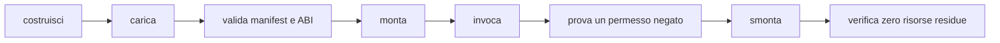

# Creare un plugin

> **Per chi:** autori di provider nativi o componenti WASM.
> **Risultato:** un bundle montabile, con manifest, permessi, test e teardown.

M5 è ancora in corso. Il percorso WASM disponibile è adatto allo sviluppo e ai
test; discovery e installazione per l'utente finale non sono complete.

## Scegliere il backend

| Backend | Quando usarlo |
|---|---|
| feature ufficiale | codice distribuito con Fub e selezionabile in build |
| provider nativo | integrazione fidata nello stesso processo |
| componente WASM | estensione di terzi isolata e compatibile via WIT |

La logica di dominio dovrebbe dipendere dal contratto, non dall'adattatore.

## Manifest

Un plugin dichiara almeno:

- id namespaced;
- nome e versione;
- versione ABI;
- permessi richiesti;
- impostazioni;
- lifecycle;
- registrazioni offerte.

Gli id pubblici devono essere stabili. Cambiare id equivale a rimuovere una
registrazione e crearne un'altra.

## Provider nativo

1. implementa il trait in un crate proprietario;
2. costruisci il manifest;
3. implementa `Plugin` o il bundle richiesto;
4. registra provider e disposer;
5. monta attraverso `fub-host`;
6. prova prima con `MemoryHost`;
7. aggiungi un'integrazione host/kernel.

Non chiamare API Tauri e non importare dettagli privati della shell.

Per un `FormatProvider`, la porta corrente è `FormatSource`: l'host lo prepara
prima di costruire il `Workspace`, lo registra prima della costruzione e
conserva le risorse preparate per la sessione, rilasciandole anche in caso di
rollback.

Un componente WASM può esportare opzionalmente l'interfaccia WIT `format`.
`fub-wasm-host` ne prepara descriptor e capability, poi espone il proxy
`FormatProvider` per parse, render HTML e serialize. Il modello attraversa una
validazione del confine fidato `O(V+E)`: sono ammessi DAG ordinari, mentre cicli,
riferimenti fuori indice, profondità oltre 64, span non validi, JSON non valido
e materializzazione oltre 8 Mi unità pesate diventano errori tipizzati.
Il manager usa solo plugin `enabled` con consenso `granted` nello snapshot della
singola apertura e carica ogni bundle selezionato una volta; le modifiche
diventano effettive dopo una riapertura. Un componente selezionato corrotto o
non caricabile, o un'export `format` presente ma incompatibile, produce una
diagnostica tipizzata e viene saltato per quell'apertura, senza impedire il
vault. Un bundle caricato resta utilizzabile per le altre interfacce se fallisce
la preparazione del provider di formato. Nessuna capability host è concessa
implicitamente dall'esportazione: dichiarare `format` non sostituisce manifest,
consenso, abilitazione o policy.

Le risorse preparate e il lease sono posseduti dalla sessione o dal rollback;
non conservare un'`Operation` del manager. Se una modifica invalida lo snapshot
durante l'apertura, il token viene revocato, l'apertura stantia fa rollback e
non pubblica una sessione.

## Componente WASM

Gli esempi correnti sono:

- `esempi/ping-wasm/`;
- `esempi/modello-wasm/`;
- `esempi/eventi-wasm/`;
- `esempi/ciclo-wasm/`;
- `esempi/format-wasm/` per un provider di formato WASM end-to-end.

Per il formato, usa `esempi/format-wasm/` come riferimento: il percorso
esercitato copre parse, render, errore dichiarato, modello malformato, trap e
serialize. Non assumere supporto per operazioni o capability non comprese in
questi casi. Il proxy non è rientrante; l'istanza e le risorse preparate vivono
fino alla chiusura della sessione o al rollback, senza trattenere un'`Operation`
del manager.

Il target è `wasm32-wasip2`.

```bash
rustup target add wasm32-wasip2
cargo build \
  --manifest-path esempi/ping-wasm/Cargo.toml \
  --target wasm32-wasip2
```

Gli esempi vivono fuori dal workspace principale perché richiedono un target
diverso e vengono costruiti dai test che li usano.

## WIT

La sorgente viva è:

```text
crates/fub-abi/wit/fub/abi.wit
```

Le copie in `wit/frozen/` sono baseline di compatibilità, non input per il nuovo
host.

Gli alberi ricorsivi attraversano il confine come arena. Non definire una
seconda conversione nel plugin: usa i binding e rispetta indici, limiti e
ordine.

## Host function

Un componente importa soltanto le famiglie necessarie. L'assenza di una
famiglia è un errore di mount leggibile.

Le host function:

- ricevono tipi WIT;
- traducono verso il contratto Rust;
- chiamano un `HostApi` già protetto;
- ritornano un valore o un errore tipizzato.

Non esistono accessi diretti a filesystem, rete o webview.

## Permessi

Richiedi il minimo.

Un test deve coprire almeno:

- permesso concesso;
- permesso negato;
- scope del vault;
- nessun mount parziale dopo il rifiuto.

La policy completa è in
[`../reference/permissions-and-security.md`](../reference/permissions-and-security.md).

## Lavoro breve e lavoro lungo

Una chiamata di trait è breve e ha una deadline. Un'operazione lunga diventa un
job con progresso e cancellazione.

Non aggirare la deadline suddividendo un lavoro infinito in chiamate che
mantengono stato non verificabile.

## UI

Un provider restituisce `UiNode`; non restituisce DOM o JavaScript.

Un componente WASM non può inviare:

- estensioni CodeMirror;
- closure;
- listener;
- HTML fidato;
- webview.

`ViewProvider` WASM e validazione non fidata sono ancora lavoro aperto in
[#10](https://github.com/Fubeo/Fub/issues/10).

## Test minimo



Aggiungi anche timeout, trap e output malformato quando il backend è WASM.
Per l'apertura gestita, tratta la corruzione o incompatibilità come diagnostica
tipizzata locale del manager e salto del componente selezionato; documenta
separatamente il rollback di uno snapshot revocato e la chiusura con drain dei
lease.

## Pubblicazione

Non esiste ancora un formato di pacchetto e discovery considerato stabile.
L'issue [#8](https://github.com/Fubeo/Fub/issues/8) deve rendere identici il
percorso documentato e quello esercitato end-to-end.
