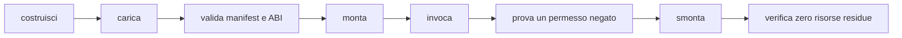

# Creare un plugin

> **Per chi:** autori di provider nativi o componenti WASM.
> **Risultato:** un bundle montabile, con manifest, permessi, test e teardown.

Il percorso prodotto è disponibile sulla base audit corrente: la shell gestisce
inventario, installazione, consenso, enabled/disabled, restart e remove. Questa
guida distingue ciò che è consegnato nel tree `audit-close` da ciò che non è
ancora stato promosso in `main`.

## Scegliere il backend

| Backend | Quando usarlo |
|---|---|
| feature ufficiale | codice distribuito con Fub e selezionabile in build |
| provider nativo | integrazione fidata nello stesso processo |
| componente WASM | estensione di terzi isolata e compatibile via WIT |

La logica di dominio dovrebbe dipendere dal contratto, non dall'adattatore.

## Manifest

Un plugin dichiara almeno:

- id namespaced;
- nome e versione;
- versione ABI;
- permessi richiesti;
- impostazioni;
- lifecycle;
- registrazioni offerte.

Gli id pubblici devono essere stabili. Cambiare id equivale a rimuovere una
registrazione e crearne un'altra.

## Provider nativo

1. implementa il trait in un crate proprietario;
2. costruisci il manifest;
3. implementa `Plugin` o il bundle richiesto;
4. registra provider e disposer;
5. monta attraverso `fub-host`;
6. prova prima con `MemoryHost`;
7. aggiungi un'integrazione host/kernel.

Non chiamare API Tauri e non importare dettagli privati della shell.

Per un `FormatProvider`, la porta corrente è `FormatSource`: l'host lo prepara
prima di costruire il `Workspace`, lo registra prima della costruzione e
conserva le risorse preparate per la sessione, rilasciandole anche in caso di
rollback.

Un componente WASM può esportare opzionalmente l'interfaccia WIT `format`.
`fub-wasm-host` ne prepara descriptor e capability, poi espone il proxy
`FormatProvider` per parse, render HTML e serialize. Il modello attraversa una
validazione del confine fidato `O(V+E)`: sono ammessi DAG ordinari, mentre cicli,
riferimenti fuori indice, profondità oltre 64, span non validi, JSON non valido
e materializzazione oltre 8 Mi unità pesate diventano errori tipizzati.
Il manager usa solo plugin `enabled` con consenso `granted` nello snapshot della
singola apertura e carica ogni bundle selezionato una volta. Una modifica
invalida lo snapshot e riconcilia i vault aperti; il riavvio rilegge le scelte
persistenti. Un componente selezionato corrotto o non caricabile, o un'export
`format` presente ma incompatibile, produce una diagnostica tipizzata e viene
diagnosticato e saltato per quell'apertura, senza impedire il vault.
Un bundle caricato resta utilizzabile per le altre interfacce se fallisce
la preparazione del provider di formato. Nessuna capability host è concessa
implicitamente dall'esportazione: dichiarare `format` non sostituisce manifest,
consenso, abilitazione o policy.

Le risorse preparate e il lease sono posseduti dalla sessione o dal rollback;
non conservare un'`Operation` del manager. Se una modifica invalida lo snapshot
durante l'apertura, il token viene revocato, l'apertura stantia fa rollback e
non pubblica una sessione.

### Decisioni sui provider

`FormatProvider` è implementato per `parse`, `render_html` e `serialize`, con
validazione del modello e errori tipizzati al confine. `ViewProvider` è
implementato con spec/interests/render, azioni `Replace`/`Patch`, preflight UI
non fidata e teardown. `GridProvider` è implementato nel protocollo Grid v1:
provider nativo, proxy WASM, finestre, patch, invalidazioni, fallback e
ownership sono esercitati dall'esempio `esempi/grid-wasm/`.

`IndexProvider` e `EventHandler` inbound restano deferred finché un componente
reale non possiede una route e prova feed/query/flush/close o la reazione a
`Notice`. Non dedurre supporto da un tipo WIT dichiarato: una capability
disponibile deve avere una famiglia host linkata e una prova end-to-end.

## Componente WASM

Gli esempi correnti sono:

- `esempi/ping-wasm/`;
- `esempi/modello-wasm/`;
- `esempi/eventi-wasm/`;
- `esempi/ciclo-wasm/`;
- `esempi/format-wasm/` per un provider di formato WASM end-to-end;
- `esempi/view-wasm/` per un `ViewProvider` WASM end-to-end.

Per il formato, usa `esempi/format-wasm/` come riferimento: il percorso
esercitato copre parse, render, errore dichiarato, modello malformato, trap e
serialize. Non assumere supporto per operazioni o capability non comprese in
questi casi. Il proxy non è rientrante; l'istanza e le risorse preparate vivono
fino alla chiusura della sessione o al rollback, senza trattenere un'`Operation`
del manager.

Il target è `wasm32-wasip2`.

```bash
rustup target add wasm32-wasip2
cargo build \
  --manifest-path esempi/ping-wasm/Cargo.toml \
  --target wasm32-wasip2
```

Gli esempi vivono fuori dal workspace principale perché richiedono un target
diverso e vengono costruiti dai test che li usano.

## WIT

La sorgente viva è:

```text
crates/fub-abi/wit/fub/abi.wit
```

Le copie in `wit/frozen/` sono baseline di compatibilità, non input per il nuovo
host.

Gli alberi ricorsivi attraversano il confine come arena. Non definire una
seconda conversione nel plugin: usa i binding e rispetta indici, limiti e
ordine.

## Host function

Un componente importa soltanto le famiglie necessarie. L'assenza di una
famiglia è un errore di mount leggibile.

Le host function:

- ricevono tipi WIT;
- traducono verso il contratto Rust;
- chiamano un `HostApi` già protetto;
- ritornano un valore o un errore tipizzato.

Non esistono accessi diretti a filesystem, rete o webview.

## Permessi

Richiedi il minimo.

Un test deve coprire almeno:

- permesso concesso;
- permesso negato;
- scope del vault;
- nessun mount parziale dopo il rifiuto.

La policy completa è in
[`../reference/permissions-and-security.md`](../reference/permissions-and-security.md).

## Lavoro breve e lavoro lungo

Una chiamata di trait è breve e ha una deadline. Un'operazione lunga diventa un
job con progresso e cancellazione.

Non aggirare la deadline suddividendo un lavoro infinito in chiamate che
mantengono stato non verificabile.

## UI

Un provider restituisce `UiNode`; non restituisce DOM o JavaScript.

Un componente WASM non fidato (`Trust::Community`) non può inviare:

- estensioni CodeMirror;
- closure;
- listener;
- HTML fidato;
- webview.

Un componente `Trust::Core` può produrre `Html` e `WebView` secondo la policy.

### ViewProvider WASM

Scegli il `ViewProvider` WASM quando la view è un'estensione di terzi isolata
via WIT; il proxy è opzionale e condivide la stessa istanza del `Plugin`.
`ViewSpec` espone i parametri (per esempio `mode` obbligatorio e `density`
opzionale), che l'host valida prima della chiamata.

Il provider dichiara `interests`, che è infallibile: un trap fa paniare il proxy
e il confine `Workspace` converte il panic in `PluginError::Internal`. Legge il
modello tramite `ReadApi` in `render_view` e usa l'`HostApi` in `on_action`;
entrambe sono capacità già protette dal `Guard`, non accessi liberi del guest.
Le sole forme di aggiornamento dimostrate in parità sono `Replace` e `Patch`;
`IndexProvider` e `EventHandler` inbound restano deferred.

Render e action passano il guard di fiducia e il preflight dell'albero:
root/riferimenti, DAG senza cicli, profondità massima 64 e budget di 8 Mi
unità pesate. Per `Trust::Community`, `Html` e `WebView` sono rifiutati prima
della shell; `Trust::Core` è ammesso. Una rientranza sulla stessa istanza
diventa un errore tipizzato. Un trap invalida il guest, mantiene vivo l'host e
può essere riportato durante il teardown.

Per una view, il test minimo aggiunge: caricamento di `esempi/view-wasm/`,
validazione dei due parametri dichiarati, confronto di `interests` e
`render_view` con un provider nativo, quindi una action che produca
`Replace` e una che produca `Patch`. Dopo lo smontaggio, una nuova chiamata
deve risultare in view sconosciuta.

Il test di confine copre inoltre un albero malformato (`BadArgs`), `Html` o
`WebView` annidati (`PermissionDenied`), un errore guest tipizzato, un trap
(`Internal`) e il fatto che l'host resti utilizzabile.

## Test minimo



Aggiungi anche timeout, trap e output malformato quando il backend è WASM.
Per l'apertura gestita, tratta la corruzione o incompatibilità come diagnostica
tipizzata locale del manager e salto del componente selezionato; documenta
separatamente il rollback di uno snapshot revocato e la chiusura con drain dei
lease.

## Ciclo prodotto supportato

Il ciclo usa le porte IPC desktop e l'`InstalledPluginManager`; non richiede
scansione arbitraria di directory e non usa `.fub/plugins/` per gli eseguibili.
La configurazione macchina è scelta dal composition root. Le porte principali
sono:

- `list_installed_plugins`;
- `install_plugin(path)`;
- `set_installed_plugin_consent(installation, consent)`;
- `set_installed_plugin_enabled(installation, enabled)`;
- `remove_installed_plugin(installation)`.

### 1. Dichiarare e installare

Il manifest dichiara id namespaced, versione, ABI, registrazioni e permessi.
L'installazione legge il file scelto, valida manifest e ABI e verifica il
contenuto prima di pubblicare blob e inventario. Non monta l'istanza e non
chiama il guest. Il record iniziale è:

```text
installed = true
consent = undecided
enabled = false
mounted = false
```

Un id già presente è una collisione esplicita, anche quando la versione è
diversa: non esiste upgrade implicito. Rimuovi prima il record disabilitato e
reinstalla per ottenere una nuova identità; il consenso non viene ereditato.
Un digest alterato, file incompleto, schema futuro o conflitto CAS è un errore,
non un fallback a un inventario vuoto.

### 2. Separare capability, consenso ed enabled

Sono tre decisioni diverse:

1. **Capability dichiarata:** il manifest e l'export WIT dichiarano quali
   famiglie e permessi il componente richiede/offre. La dichiarazione non
   concede accesso.
2. **Consenso:** `undecided`, `denied` o `granted` autorizza l'esecuzione degli
   esatti byte installati. Non modifica la mappa capability e non sostituisce
   il `Guard` del kernel.
3. **Enabled:** la scelta persistente seleziona il componente per lo startup.
   Un componente enabled non è ancora un'istanza montata.

Il mount allo startup avviene solo quando `enabled == true` e
`consent == granted`; il `Guard` applica poi fiducia, capability e scope. Un
permesso negato produce un errore tipizzato e non lascia registrazioni
parziali. L'export `format`, `view` o `grid` non aggira nessuno di questi
passaggi.

### 3. Attivare, disattivare e riavviare

Imposta prima il consenso esplicito, poi `enabled = true`. Il manager
invalida lo snapshot startup e riconcilia i vault aperti; il riavvio rilegge
le stesse scelte dalla configurazione macchina. Prima di `enabled = false`
esegue teardown, ritira claim e registrazioni e conserva i dati persistenti del
plugin. Un record disabilitato resta elencabile senza leggere o istanziare il
guest.

Il filtro startup avviene prima di load, validazione attiva e istanziazione:
blob corrotto di un record non selezionato non viene eseguito né diagnosticato
durante l'avvio. Un componente selezionato ma corrotto viene diagnosticato e
saltato senza impedire l'apertura del vault.

### 4. Rimuovere

La rimozione richiede `enabled = false`. Il manager completa il teardown in
tutti i vault, ritira il record dall'inventario e pulisce il blob della
specifica installazione. Un errore di cleanup è riportato senza ricreare il
record. `.fub/plugins/<id>/` è storage persistente namespaced del plugin e non
viene cancellato: dati e componente eseguibile hanno lifecycle distinti.

### Troubleshooting

| Sintomo | Causa da controllare | Azione |
|---|---|---|
| Il componente compare ma non parte | consenso `undecided`/`denied` o `enabled=false` | mostra lo stato con `list_installed_plugins`, concedi consenso e abilita esplicitamente |
| Il mount fallisce prima del guest | ABI, import o famiglia host non servita | usa la diagnostica tipizzata; aggiorna ABI o rimuovi l'import non supportato |
| Il vault si apre ma il plugin manca | record selezionato corrotto/non caricabile | conserva il log, reinstalla dopo aver disabilitato; non copiare blob in `.fub/plugins/` |
| L'abilitazione non sopravvive al restart | decisione scritta su un'altra config root o CAS stantia | usa la sola configurazione scelta dal composition root e ripeti l'operazione dopo aver riletto la lista |
| Remove viene rifiutato | il record è ancora enabled | disabilita, attendi il teardown e riprova la rimozione |
| L'id collide con un'altra installazione | stesso id già nell'inventario | non sovrascrivere: rimuovi esplicitamente la vecchia installazione |
| La view viene rifiutata | HTML/WebView o albero oltre i limiti per `Trust::Community` | restituisci forme dichiarative valide, DAG senza cicli, profondità ≤64 e budget ≤8 Mi unità pesate |
| Una chiamata si blocca o rientra | lavoro lungo in una chiamata breve o reentrancy sulla stessa istanza | usa un job per il lavoro lungo e non rientrare nel provider |

Il ciclo esercitato e i limiti correnti sono descritti anche in
[`../project/m5-wasm-runtime.md`](../project/m5-wasm-runtime.md) e nel
[layout su disco](../reference/on-disk-layout.md).

## Pubblicazione

Il percorso supportato corrente installa un singolo file WASM scelto
esplicitamente dalla shell. Non esiste ancora un marketplace o un ecosistema
di distribuzione dei pacchetti: il formato del componente, l'ABI dichiarata e
il ciclo di inventario sono invece verificati prima del mount.

L'issue [#8](https://github.com/Fubeo/Fub/issues/8) resta il tracker per la
chiusura formale del percorso end-to-end; non usare questo stato per dedurre
che la capability sia disponibile su `main`.
