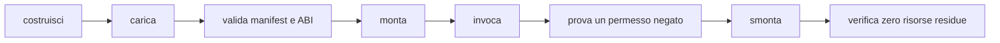

# Creare un plugin

> **Per chi:** autori di provider nativi o componenti WASM.
> **Risultato:** un bundle montabile, con manifest, permessi, test e teardown.

M5 è ancora in corso. Il percorso WASM disponibile è adatto allo sviluppo e ai
test; discovery e installazione per l'utente finale non sono complete.

## Scegliere il backend

| Backend | Quando usarlo |
|---|---|
| feature ufficiale | codice distribuito con Fub e selezionabile in build |
| provider nativo | integrazione fidata nello stesso processo |
| componente WASM | estensione di terzi isolata e compatibile via WIT |

La logica di dominio dovrebbe dipendere dal contratto, non dall'adattatore.

## Manifest

Un plugin dichiara almeno:

- id namespaced;
- nome e versione;
- versione ABI;
- permessi richiesti;
- impostazioni;
- lifecycle;
- registrazioni offerte.

Gli id pubblici devono essere stabili. Cambiare id equivale a rimuovere una
registrazione e crearne un'altra.

## Provider nativo

1. implementa il trait in un crate proprietario;
2. costruisci il manifest;
3. implementa `Plugin` o il bundle richiesto;
4. registra provider e disposer;
5. monta attraverso `fub-host`;
6. prova prima con `MemoryHost`;
7. aggiungi un'integrazione host/kernel.

Non chiamare API Tauri e non importare dettagli privati della shell.

## Componente WASM

Gli esempi correnti sono:

- `esempi/ping-wasm/`;
- `esempi/modello-wasm/`;
- `esempi/eventi-wasm/`;
- `esempi/ciclo-wasm/`.

Il target è `wasm32-wasip2`.

```bash
rustup target add wasm32-wasip2
cargo build \
  --manifest-path esempi/ping-wasm/Cargo.toml \
  --target wasm32-wasip2
```

Gli esempi vivono fuori dal workspace principale perché richiedono un target
diverso e vengono costruiti dai test che li usano.

## Store per host nativi

Un host Rust può installare un singolo componente compilato usando
`fub_wasm_host::installed::InstalledPluginStore`. Deve passare esplicitamente
la directory di configurazione della macchina, già esistente:

```rust
let store = InstalledPluginStore::open(config_dir)?;
let base = store.snapshot()?;
let installed = store.install(&base, component_path)?;
```

Il componente nasce disabilitato e senza consenso. `set_consent` registra
l'approvazione all'esecuzione degli esatti byte, mentre `set_enabled` conserva
una scelta distinta. Entrambi richiedono una fotografia corrente e possono
restituire `InstallError::Conflict`; il chiamante rilegge e presenta la nuova
situazione, senza ripetere automaticamente una decisione vecchia.

`load` ricontrolla digest e manifest e restituisce un `WasmBundle` con fiducia
Community. Non monta l'istanza né concede capability. Il chiamante completa
il percorso comune di permessi, dipendenze e lifecycle, e deve completare il
teardown prima di `remove`. La rimozione conserva i dati del plugin nel vault.

Il banco `crates/fub-wasm-host/tests/installed_inventory.rs` esercita questa
stessa API, compresi guasti, riavvio e concorrenza. L'integrazione desktop,
l'aggiornamento di una versione già installata e il percorso completo restano
tracciati in [#8](https://github.com/Fubeo/Fub/issues/8).

## WIT

La sorgente viva è:

```text
crates/fub-abi/wit/fub/abi.wit
```

Le copie in `wit/frozen/` sono baseline di compatibilità, non input per il nuovo
host.

Gli alberi ricorsivi attraversano il confine come arena. Non definire una
seconda conversione nel plugin: usa i binding e rispetta indici, limiti e
ordine.

## Host function

Un componente importa soltanto le famiglie necessarie. L'assenza di una
famiglia è un errore di mount leggibile.

Le host function:

- ricevono tipi WIT;
- traducono verso il contratto Rust;
- chiamano un `HostApi` già protetto;
- ritornano un valore o un errore tipizzato.

Non esistono accessi diretti a filesystem, rete o webview.

## Permessi

Richiedi il minimo.

Un test deve coprire almeno:

- permesso concesso;
- permesso negato;
- scope del vault;
- nessun mount parziale dopo il rifiuto.

La policy completa è in
[`../reference/permissions-and-security.md`](../reference/permissions-and-security.md).

## Lavoro breve e lavoro lungo

Una chiamata di trait è breve e ha una deadline. Un'operazione lunga diventa un
job con progresso e cancellazione.

Non aggirare la deadline suddividendo un lavoro infinito in chiamate che
mantengono stato non verificabile.

## UI

Un provider restituisce `UiNode`; non restituisce DOM o JavaScript.

Un componente WASM non può inviare:

- estensioni CodeMirror;
- closure;
- listener;
- HTML fidato;
- webview.

`ViewProvider` WASM e validazione non fidata sono ancora lavoro aperto in
[#10](https://github.com/Fubeo/Fub/issues/10).

## Test minimo



Aggiungi anche timeout, trap e output malformato quando il backend è WASM.

## Pubblicazione

Non esiste ancora un formato di pacchetto e discovery considerato stabile.
L'issue [#8](https://github.com/Fubeo/Fub/issues/8) deve rendere identici il
percorso documentato e quello esercitato end-to-end.
