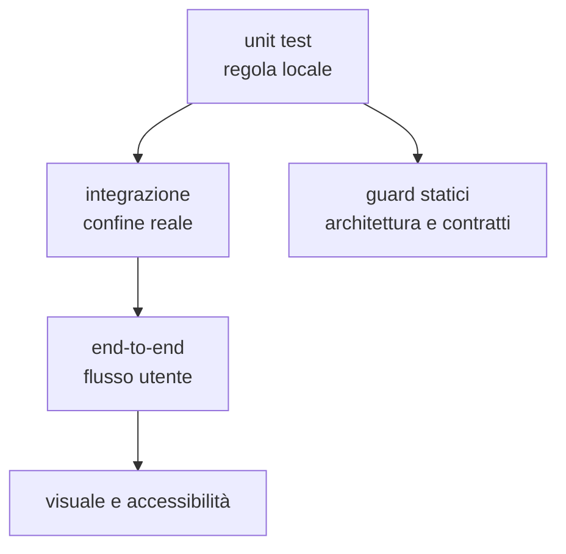

# Test e qualità

> **Domanda:** quale banco dimostra una proprietà e quali guard impediscono la
> deriva?
> **Fonti autorevoli:** test nei crate, test frontend e workflow CI.

## Piramide



Ogni livello risponde a una domanda diversa. Un guard non sostituisce il test
del comportamento; un test end-to-end non sostituisce la verifica di una
invariante strutturale.

## Rust

### Test unitari

Vivono vicino alla regola o nel crate proprietario. Sono adatti a:

- canonicalizzazione;
- parser e serializzazione;
- query;
- compatibilità;
- conversioni;
- errori;
- versioni di schema.

### `MemoryHost`

`fub-sdk::testing::MemoryHost` serve a esercitare provider senza montare
l'intera applicazione. È il primo banco per comandi, view e servizi che usano
`HostApi`.

### `fub-testkit`

`fub-testkit` monta kernel e host con fixture reali. Usalo per:

- lifecycle dei bundle;
- storage;
- eventi;
- registri;
- conflitti;
- aperture e teardown.

Resta una dipendenza di sviluppo.

### Test del contratto

I guard del contratto verificano:

- Rust ↔ WIT;
- additività rispetto a `wit/frozen/`;
- radice pubblica di `fub-abi`;
- proiezioni TypeScript;
- enum e fixture generate;
- dipendenze vietate.

### Snapshot globale (#5)

Il protocollo globale e la sua orchestrazione host si verificano separatamente
dal drill storico di backup/restore per-file:

```bash
cargo +1.89.0 test -p fub-kernel snapshot
cargo +1.89.0 test -p fub-host --test global_snapshot
cargo +1.89.0 test -p fub-app --test schemas_on_disk
```

I primi due comandi esercitano manifest, preflight, transazione, recovery e
riapertura osservabile del vault per #5. `schemas_on_disk` presidia invece la
registrazione persistente dello schema; il comando legacy di #7 resta quello
indicato nella sezione seguente.

### Drill backup/restore

Il banco d'integrazione eseguibile è:

```bash
cargo +1.89.0 test -p fub-host --lib legacy_tests::backup_restore_drill -- --nocapture
```

Il fixture copre l'intero vault: documenti Markdown, allegati binari, file
sconosciuti, `.trash/` e stato autorevole sotto `.fub/`, inclusi storage di
plugin e versioning. La configurazione macchina resta esclusa. Il manifesto
indipendente verifica per ogni path classe, dimensione, impronta FNV-1a e
schema; la scansione rifiuta symlink e file speciali.

Il drill opera offline in un parent temporaneo privato ed esclusivo. Copia
l'albero in uno staging adiacente alla destinazione e pubblica con un solo
rename. Questo dimostra il flusso del banco, non una garanzia universale di
no-replace concorrente o di durabilità dopo un crash.

Un artefatto corrotto o mancante viene validato prima di creare lo staging e
prima di toccare la destinazione. Una destinazione occupata resta invariata e
lo staging completo resta disponibile. La verifica finale usa `Host` reale:
apertura, attesa dell'indicizzazione e lettura del documento, poi chiusura.

`fub.backup` riguarda soltanto le note nello stesso vault; non è il backup
completo esercitato da questo drill. Il drill storico di #7 documenta il
comportamento legacy e resta distinto dalla verifica del protocollo globale #5.


## Frontend

Vitest 5 usa un fake host. Con `clearMocks: true`, prima di ogni test vengono
svuotate chiamate, istanze e risultati delle spy (`vi.clearAllMocks()`), senza
ripristinare l'implementazione né rimuovere i mock; i test che richiedono un
comportamento diverso devono configurarlo esplicitamente. I test devono
verificare la shell senza avviare Tauri.

Aree importanti:

- conversione byte UTF-8 ↔ offset JavaScript;
- sincronizzazione dell'editor;
- layout e focus;
- lifecycle di listener, observer e timer;
- rendering dichiarativo;
- tema;
- comandi e race cancellabili;
- comportamento end-to-end della shell.

`npm run typecheck`, `npm test` e `npm run build` sono tre controlli distinti.

### Bundle e dipendenze

La [configurazione Vite](../../apps/client/vite.config.ts) separa i runtime
riusabili e mantiene grafo, Mermaid e linguaggi opzionali su richiesta.
Ogni chunk, cioè un blocco JavaScript emesso dalla build, ha un limite di
500.000 byte minificati, prima della compressione di trasporto.
Il solo parser precompilato di Mermaid ha un limite di 700.000 byte e non
può appartenere alle dipendenze statiche degli ingressi applicativi.
Il controllo misura il codice finale, dopo la riscrittura degli import di
Vite, e interrompe la build in caso di superamento.

Il [guard delle copie npm](../../.github/scripts/check-npm-copies.mjs)
mantiene uniche le dipendenze che condividono identità applicativa.
Le eccezioni per i motori privati di Mermaid e gli strumenti Node sono
limitate alle versioni verificate: una versione diversa o una copia
aggiuntiva richiede una nuova valutazione, non un override fra major.

## Visuale e accessibilità

Il banco visuale usa scene deterministiche e baseline del runner Linux. In caso
di differenza, la CI conserva immagini attuali, diff e foglio di contatto.

Le baseline coprono le scene in
[`bench/scene.mjs`](../../apps/client/bench/scene.mjs), in luce scura e chiara.
L'ambiente di riferimento usa Ubuntu, Node 22, Chromium della revisione
Playwright fissata dal lockfile e i font del runner, inclusi DejaVu Sans Mono.
Prima di usare un ambiente Ubuntu ricostruito, eseguire il banco sul commit
di riferimento con le baseline invariate: tutte le scene devono passare.
Questa prova separa una differenza dell'ambiente da una modifica della UI.

La soglia colore resta `0.01` e una foto passa soltanto con al massimo lo
`0.1%` di pixel diversi. Una diversa rasterizzazione del sistema non è
una motivazione per alzare questi limiti.

Un confronto locale fuori da questo ambiente può superare il limite per
rasterizzazione di testo o canvas pur senza una regressione applicativa. Va
esaminato il diff; non va promosso a baseline. Un cambiamento intenzionale
richiede invece revisione del foglio, spiegazione delle scene coinvolte e
rigenerazione nell'ambiente Ubuntu validato.

L'accessibilità verifica la pagina resa, non soltanto una tabella teorica di
colori.
Il catalogo contiene i campioni posizionati dentro i rispettivi riquadri;
le regioni che scorrono hanno nome accessibile e ingresso da tastiera.
Il controllo del focus distingue i discendenti di un `details` chiuso
dagli elementi realmente visibili e raggiungibili.

Regole:

- controllare luce chiara e scura;
- non aggiornare baseline da un ambiente non validato sul riferimento;
- spiegare ogni cambiamento intenzionale;
- usare moto ridotto nelle scene pertinenti;
- non mascherare una regressione alzando la soglia.

## Runtime WASM

Un test reale costruisce i componenti in `esempi/`. Le classi minime sono:

| Classe | Proprietà |
|---|---|
| successo | mount, chiamata, esito e teardown |
| compatibilità | ABI incompatibile rifiutata prima dell'attivazione |
| capability | accesso negato come errore tipizzato |
| isolamento | trap o panic non abbatte l'host |
| disponibilità | loop infinito fermato dalla deadline |
| memoria | limite applicato prima dell'istanza |
| forma | arena e output malformati rifiutati |
| lifecycle | registrazioni e risorse rimosse |

## Documentazione

I guard documentali controllano:

- link e target;
- raggiungibilità delle pagine;
- dimensioni;
- struttura Markdown;
- blocchi Mermaid;
- tabelle;
- riferimenti legacy e cronaca vietata;
- allineamento del ciclo locale.

## Matrice per modifica

| Modifica | Test necessari |
|---|---|
| helper puro | unit test |
| provider | unit test e `MemoryHost` |
| mount o sessione | integrazione `fub-testkit` |
| storage | integrazione, corruzione e interruzione |
| IPC | mirror, fixture e test shell |
| UI | Vitest, type-check, build, accessibilità |
| resa | banco visuale |
| WIT | conformità, additività e componente reale |
| docs | tutti i guard documentali |

## Qualità della prova

Un test deve fallire per la proprietà che nomina. Evita:

- conteggi fragili senza significato architetturale;
- snapshot enormi non leggibili;
- test saltati quando manca l'artefatto che dovrebbero costruire;
- attese basate su sleep quando esiste un clock controllabile;
- fixture che copiano l'implementazione;
- verifiche che cercano una sottostringa in un errore tipizzato.
