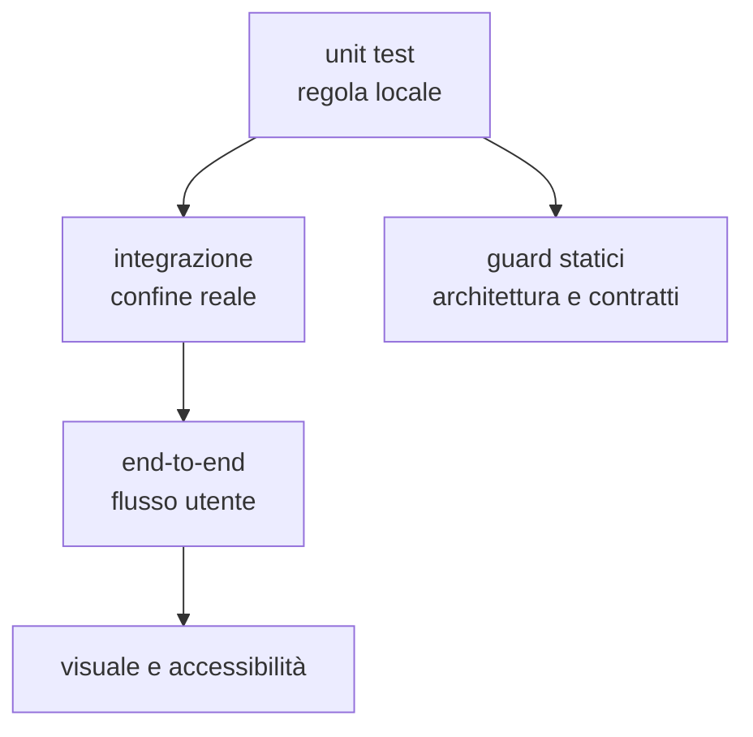

# Test e qualità

> **Domanda:** quale banco dimostra una proprietà e quali guard impediscono la
> deriva?
> **Fonti autorevoli:** test nei crate, test frontend e workflow CI.

## Piramide

Ogni livello risponde a una domanda diversa. Un guard non sostituisce il test
del comportamento; un test end-to-end non sostituisce la verifica di una
invariante strutturale.

## Rust

### Test unitari

Vivono vicino alla regola o nel crate proprietario. Sono adatti a:

- canonicalizzazione;
- parser e serializzazione;
- query;
- compatibilità;
- conversioni;
- errori;
- versioni di schema.

### `MemoryHost`

`fub-sdk::testing::MemoryHost` serve a esercitare provider senza montare
l'intera applicazione. È il primo banco per comandi, view e servizi che usano
`HostApi`.

### `fub-testkit`

`fub-testkit` monta kernel e host con fixture reali. Usalo per:

- lifecycle dei bundle;
- storage;
- eventi;
- registri;
- conflitti;
- aperture e teardown.

Resta una dipendenza di sviluppo.

### Test del contratto

I guard del contratto verificano:

- Rust ↔ WIT;
- additività rispetto a `wit/frozen/`;
- radice pubblica di `fub-abi`;
- proiezioni TypeScript;
- enum e fixture generate;
- dipendenze vietate.

## Frontend

Vitest usa un fake host. I test devono verificare la shell senza avviare Tauri.

Aree importanti:

- conversione byte UTF-8 ↔ offset JavaScript;
- sincronizzazione dell'editor;
- layout e focus;
- lifecycle di listener, observer e timer;
- rendering dichiarativo;
- tema;
- comandi e race cancellabili;
- comportamento end-to-end della shell.

`npm run typecheck`, `npm test` e `npm run build` sono tre controlli distinti.

## Visuale e accessibilità

Il banco visuale usa scene deterministiche e baseline del runner Linux. In caso
di differenza, la CI conserva immagini attuali, diff e foglio di contatto.

L'accessibilità verifica la pagina resa, non soltanto una tabella teorica di
colori.

Regole:

- controllare luce chiara e scura;
- non aggiornare baseline da un sistema diverso;
- spiegare ogni cambiamento intenzionale;
- usare moto ridotto nelle scene pertinenti;
- non mascherare una regressione alzando la soglia.

## Runtime WASM

Un test reale costruisce i componenti in `esempi/`. Le classi minime sono:

| Classe | Proprietà |
|---|---|
| successo | mount, chiamata, esito e teardown |
| compatibilità | ABI incompatibile rifiutata prima dell'attivazione |
| capability | accesso negato come errore tipizzato |
| isolamento | trap o panic non abbatte l'host |
| disponibilità | loop infinito fermato dalla deadline |
| memoria | limite applicato prima dell'istanza |
| forma | arena e output malformati rifiutati |
| lifecycle | registrazioni e risorse rimosse |

## Documentazione

I guard documentali controllano:

- link e target;
- raggiungibilità delle pagine;
- dimensioni;
- struttura Markdown;
- blocchi Mermaid;
- tabelle;
- riferimenti legacy e cronaca vietata;
- allineamento del ciclo locale.

## Matrice per modifica

| Modifica | Test necessari |
|---|---|
| helper puro | unit test |
| provider | unit test e `MemoryHost` |
| mount o sessione | integrazione `fub-testkit` |
| storage | integrazione, corruzione e interruzione |
| IPC | mirror, fixture e test shell |
| UI | Vitest, type-check, build, accessibilità |
| resa | banco visuale |
| WIT | conformità, additività e componente reale |
| docs | tutti i guard documentali |

## Qualità della prova

Un test deve fallire per la proprietà che nomina. Evita:

- conteggi fragili senza significato architetturale;
- snapshot enormi non leggibili;
- test saltati quando manca l'artefatto che dovrebbero costruire;
- attese basate su sleep quando esiste un clock controllabile;
- fixture che copiano l'implementazione;
- verifiche che cercano una sottostringa in un errore tipizzato.
