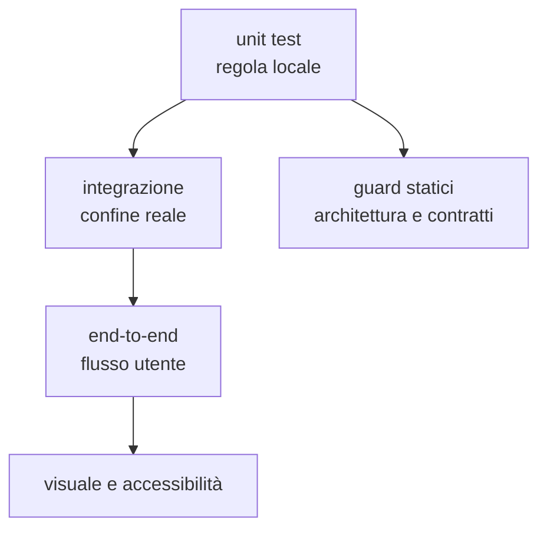

# Test e qualità

> **Domanda:** quale banco dimostra una proprietà e quali guard impediscono la
> deriva?
> **Fonti autorevoli:** test nei crate, test frontend e workflow CI.

## Piramide


```mermaid
flowchart TD
    UNIT["unit test<br/>regola locale"] --> INTEGRATION["integrazione<br/>confine reale"]
    INTEGRATION --> E2E["end-to-end<br/>flusso utente"]
    E2E --> VISUAL["visuale e accessibilità"]
    UNIT --> GUARD["guard statici<br/>architettura e contratti"]
```

Ogni livello risponde a una domanda diversa. Un guard non sostituisce il test
del comportamento; un test end-to-end non sostituisce la verifica di una
invariante strutturale.

## Rust

### Test unitari

Vivono vicino alla regola o nel crate proprietario. Sono adatti a:

- canonicalizzazione;
- parser e serializzazione;
- query;
- compatibilità;
- conversioni;
- errori;
- versioni di schema.

### `MemoryHost`

`fub-sdk::testing::MemoryHost` serve a esercitare provider senza montare
l'intera applicazione. È il primo banco per comandi, view e servizi che usano
`HostApi`.

Il doppio non parsa: modelli, outline, tag, backlink e archi si seminano, e
un formato diverso dal Markdown di serie si dichiara con `with_format`. Ciò
che sa di sé lo serve con le regole condivise del kernel: anagrafe e specie
delle voci, documenti, risoluzione dei riferimenti, vicini a partire dai semi,
filtri su id, cartella, link e proprietà dei modelli seminati. Una domanda che
vorrebbe un indice, come testo, tag o glob, risponde `unserved` invece di
ignorare il filtro. `crates/fub-features/tests/both_hosts_answer_alike.rs`
confronta le risposte dei due host, anche con un secondo formato registrato.

### `fub-testkit`

`fub-testkit` monta kernel e host con fixture reali. Usalo per:

- lifecycle dei bundle;
- storage;
- eventi;
- registri;
- conflitti;
- aperture e teardown.

Resta una dipendenza di sviluppo.

### Test del contratto

I guard del contratto verificano:

- Rust ↔ WIT;
- additività rispetto a `wit/frozen/`;
- radice pubblica di `fub-abi`;
- proiezioni TypeScript;
- enum e fixture generate;
- dipendenze vietate.

### Snapshot globale (#5)

Il protocollo globale e la sua orchestrazione host si verificano separatamente
dal drill storico di backup/restore per-file:

```bash
cargo +1.95.0 test -p fub-kernel snapshot
cargo +1.95.0 test -p fub-host --test global_snapshot
cargo +1.95.0 test -p fub-app --test schemas_on_disk
```

I primi due comandi esercitano manifest, preflight, transazione, recovery e
riapertura osservabile del vault per #5. `schemas_on_disk` presidia invece la
registrazione persistente dello schema; il comando legacy di #7 resta quello
indicato nella sezione seguente.

### Drill backup/restore

Il banco d'integrazione eseguibile è:

```bash
cargo +1.95.0 test -p fub-host --lib legacy_tests::backup_restore_drill -- --nocapture
```

Il fixture copre l'intero vault: documenti Markdown, allegati binari, file
sconosciuti, `.trash/` e stato autorevole sotto `.fub/`, inclusi storage di
plugin e versioning. La configurazione macchina resta esclusa. Il manifesto
indipendente verifica per ogni path classe, dimensione, impronta FNV-1a e
schema; la scansione rifiuta symlink e file speciali.

Il drill opera offline in un parent temporaneo privato ed esclusivo. Copia
l'albero in uno staging adiacente alla destinazione e pubblica con un solo
rename. Questo dimostra il flusso del banco, non una garanzia universale di
no-replace concorrente o di durabilità dopo un crash.

Un artefatto corrotto o mancante viene validato prima di creare lo staging e
prima di toccare la destinazione. Una destinazione occupata resta invariata e
lo staging completo resta disponibile. La verifica finale usa `Host` reale:
apertura, attesa dell'indicizzazione e lettura del documento, poi chiusura.

`fub.backup` riguarda soltanto le note nello stesso vault; non è il backup
completo esercitato da questo drill. Il drill storico di #7 documenta il
comportamento legacy e resta distinto dalla verifica del protocollo globale #5.

### Corpus senza perdite della pre-alpha

```bash
cargo +1.95.0 test -p fub-host --test prealpha_corpus
```

Un file vero per ogni formato della pre-alpha, in
[`tests/fixtures/prealpha-corpus/`](../../tests/fixtures/prealpha-corpus/README.md):
Markdown con CRLF, con BOM, col frontmatter e con caratteri fuori dal piano
base; un `.docx` modificabile e uno protetto; un `.xlsx` con formule; un SVG
di Inkscape; un `.canvas` di Obsidian con CRLF e BOM; un PDF. Il `README.md`
della cartella dice da quale corpus viene ciascuno.

Il test copia il corpus in una cartella temporanea, apre il vault con `Host`
e prova per ogni file:

- aprire e chiudere come la shell non cambia un byte: la lettura sotto la
  chiave di apertura e `document_closed` dei motori, la griglia per un foglio,
  la risorsa per un PDF;
- una scrittura da una revisione vecchia dà `Conflict`, e il file resta;
- un file che sparisce fra la lettura e la scrittura dà un errore tipizzato e
  non rinasce;
- per Markdown e SVG una parola cambiata, per il `.canvas` una scheda spostata
  con `canvas.apply`: i byte cambiano solo nello spazio della modifica, e i
  fine riga e il BOM restano.

La sola lettura si prova coi motivi che l'host conosce, uguali sui tre
sistemi: il `.docx` protetto (`host.rich.readonly.protected`) e una cartella
di Excel che la shell coprirebbe con dei byte suoi (`host.xlsx.readonly`). Il
permesso del file non è uno di questi motivi: su Linux e macOS la scrittura
atomica sostituisce anche un file senza permesso di scrittura.

Le modifiche di un `.docx` e di un `.xlsx` hanno i loro corpus nei crate dei
formati (`fub-format-rich`, `fub-format-xlsx`, test `corpus`). Un formato che
entra nella pre-alpha aggiunge qui il suo file, con la provenienza.

### Albero delle dipendenze

Il [guard dei motori](../../.github/scripts/check-motori.mjs) legge l'albero
di `fub-app` con `cargo tree`, solo gli archi normali, con tutte le feature e
tutte le piattaforme, e pone due tetti a ciò che si installa.

- Nessuna interfaccia di un'app Craft: `egui`, `eframe`, `egui-wgpu`,
  `egui-winit`, `winit`, `rfd` e `accesskit_winit` fanno fallire il guard, con
  la catena di chi li tira dentro. Fa eccezione `rfd` portato da
  `tauri-plugin-dialog`, che apre i dialoghi di sistema della shell.
- Le librerie presenti in due o più versioni non superano `librerie_doppie`
  di [`budgets.json`](../reference/budgets.json). Il tetto si può soltanto
  abbassare: quando il conto scende, il guard avvisa di scriverci il numero
  nuovo.

Un Cargo che non riesce a dare l'albero fa uscire il guard con 2, mai con un
conto vuoto. `--self-test` prova il lettore su un albero finto; `--albero` e
`--budgets` leggono l'albero e i tetti da file.


## Frontend

Vitest 5 usa un fake host. Con `clearMocks: true`, prima di ogni test vengono
svuotate chiamate, istanze e risultati delle spy (`vi.clearAllMocks()`), senza
ripristinare l'implementazione né rimuovere i mock; i test che richiedono un
comportamento diverso devono configurarlo esplicitamente. I test devono
verificare la shell senza avviare Tauri.

Aree importanti:

- conversione byte UTF-8 ↔ offset JavaScript;
- sincronizzazione dell'editor;
- layout e focus;
- lifecycle di listener, observer e timer;
- rendering dichiarativo;
- tema;
- comandi e race cancellabili;
- comportamento end-to-end della shell.

`npm run typecheck`, `npm test` e `npm run build` sono tre controlli distinti.

### Bundle e dipendenze

La [configurazione Vite](../../apps/client/vite.config.ts) separa i runtime
riusabili e mantiene grafo, Mermaid, linguaggi opzionali e l'editor dei
disegni su richiesta.
Ogni chunk, cioè un blocco JavaScript emesso dalla build, ha un limite di
500.000 byte minificati, prima della compressione di trasporto.
Il solo parser precompilato di Mermaid ha un limite di 700.000 byte e non
può appartenere alle dipendenze statiche degli ingressi applicativi.
Il controllo misura il codice finale, dopo la riscrittura degli import di
Vite, e interrompe la build in caso di superamento.

Il [guard delle copie npm](../../.github/scripts/check-npm-copies.mjs)
mantiene uniche le dipendenze che condividono identità applicativa.
Le eccezioni per i motori privati di Mermaid e gli strumenti Node sono
limitate alle versioni verificate: una versione diversa o una copia
aggiuntiva richiede una nuova valutazione, non un override fra major.

## Banchi

Tutti i comandi girano da `apps/client/`; gli script sorgente sono in
`apps/client/package.json` e in `bench/`:

| Comando | Che cosa misura |
|---|---|
| `npm run bench:verify` | le scene del banco visivo contro le baseline Linux |
| `npm run bench:update` | rigenera le baseline (solo dal runner Linux) |
| `npm run bench:a11y` | accessibilità della pagina resa (`-- --scene=a,b` per alcune scene, `-- --light=dark` per una luce) |
| `npm run bench:motion` | le coreografie del moto dello Scrittoio |
| `npm run bench:lampo` | lo strato d'avvio prima di ogni modulo |
| `npm run bench:interaction` | il budget d'interazione (menu, palette, nota) |
| `npm run bench:ink` | l'inchiostro in TypeScript e in WebAssembly, fianco a fianco |
| `npm run bench:fidelity` | la fedeltà pixel dei disegni (foglio, PNG, Lettura) |
| `npm run bench:grid` | i gesti della griglia con mouse e tastiera veri |
| `npm run bench:graph-scale` | il grafo a 2k/10k nodi: tempi, heap, soak |
| `npm run bench:large` | i disegni grandi (da 200 a 49 900 elementi) nell'app vera |
| `npm run bench:webview` | le misure nella WebView vera (vedi [webview-measurements.md](webview-measurements.md)) |

Varianti usate dalle prove di accettazione della Graph View e dei disegni
grandi:

```bash
cd apps/client
npm run bench:graph-scale -- --nodes 2000 --seed 6 --cycles 3
npm run bench:graph-scale -- --nodes 10000 --seed 6 --cycles 1 --soak-windows 8
npm run bench:graph-scale -- --nodes 10000 --seed 6 --cycles 1 --soak-windows 16
npm run bench:large -- --elements 30000   # da 200 a 49 900 elementi, senza soglie
npm run bench:large -- --cpu 4            # la pagina quattro volte più lenta
```

## Visuale e accessibilità

Il banco visuale usa scene deterministiche e baseline del runner Linux. In caso
di differenza, la CI conserva immagini attuali, diff e foglio di contatto.

Le baseline coprono le scene in
[`bench/scene.mjs`](../../apps/client/bench/scene.mjs), in luce scura e chiara.
L'ambiente di riferimento usa Ubuntu, Node 22, Chromium della revisione
Playwright fissata dal lockfile e i font del runner, inclusi DejaVu Sans Mono.
Prima di usare un ambiente Ubuntu ricostruito, eseguire il banco sul commit
di riferimento con le baseline invariate: tutte le scene devono passare.
Questa prova separa una differenza dell'ambiente da una modifica della UI.

La soglia colore resta `0.01` e una foto passa soltanto con al massimo lo
`0.1%` di pixel diversi. Una diversa rasterizzazione del sistema non è
una motivazione per alzare questi limiti.

Un confronto locale fuori da questo ambiente può superare il limite per
rasterizzazione di testo o canvas pur senza una regressione applicativa. Va
esaminato il diff; non va promosso a baseline. Un cambiamento intenzionale
richiede invece revisione del foglio, spiegazione delle scene coinvolte e
rigenerazione nell'ambiente Ubuntu validato.

Lo strato d'avvio ha quattro scene: `avvio-attesa` (il marchio e la riga del
vault che si apre), `avvio-lento` («Ci vuole più del solito.», a 10 s),
`avvio-guasto` (il motivo, col fuoco su Riprova) e `avvio-telefono` (l'attesa
su `mobile.html`). Il fake del banco ferma l'avvio dalla query: `avvio=attesa`
trattiene `openVault`, `avvio=guasto` fa cadere `initialVault`. Una scena che
non arriva a `data-bench="ready"` dichiara la sua condizione d'arrivo
(`ready`), e il palco ferma la scia (`.avvio-scia`) prima dello scatto.

Gli stati di Scrittoio 2 hanno sei scene: `banda-modalita` (la nota col menu
delle modalità aperto dalla banda), `nota-stretta` (la nota a 800×800, la
finestra minima del computer), `barra-formato` e `barra-formato-stretta` (la
barra di formato della nota a 1280 e a 800, con `?formatbar=1`, che dà alla
finestra principale i comandi di formato del telefono senza cambiare le altre
scene), `icone-figure` e `icone-emoji` (il selettore dell'icona aperto su una
cartella, con le figure del vault del banco e con `?icone=emoji`).

La guardia del lampo (`npm run bench:lampo`, `-- --port <n> --strictPort` per
un'altra porta) trattiene il modulo d'ingresso di `index.html` e di
`mobile.html` e guarda la pagina com'è prima di ogni modulo, in luce scura,
chiara e con una cache `fub.avvio` chiara su un sistema scuro: il fondo di
`<html>` è pieno e della luce attesa, `.avvio` copre la finestra (nove punti
cadono dentro di lui), `#app` è `inert` e nessun bottone dell'app si vede con
l'aspetto nativo. Poi rilascia il modulo e, ad avvio finito, verifica che non
restino `.avvio`, `#avvio-stile`, `data-avvio-*` né `--avvio-*` e che `#app`
sia vivo. Esce diverso da zero nominando la pagina, il caso e il controllo
caduto: senza il foglio dello strato in una pagina cade. In CI gira nel job
del banco visivo, dopo le scene.

Il banco del moto (`npm run bench:motion`) misura le coreografie dello
Scrittoio nel browser: lo stato d'arrivo coincide con quello a moto ridotto,
non resta nessuna animazione viva, i fotogrammi chiave toccano soltanto
`transform` e `opacity`, un gesto invertito a metà torna allo stato di
partenza senza salti (ogni riquadro in corsa prosegue da dov'era, lui o la
sua immagine che esce, e il referto dice com'era e com'è il riquadro che
salta), e un'uscita (un lanciatore, un cassetto, un dialogo che si chiude)
finisce entro 140 ms. Ogni file della shell e del kit che fa partire una corsa
ha la sua coreografia. Anche il budget d'interazione (`npm run bench:interaction`) apre
la pagina col movimento acceso e l'ora vera: misura in quanti millisecondi un
menu, la palette e una nota arrivano al primo fotogramma e alla fine del moto,
contro i budget del [budget prestazionale](../product/performance-budget.md#il-budget-dinterazione).
Nessuno dei due vede la webview del sistema: per quella c'è la [prova manuale
del moto](motion-smoke-test.md).

L'accessibilità verifica la pagina resa, non soltanto una tabella teorica di
colori. La carta dei fogli è uno pseudo-elemento, che axe non sa leggere dietro
il testo: per la sola misura, a scena ferma, il banco la porta sui fratelli che
le stanno sopra, col suo colore, e il contrasto del testo sul foglio diventa un
esito invece di un «da verificare».
Il catalogo contiene i campioni posizionati dentro i rispettivi riquadri;
le regioni che scorrono hanno nome accessibile e ingresso da tastiera.
Il controllo del focus distingue i discendenti di un `details` chiuso
dagli elementi realmente visibili e raggiungibili. In ogni scena con la
modalità nella banda, Invio su `#status-mode` apre il menu (che prende il
fuoco) ed Esc lo chiude riportando il fuoco sulla banda; la barra di formato e
quella del PDF sono un solo punto di Tab ciascuna.

Regole:

- controllare luce chiara e scura;
- non aggiornare baseline da un ambiente non validato sul riferimento;
- spiegare ogni cambiamento intenzionale;
- usare moto ridotto nelle scene pertinenti;
- non mascherare una regressione alzando la soglia.

## Runtime WASM

Un test reale costruisce i componenti in `esempi/`. Le classi minime sono:

| Classe | Proprietà |
|---|---|
| successo | mount, chiamata, esito e teardown |
| compatibilità | ABI incompatibile rifiutata prima dell'attivazione |
| capability | accesso negato come errore tipizzato |
| isolamento | trap o panic non abbatte l'host |
| disponibilità | loop infinito fermato dalla deadline |
| memoria | limite applicato prima dell'istanza |
| forma | arena e output malformati rifiutati |
| lifecycle | registrazioni e risorse rimosse |

## Documentazione

I guard documentali controllano:

- link e target;
- raggiungibilità delle pagine;
- dimensioni;
- struttura Markdown;
- blocchi Mermaid;
- tabelle;
- riferimenti legacy e cronaca vietata;
- allineamento del ciclo locale.

Il [guard dei commenti di Rust](../../.github/scripts/check-rust-comments.mjs)
controlla che ogni `///` stia sopra l'item che descrive: niente righe
ripetute, niente doc staccati da una riga vuota o da un commento, niente
attributi sopra il doc, niente intestazioni di sezione spezzate. Gli attributi
stanno fra il doc e l'item: uno sopra il doc passa all'item di un altro doc
appena qualcuno inserisce un item nel mezzo.

## La CI in breve

- Una PR **bozza** riceve la CI corta: solo Linux, senza banchi. Pronta per
  la revisione gira la CI completa, Windows e macOS compresi; su `main` gira
  sempre tutto.
- I test del workspace girano con `cargo nextest run --workspace --profile ci`
  più `cargo test --workspace --doc`; i fuzzer del Markdown girano a 2000 casi
  (20000 nella corsa settimanale e con `fuzz_completo`).
- La cache Rust salva solo da `main` (budget di 10 GB); i job che possono
  riutilizzarla leggono la test cache di Linux con `shared-key: test` e non la
  risalvano.
- Il gate di release è `.github/scripts/check-release-gate.mjs`: aggiungere o
  rinominare un job richiede di aggiornarlo.
- Un push fa girare la CI solo su `main`; una PR la fa girare a ogni push, e un
  push più recente annulla la corsa precedente.
- Un test noto come instabile ha un'issue aperta: rilancia una volta i job
  falliti; se un job resta rosso, indaga prima di dirlo instabile.
- Per leggere una corsa: `gh run view <corsa> --json jobs`; il log di un job:
  `gh api repos/Fubeo/Fub/actions/jobs/<job>/logs`; un artefatto:
  `gh api repos/Fubeo/Fub/actions/artifacts/<id>/zip`, perché `gh run
  download` ne rifiuta alcuni.

## Matrice per modifica

| Modifica | Test necessari |
|---|---|
| helper puro | unit test |
| provider | unit test e `MemoryHost` |
| kernel, mount o sessione | test del crate e integrazione `fub-testkit` |
| storage | integrazione, corruzione e interruzione |
| IPC | mirror, fixture e test shell |
| UI | Vitest, type-check, build, accessibilità |
| resa | banco visuale |
| WIT | conformità, additività e componente reale |
| runtime WASM | componente reale, casi positivi e negativi di limiti e ciclo di vita |
| docs | tutti i guard documentali |
| trasversale | il ciclo Rust e frontend pertinente e i guard di `CONTRIBUTING.md` |

## Qualità della prova

Un test deve fallire per la proprietà che nomina. Evita:

- conteggi fragili senza significato architetturale;
- snapshot enormi non leggibili;
- test saltati quando manca l'artefatto che dovrebbero costruire;
- attese basate su sleep quando esiste un clock controllabile;
- fixture che copiano l'implementazione;
- verifiche che cercano una sottostringa in un errore tipizzato.
