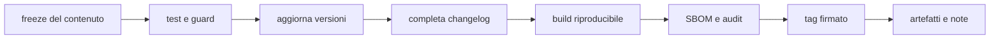

# Versionamento e release

> **Domanda:** quali versioni esistono, chi proteggono e come si prepara un
> rilascio?
> **Fonti autorevoli:** manifest, `ABI_VERSION`, package WIT e `SchemaVersion`.

## Tre promesse

| Versione | Protegge | Fonte |
|---|---|---|
| applicazione e crate | chi compila o installa Fub | `Cargo.toml`, `apps/client/package.json` |
| ABI | plugin già compilati | Rust e `package fub:abi` |
| schema su disco | file che sopravvivono all'app | costanti `SchemaVersion` |

Questi numeri cambiano in momenti diversi.

## Versione dell'applicazione

Il workspace usa una versione comune finché i crate non vengono pubblicati con
cicli indipendenti. Il frontend porta la stessa versione del prodotto.

Prima di `1.0`, una minor può essere incompatibile secondo SemVer, ma una
rottura va comunque dichiarata e motivata.

L'MSRV fa parte della promessa di build. La CI pinna Rust 1.89. Alzarlo è una
decisione deliberata e richiede aggiornamento di manifest, CI e guide.

## Versione ABI

Il contratto corrente è `fub:abi@0.1.1`.

La regola di caricamento:

| Plugin | Host | Esito |
|---|---|---|
| major diversa | qualunque | rifiuto |
| stessa major, minor plugin minore o uguale | più nuovo o uguale | accetto |
| stessa major, minor plugin maggiore | più vecchio | rifiuto |
| versione non valida | qualunque | rifiuto |

La patch non cambia la superficie.

Dopo il freeze, una minor cresce soltanto per aggiunta. Il test confronta il WIT
vivo con gli snapshot in `crates/fub-abi/wit/frozen/`.

Una rottura del contratto non si nasconde aggiornando lo snapshot: richiede la
strategia di compatibilità e, quando necessario, una nuova major.

## Versioni degli schemi

Ogni formato persistente ha una versione propria.

La tabella seguente è l'inventario canonico dei formati persistenti. Il test
[`schemas_on_disk.rs`](../../crates/fub-app/tests/schemas_on_disk.rs) la
confronta in entrambi i versi con le costanti `SchemaVersion`: una riga mancante,
un percorso obsoleto o un numero divergente fanno fallire la CI.

| Schema | Dove | Versione | Contenuto |
|---|---|---:|---|
| registro dei vault | [`crates/fub-host/src/vaults.rs:44`](../../crates/fub-host/src/vaults.rs) | 1 | vault conosciuti dalla macchina |
| organizzazione | [`crates/fub-kernel/src/organization.rs:78`](../../crates/fub-kernel/src/organization.rs) | 1 | albero, icone, spazi e voci appuntate |
| stato di vista | [`crates/fub-kernel/src/viewstate.rs:57`](../../crates/fub-kernel/src/viewstate.rs) | 1 | posizione e stato per esemplare di vista |
| anagrafe | [`crates/fub-kernel/src/entries.rs:142`](../../crates/fub-kernel/src/entries.rs) | 4 | metadati indicizzati delle voci |
| impostazioni | [`crates/fub-kernel/src/settings.rs:89`](../../crates/fub-kernel/src/settings.rs) | 1 | valori per vault e macchina |
| versioning | [`crates/fub-features/src/versioning.rs:261`](../../crates/fub-features/src/versioning.rs) | 1 | snapshot dei file |
| indice di ricerca | [`crates/fub-features/src/search.rs:93`](../../crates/fub-features/src/search.rs) | 5 | campi, opzioni e tokenizer dell'indice |
| registro delle mutazioni | [`crates/fub-kernel/src/journal.rs:177`](../../crates/fub-kernel/src/journal.rs) | 1 | mutazioni applicate al vault |
| bozze | [`crates/fub-kernel/src/drafts.rs:110`](../../crates/fub-kernel/src/drafts.rs) | 1 | contenuto non ancora salvato |
| bundle diagnostico | [`crates/fub-kernel/src/maintenance.rs:232`](../../crates/fub-kernel/src/maintenance.rs) | 1 | copia dei fatti raccolti per la diagnostica |
| sidecar del cestino | [`crates/fub-kernel/src/vault.rs:149`](../../crates/fub-kernel/src/vault.rs) | 1 | provenienza di una voce cestinata |
| workbook `.fubsheet` | [`crates/fub-format-sheet/src/codec.rs:7`](../../crates/fub-format-sheet/src/codec.rs) | 1 | identità, input, ordine, dimensioni, stile e metadati del foglio |

### Derivato

Se il file è ricostruibile:

1. riconosci versione incompatibile;
2. non leggere parzialmente;
3. elimina o isola il derivato;
4. ricostruisci dalla fonte autorevole.

### Autorevole

Se il file contiene dati non ricostruibili:

1. rifiuta una versione futura;
2. migra in una scrittura atomica;
3. conserva il valore precedente in caso di errore;
4. prova upgrade, dati corrotti e interruzione.

Un fallback silenzioso è ammesso soltanto quando la perdita del sidecar non può
perdere il contenuto dell'utente e il comportamento degradato è definito.

## Preparare una release

### Procedura

1. chiudi o sposta fuori dalla release il lavoro incompleto;
2. esegui CI su tutte le piattaforme;
3. verifica WIT e schemi;
4. aggiorna versione del prodotto e lockfile;
5. sposta le voci da `Non rilasciato` alla versione;
6. genera SBOM;
7. costruisci gli artefatti;
8. crea tag e note;
9. verifica installazione e avvio dagli artefatti;
10. riapri `Non rilasciato`.

## Changelog

Il changelog parla a utenti e autori di estensioni. Include:

- capacità nuove;
- cambiamenti osservabili;
- deprecazioni;
- migrazioni;
- vulnerabilità corrette;
- cambi ABI e requisiti di sistema.

Non include la cronaca dei refactor o il conteggio dei test.

## Compatibilità del plugin

Un rilascio che aggiunge una capacità host deve:

- aggiungere la forma in coda quando richiesto dal WIT;
- aggiornare la minor ABI;
- lasciare funzionanti i plugin della stessa major più vecchi;
- dichiarare il fallback quando la nuova capacità non è disponibile;
- aggiornare frozen WIT e test secondo la procedura prevista.
