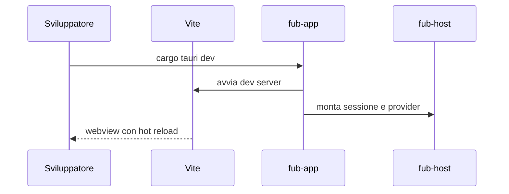

# Installazione e avvio

> **Stato:** implementato  
> **Fonte di verità:** `Cargo.toml`, `frontend/package.json`, `.github/workflows/ci.yml`

Questa procedura avvia la shell Vite e l'app Tauri in modalità sviluppo.

## Prerequisiti

- Rust 1.89;
- Node.js 22;
- npm;
- Tauri CLI;
- dipendenze native della piattaforma.

### Linux Debian/Ubuntu

```bash
sudo apt-get update
sudo apt-get install -y \
  libwebkit2gtk-4.1-dev \
  libappindicator3-dev \
  librsvg2-dev \
  patchelf \
  libgtk-3-dev
```

## Prima installazione

```bash
cd frontend
npm ci
cd ..
```

## Sviluppo desktop

```bash
cargo tauri dev --config crates/fub-app/tauri.conf.json
```



## Build

```bash
cd frontend
npm run build
cd ..
cargo build --release -p fub-app
```

Il binario nativo viene prodotto sotto `target/release/` secondo la piattaforma.

## Aprire un vault senza dialog

```bash
FUB_VAULT="$PWD/tests/fixtures/sample-vault" \
  target/release/fub
```

## Verifica minima

```bash
cargo test --workspace
cd frontend
npm run typecheck
npm test
npm run build
```

La verifica completa è in [CONTRIBUTING.md](../../CONTRIBUTING.md).

## Problemi comuni

| Sintomo | Controllo |
|---|---|
| WebKitGTK non trovato | Installa le dipendenze Linux sopra elencate |
| Target WASM mancante | Installa `wasm32-wasip2` o `wasm32-unknown-unknown` secondo il comando |
| TypeScript verde ma build incoerente | Esegui esplicitamente `npm run typecheck` |
| Baseline visuali diverse | Non rigenerarle fuori da `ubuntu-latest` |

Per gli altri casi consulta [guides/troubleshooting.md](../guides/troubleshooting.md).
