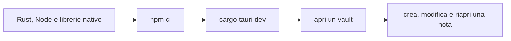

# Installare, avviare e verificare Fub

> **Per chi:** chi apre la repository per la prima volta.
> **Risultato:** una shell desktop avviata e un controllo minimo verde.

## Prerequisiti

| Strumento | Versione |
|---|---|
| Rust | 1.89 |
| Node.js | 22 |
| npm | quello compatibile con il lockfile |
| Tauri CLI | major 2 |
| Git | una versione recente |

Rust 1.89 è il valore di `rust-version` nel workspace e la toolchain usata in
CI. Node 22 è la versione usata dai job frontend e documentazione.

### Linux

Il runner Linux installa le librerie di sviluppo per WebKitGTK, GTK,
AppIndicator, librsvg e `patchelf`. Su distribuzioni Debian o Ubuntu servono
almeno i pacchetti equivalenti a:

```bash
sudo apt-get install \
  libwebkit2gtk-4.1-dev \
  libappindicator3-dev \
  librsvg2-dev \
  libgtk-3-dev \
  patchelf
```

### macOS e Windows

Installa gli strumenti di compilazione richiesti da Rust e Tauri v2. Su Windows
serve il toolchain MSVC; su macOS servono gli Xcode Command Line Tools.

## Installazione

Clona il repository e installa le dipendenze frontend dal lockfile.

```bash
git clone https://github.com/Fubeo/Fub.git
cd Fub

cd apps/client
npm ci
cd ../..
```

Non eseguire `npm install` per aggiornare dipendenze durante il setup: cambierebbe
il lockfile.

## Avvio desktop

```bash
cargo tauri dev --config crates/fub-app/tauri.conf.json
```

Il flusso è:



## Build

```bash
cd apps/client
npm run typecheck
npm run build
cd ../..

cargo build --workspace
cargo tauri build --config crates/fub-app/tauri.conf.json
```

`npm run build` non sostituisce il type-check: Vite traspila, mentre
`npm run typecheck` verifica i tipi.

## Verifica minima

```bash
cargo test --workspace

cd apps/client
npm run typecheck
npm test
npm run build
```

Il ciclo completo è in [`CONTRIBUTING.md`](../../CONTRIBUTING.md).

## Target WASM

I test completi di `fub-wasm-host` costruiscono componenti reali.

```bash
rustup target add wasm32-wasip2
cargo build \
  --manifest-path esempi/ping-wasm/Cargo.toml \
  --target wasm32-wasip2
```

`tools/varco-wasm` usa invece `wasm32-unknown-unknown` per verificare la
generazione dei binding del contratto.

## Problemi comuni

### `cargo tauri` non esiste

Installa una Tauri CLI major 2 e ripeti il comando. Non usare una CLI major 1
con `tauri.conf.json` v2.

### WebKitGTK o GTK mancanti

Installa i pacchetti nativi della tua distribuzione. Un errore di linker o
`pkg-config` non si risolve reinstallando i crate Rust.

### Il test WASM chiede un target

Installa `wasm32-wasip2`. Il test costruisce gli esempi dai sorgenti: un
artefatto `.wasm` precompilato non viene committato.

### Il frontend compila ma la CI fallisce sui tipi

Esegui `npm run typecheck`. Il build Vite non è il controllo TypeScript
autorevole.

### Le baseline visuali differiscono

Le baseline canoniche provengono dal runner Linux. Non aggiornare le immagini da
un altro sistema operativo; usa la procedura descritta in
[`development/testing-and-quality.md`](../development/testing-and-quality.md).
