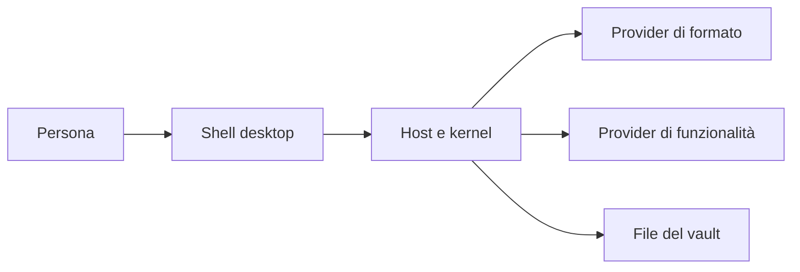

# Panoramica di Fub

> **Stato:** implementato  
> **Fonte di verità:** `README.md`, `crates/`, `frontend/`

Fub è un workspace di scrittura desktop che conserva i contenuti principali in file locali. Non richiede un account e non introduce un database proprietario come unica via di accesso alle note.

## In breve

- il vault è una cartella scelta dall'utente;
- il Markdown è il primo formato supportato, non il formato interno del kernel;
- ricerca, grafo e pannelli ufficiali sono provider;
- la shell è TypeScript, il backend è Rust;
- i plugin WASM sono supportati solo nelle superfici già dichiarate come disponibili.

## Modello mentale

La shell raccoglie il gesto, il backend applica regole e policy, i provider eseguono il lavoro specifico e il vault rimane la sorgente persistente dei contenuti.

## Principi

| Principio | Conseguenza |
|---|---|
| Local-first | Il lavoro normale non dipende da un servizio remoto |
| Formato aperto | Le note principali restano leggibili con altri strumenti |
| Core agnostico | Il kernel non importa Markdown, Tauri o Wasmtime |
| Estensione uniforme | Funzioni native e WASM convergono sugli stessi contratti |
| Errori espliciti | I fallimenti attraversano i confini come dati tipizzati |

## Limiti correnti

Il runtime WASM non offre ancora un percorso utente completo di scoperta, installazione e gestione di ogni tipo di provider. Lo stato preciso è in [architecture/wasm-runtime.md](../architecture/wasm-runtime.md) e il percorso end-to-end mancante è tracciato nell'issue #8.

La serializzazione di un `DocumentModel` generato è *best-effort*: non equivale a un round-trip byte-per-byte della sorgente. La distinzione è spiegata in [architecture/document-model.md](../architecture/document-model.md).

## Prossimi passi

- [Installare e avviare Fub](install-and-run.md)
- [Capire la struttura della repository](repository-layout.md)
- [Leggere l'architettura](../architecture/overview.md)
