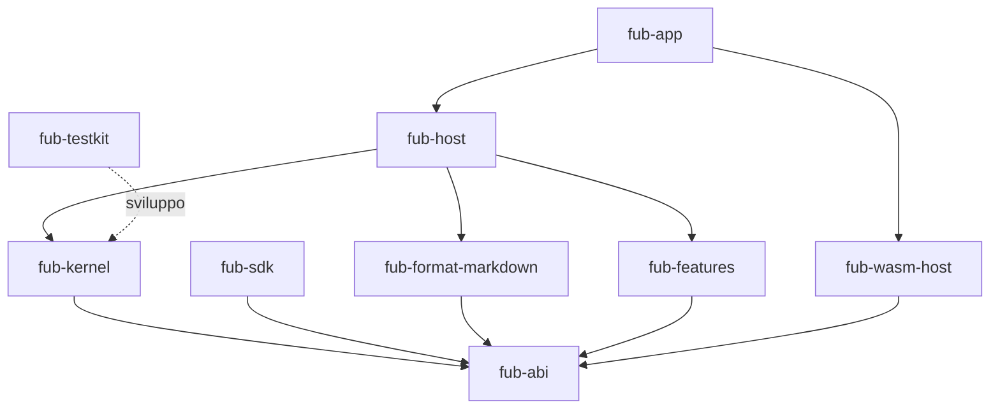

# Struttura della repository

> **Stato:** implementato  
> **Fonte di verità:** albero Git e `Cargo.toml`

La repository separa contratto, kernel, montaggio, adattatori, provider e shell.

```text
Fub/
├── crates/                 workspace Rust
├── frontend/               shell TypeScript
├── esempi/                 componenti WASM di esempio
├── tools/                  strumenti fuori dal workspace
├── docs/                   documentazione canonica e ADR
└── .github/                workflow e controlli automatici
```

## Crate Rust



La direzione delle frecce è una regola architetturale, non una preferenza. I test di dipendenza devono diventare rossi quando un crate attraversa un confine vietato.

## Frontend

| Percorso | Responsabilità |
|---|---|
| `frontend/src/host/` | contratto tipizzato e seam IPC |
| `frontend/src/state/` | stato condiviso, layout ed eventi |
| `frontend/src/ui/` | interprete della UI dichiarativa |
| `frontend/src/panels/` | pannelli e superfici applicative |
| `frontend/src/editor/` | CodeMirror, preview e comandi di editing |
| `frontend/src/theme/` | token, ricette, skin e caricamento temi |
| `frontend/bench/` | prove visuali e accessibilità |

## Codice fuori dal workspace

`tools/varco-wasm/` e gli esempi WASM restano fuori dal workspace principale perché richiedono target aggiuntivi. La build normale non deve obbligare ogni contributore a installare quei target.

## Dove aggiungere una modifica

| Modifica | Casa |
|---|---|
| Tipo condiviso o trait | `fub-abi` |
| Regola del vault | `fub-kernel` |
| Montaggio o lifecycle | `fub-host` |
| Funzione ufficiale | `fub-features` |
| Semantica Markdown | `fub-format-markdown` |
| Adattatore Wasmtime | `fub-wasm-host` |
| Comando Tauri | `fub-app` solo se richiede Tauri |
| Interazione grafica | `frontend/src/` |

La descrizione dei singoli crate è in [reference/crates.md](../reference/crates.md).
