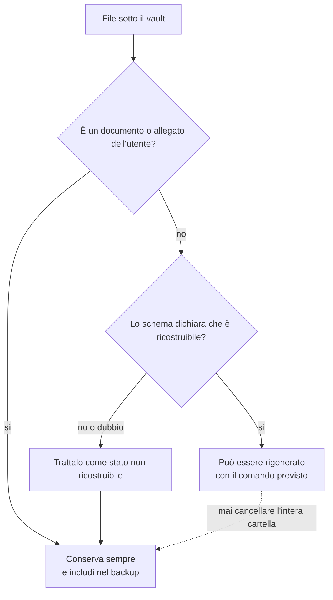
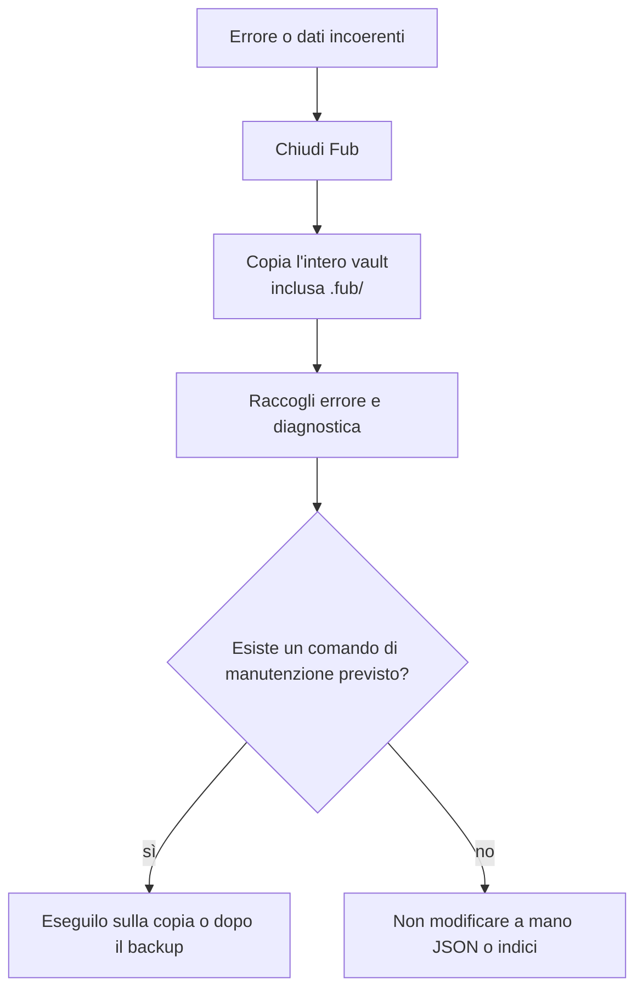

# Dati, backup e recupero

## Regola più importante

Non cancellare tutta `.fub/` o tutta `.fub/data/` pensando che contengano soltanto cache. Alcuni dati sono ricostruibili; altri conservano informazioni che non esistono nelle note, come bozze, organizzazione della sidebar, stato delle viste, snapshot e metadati di recupero.

La vecchia documentazione applicava una regola troppo ampia alla cartella `.fub/data/`; questa pagina la sostituisce.

## Tre categorie

### File dell'utente

Sono documenti e allegati del vault. Sono la sorgente principale e devono entrare sempre nel backup.

### Stato non ricostruibile

Comprende, secondo le funzionalità attive:

- impostazioni del vault;
- organizzazione manuale, note fissate e stato delle viste;
- bozze non ancora salvate;
- registro delle mutazioni;
- snapshot di versioning;
- informazioni necessarie a ripristinare correttamente elementi dal cestino.

Questi dati devono essere trattati come parte del backup.

### Dati ricostruibili

Indici di ricerca, anagrafi e altre cache possono essere rigenerati dal vault. La possibilità di rigenerare un singolo file è definita dal relativo schema, non dal fatto che si trovi sotto una cartella chiamata `data`.

## Backup consigliato

Per un backup completo copia il vault intero, inclusa `.fub/`, mentre Fub è chiuso. Non escludere automaticamente le cartelle nascoste.

Per un backup minimo delle sole note puoi copiare documenti e allegati, ma perderai preferenze, organizzazione, bozze, versioni e altri dati applicativi.

## Cestino e versioni

La cancellazione deve passare dal cestino gestito dal vault, non da una rimozione definitiva. Gli snapshot di versioning sono una rete di sicurezza, non una copia completa del vault e non sostituiscono un backup esterno.

## In caso di problema

1. chiudi Fub;
2. crea una copia completa del vault, inclusa `.fub/`;
3. non modificare manualmente file JSON o indici finché non hai una copia;
4. raccogli il messaggio d'errore e il bundle diagnostico, se disponibile;
5. prova una ricostruzione soltanto attraverso i comandi di manutenzione previsti dall'applicazione.

I formati e le regole di compatibilità sono descritti in [`versionamento.md`](../versionamento.md) e in [`architecture/on-disk-layout.md`](../architecture/on-disk-layout.md).