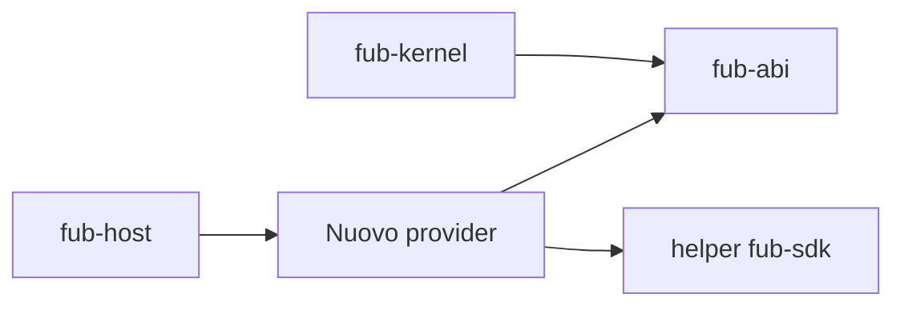

# Creare un provider nativo

> **Stato:** implementato  
> **Fonte di verità:** `fub-abi`, `fub-sdk`, `fub-features` e test dei bundle

Questa guida descrive il percorso comune per aggiungere una funzionalità nativa senza introdurre un canale speciale.

## 1. Scegli il punto di estensione

| Esigenza | Trait o canale |
|---|---|
| Leggere o generare un formato | `FormatProvider` |
| Esporre una vista | `ViewProvider` |
| Rispondere a query | `IndexProvider` |
| Eseguire un'azione | `CommandProvider` |
| Reagire a fatti | `EventHandler` |
| Esporre una capacità condivisa | servizio dichiarato nel contratto |

Se nessun trait esprime la semantica, apri una RFC prima di modificare l'ABI.

## 2. Implementa contro `fub-abi`

Il provider dipende dal contratto, non dal kernel concreto. Riceve soltanto le API previste e restituisce tipi pubblici.



## 3. Scrivi il test del provider

Usa `fub-sdk::testing::MemoryHost` per la logica isolata. Il fake deve fallire su operazioni non configurate invece di restituire dati plausibili ma falsi.

## 4. Monta il bundle

Registra il provider nel bundle proprietario. Ogni registrazione deve avere owner e teardown. Se la feature è opzionale, collegala a una Cargo feature indipendente.

## 5. Verifica l'integrazione

Usa `fub-testkit` quando servono kernel, host, filesystem ed eventi reali.

```bash
cargo test -p fub-features
cargo build -p fub-features --no-default-features
cargo test --workspace
```

## 6. Aggiorna la documentazione

- pagina canonica del comportamento;
- riferimento al contratto, se cambia;
- ADR per una decisione accettata;
- issue per lavoro ancora aperto.

Non aggiungere un documento di pianificazione dentro le guide.
