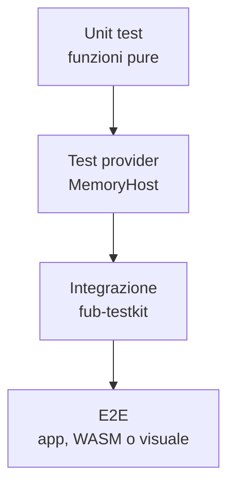

# Strategia di test

> **Stato:** implementato  
> **Fonte di verità:** suite Rust, Vitest, Playwright e workflow CI

Fub usa il livello più piccolo che possa dimostrare la proprietà, poi conclude le modifiche trasversali con la suite completa.

## Piramide



## Rust

| Livello | Strumento |
|---|---|
| Funzione pura | `#[cfg(test)]` nel modulo |
| Contratto/provider | `fub-sdk::testing::MemoryHost` |
| Host/kernel/storage | `fub-testkit::{Bench, Mounted}` |
| Contratto | test in `crates/fub-abi/tests/` |
| Cross-platform | matrice Linux, Windows e macOS |

## Frontend

- Vitest e happy-dom;
- fake host comune in `frontend/src/host/fake.ts`;
- test colocati `*.test.ts`;
- gate deterministici per race e fault;
- niente test basati su attese arbitrarie con `setTimeout`.

## Visuale e accessibilità

```bash
cd frontend
npm run bench:verify
npm run bench:a11y
```

Le baseline a pixel sono canoniche su `ubuntu-latest`. Non vanno rigenerate e committate da un altro sistema operativo.

## Contratti

Un cambio di ABI richiede almeno:

- conformità Rust ↔ WIT;
- additività rispetto alle baseline congelate;
- mirror TypeScript;
- fake host;
- parità nativo/WASM per la superficie disponibile.

## Comando finale

```bash
cargo test --workspace
cd frontend
npm run typecheck
npm test
npm run build
```

Aggiungi i controlli Node pertinenti indicati in [CONTRIBUTING.md](../../CONTRIBUTING.md).
