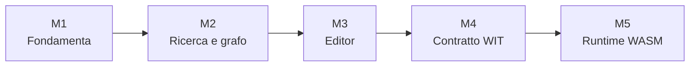

# Milestone

Le milestone descrivono obiettivi tecnici di ampia portata. Lo stato sintetico e l'ordine corrente restano in [`../PIANO.md`](../PIANO.md); le singole attività aperte restano in [`../todo.md`](../todo.md).

| Milestone | Stato | Documento |
|---|---|---|
| M1 — fondamenta local-first | **Completata** | Non esiste un documento separato: il risultato è descritto nella guida e in [`../STATO.md`](../STATO.md). |
| M2 — ricerca e grafo | **Completata** | [`M2-search-graph.md`](M2-search-graph.md) |
| M3 — fedeltà dell'editor | **Completata** | [`M3-editor-fidelity.md`](M3-editor-fidelity.md) |
| M4 — irrobustimento WIT | **Completata** | [`M4-wit-hardening.md`](M4-wit-hardening.md) |
| M5 — runtime WASM | **In corso** | [`M5-wasm-runtime.md`](M5-wasm-runtime.md) |

I documenti di milestone possono contenere criteri, prove e storia implementativa più dettagliati. Non usarli per ricostruire a mano il backlog: le voci ancora attive devono comparire in `todo.md`.