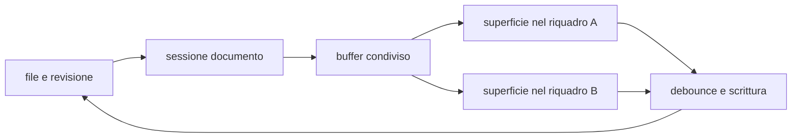

# Editor e anteprima

> **Per chi:** chi usa o modifica l'esperienza di scrittura.
> **Risultato:** capire buffer, modalità, salvataggio e responsabilità locali.

## Modalità

Il documento Markdown può essere mostrato come:

- **sorgente**, con la sintassi esplicita;
- **live preview**, che mantiene l'editing e riduce il rumore della sintassi;
- **lettura**, che mostra la resa senza cursore di testo.

Il provider Markdown interpreta la sorgente. La shell possiede CodeMirror,
focus, selezione, scroll, tema e lifecycle.

## Flusso

## Documento e superficie

Un documento aperto in più riquadri condivide:

- testo;
- revisione di base;
- stato dirty;
- coda di salvataggio;
- bozza;
- ultimo esito di scrittura.

Ogni superficie conserva invece:

- cursore e selezioni;
- scroll;
- modalità;
- focus;
- la propria history nativa di undo e redo.

Questa distinzione impedisce di creare due copie concorrenti dello stesso
buffer e, allo stesso tempo, evita che il cursore di un riquadro muova quello
dell'altro.

## Offset e terminatori

Il contratto Rust usa span in byte UTF-8. CodeMirror usa offset JavaScript. Il
ponte di conversione è una responsabilità esplicita e coperta da test.

La sorgente conserva i terminatori di riga. Caricare o sincronizzare un
documento non deve normalizzare CRLF involontariamente.

## Undo, redo e selezione

L'editor offre due piani distinti:

1. undo e redo del contenuto, legati alla superficie;
2. undo di un comando applicato dal core, descritto nel suo esito.

Nel piano del contenuto, i comandi visibili sono `Mod-z` per annullare e
`Mod-y` per rifare. Sono disponibili anche `Mod-Shift-z` su macOS e
`Ctrl-Shift-z` su Linux per rifare. `Mod-u` annulla l'ultima selezione e `Alt-u`
la rifà; su macOS il redo della selezione è `Mod-Shift-u`. `Mod` indica il
modificatore della piattaforma.

Gli undo e redo del contenuto sono disponibili anche negli eventi di modifica
del browser `historyUndo` e `historyRedo`. Le battute adiacenti vengono
raggruppate secondo le regole native dell'editor; composizione, incolla,
cancellazione, sostituzione e modifiche multi-cursore conservano i propri
confini osservabili. La history della selezione è distinta da quella del
contenuto.

Una modifica ricevuta da un altro riquadro aggiorna il testo ma non diventa una
battuta nella history della superficie destinataria. Se il cambio esterno è
disgiunto, i rami locali restano disponibili e seguono il nuovo testo. Se
invece tocca in modo ambiguo il contenuto che una superficie potrebbe ancora
annullare, l'editor mantiene il testo esterno e scarta in sicurezza i rami undo
e redo di quella superficie. Questa perdita conservativa impedisce a un undo
stale di riportare contenuto già sovrascritto.

## Salvataggio e conflitti

La shell accoda le scritture per documento. Il core applica la revisione di
base. Un contenuto esterno più recente produce un conflitto esplicito.

Una chiusura non deve distruggere la superficie prima che flush e protezione
della bozza abbiano avuto il proprio esito.

## Preview e contenuto non fidato

La preview usa le forme prodotte dal provider e le policy della webview. HTML
grezzo o contenuto attivo non deve diventare automaticamente codice eseguibile.

La UI dichiarativa di un plugin WASM dovrà passare da
`UiNode::validate_untrusted()` prima di raggiungere la shell; questo lavoro è
tracciato nell'issue [#10](https://github.com/Fubeo/Fub/issues/10).

## Superfici condivise

`TextEngine` è il motore testuale corrente della shell e fornisce la meccanica
condivisa. L'unico percorso montato dall'utente è l'editor Markdown, che passa
da `createEditor()` e `MarkdownProfile`.

`PlainTextProfile` e `FormulaProfile` sono clienti architetturali reali dello
stesso `TextEngine`: vengono esercitati dai test dedicati e dalla fixture a tre
profili, ma non sono superfici esposte all'utente. La loro presenza dimostra il
seam interno; non introduce una nuova modalità del prodotto né anticipa
`DocumentSession` o altre fasi successive.

Il coordinamento del buffer resta nel pannello documento e nessun profilo invia
una chiamata IPC o WASM per ogni battuta.

## Dove si trova

- `apps/client/src/editor/`
- `apps/client/src/panels/document.ts`
- `apps/client/src/state/`
- `crates/fub-abi/src/edit.rs`
- `crates/fub-abi/src/session.rs`
- `crates/fub-kernel/src/drafts.rs`
