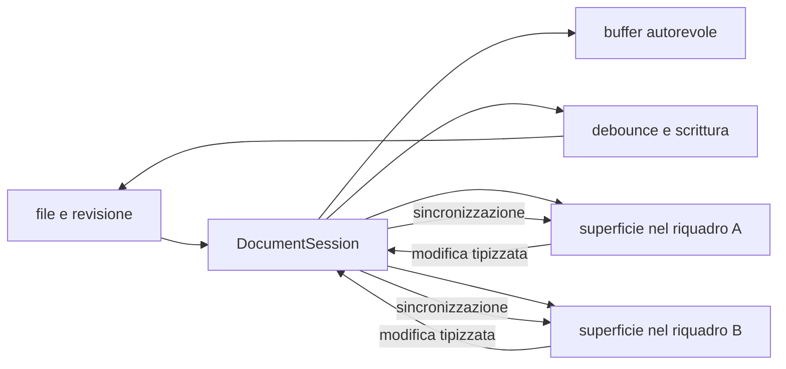

# Editor e anteprima

> **Per chi:** chi usa o modifica l'esperienza di scrittura.
> **Risultato:** capire la sessione documento, il buffer condiviso, il
> salvataggio e le responsabilità locali.

## Modalità

Ogni superficie dichiara le modalità che supporta. Il documento Markdown offre:

- **sorgente**, con la sintassi esplicita;
- **live preview**, che mantiene l'editing e riduce il rumore della sintassi;
- **lettura**, che mostra la resa senza cursore di testo.

La superficie plain text offre soltanto **sorgente**: non simula capacità
Markdown. I documenti `.fubsheet` usano invece la modalità **foglio** della
famiglia Grid; se il provider Grid non è servito, la stessa superficie resta
navigabile e mostra gli input grezzi senza un secondo valutatore formule.
Il commutatore nella barra di ciascun riquadro legge la dichiarazione della
propria superficie; con una sola modalità non mostra un selettore. Il riquadro
ricorda la modalità scelta per ogni famiglia di superfici: una nota in Sorgente
non fa aprire la tela seguente come JSON, e la tela non cambia la modalità in
cui si riapre la nota.
Le scorciatoie seguono il riquadro attivo. La modalità delle note in una
finestra nuova viene da `editor.default-mode`; un riquadro diviso eredita
quelle del riquadro da cui nasce. I divisori fra riquadri si trascinano, si spostano con le frecce
e tornano a parti uguali con un doppio clic; le proporzioni restano nel layout
finché la fila non cambia.

Il tema di serie è quieto: neutri caldi, una carta antracite al buio e avorio
in luce (mai il nero o il bianco puri), e un accento salvia desaturato per
focus e azioni primarie. La selezione del testo usa un fondo neutro; nella
scocca la voce scelta si legge dal fondo, senza tacche d'accento. Le superfici
che si aprono si posano con un moto lento e morbido; con il moto ridotto
compaiono subito. I titoli usano
l'inchiostro del documento in tutte e tre le modalità — solo i `#` restano
sintassi colorata — e i link resi usano lo stesso inchiostro dei wikilink.
Il ritmo verticale è lo stesso in Live e Lettura: un passo sotto ogni
blocco, due passi sopra i titoli di sezione. In Live il ritmo vive sui
widget (i margini dei figli non escono dal blocco isolato).
Font, corpo, interlinea e misura rispettano le preferenze di lettura.

L'editor testuale supporta folding, selezioni multiple e rettangolari,
indentazione, liste intelligenti, matching e chiusura delle parentesi. L'incolla
da HTML passa dal sanitizzatore e viene convertito in Markdown, tabelle,
barrato ed elenchi di attività GFM compresi; testo semplice e Markdown
dichiarato restano invece input autorevole. Un allegato depositato incollando o
trascinando si incorpora se la lettura lo sa mostrare (immagini, audio, video,
PDF) e diventa un link col suo nome altrimenti; una nota trascinata dall'albero
diventa un wikilink nel punto in cui cade. Correttore ortografico, modalità
Vim, numeri di riga (visibili in Sorgente), a capo automatico e unità di
rientro sono preferenze di macchina aggiornate senza rimontare la sessione.
Valgono per le superfici di documento: la barra delle formule e l'editor di
cella della griglia sono campi con una disposizione fissa, senza numeri di
riga, Vim o correttore.
La direzione del testo è automatica per riga e la misura leggibile riusa la
preferenza di aspetto.

## Codice e diagrammi Mermaid

I blocchi di codice dichiarano il linguaggio dopo i backtick di apertura.
Sorgente e Live caricano la colorazione del linguaggio quando serve, senza
caricare tutti i parser all'avvio.

Un blocco con linguaggio `mermaid` mostra un diagramma in Live e Lettura,
anche dentro una nota trasclusa. In Live, portare il cursore nel blocco o usare
**Apri sorgente** rende nuovamente modificabile il testo. Selezioni e
multi-cursori mantengono visibili i blocchi che toccano; un blocco ancora privo
della chiusura resta sorgente durante l'editing.

La resa usa Mermaid incluso nell'app, senza un servizio esterno. Segue la luce
chiara o scura e conserva la sorgente in una sezione espandibile. Un errore di
sintassi o di caricamento mostra il motivo e apre la sorgente: non modifica il
documento e non impedisce di rendere i diagrammi successivi.

La configurazione usa la modalità di sicurezza `strict`, protegge i limiti di
Mermaid e non consente alla nota di sostituire la policy o il CSS della shell.
La vista finale è un'immagine SVG inerte, senza callback del diagramma.
Restano i vincoli della CSP della webview, compreso il blocco delle immagini
remote. Il rendering accetta fino a 50.000 caratteri di sorgente per diagramma;
il limite Mermaid degli archi è 500. Il cambio di superficie rilascia gli
osservatori e gli URL delle immagini; una risposta vecchia non rimonta il
diagramma.

I link espliciti contenuti nel diagramma diventano controlli adiacenti
navigabili soltanto per destinazioni `http`, `https`, `mailto` o frammenti
locali. Lo SVG resta un'immagine inerte: non porta callback o navigazione propria
nella webview.

## Formule

Le formule inline usano `$…$`; quelle a blocco `$$…$$`. KaTeX e il suo CSS si
caricano soltanto quando una superficie contiene una formula. Il renderer non
considera formule il codice, i dollari escapati o delimitatori incompleti.
Sorgenti oltre 20.000 caratteri e formule che superano i limiti di espansione o
dimensione mostrano un errore leggibile conservando il testo originale.

## Sintassi estesa e viste strutturali

La resa condivisa supporta task, highlight, callout annidati e ripiegabili,
wikilink con alias, heading e block id, tabelle, note a piè di pagina etichettate
e inline. Nelle immagini Markdown il suffisso dell'alt `|larghezza` o
`|larghezzaxaltezza` imposta dimensioni numeriche senza entrare nel testo
alternativo.

I commenti `%%…%%` su una riga restano nel file e nel modello, con i
delimitatori, ma non compaiono nella resa: in Lettura spariscono insieme a
link, tag ed evidenziati che contengono, in Live restano visibili e attenuati
solo sulla riga del cursore.

Immagini e media del vault si risolvono con la regola dei link del kernel:
un'immagine Markdown con path relativo parte dalla nota, un embed `![[nome]]`
si cerca per nome. I byte arrivano dal
protocollo `fub-asset:` tramite un lease chiuso quando la resa si smonta; un
riferimento che non si risolve resta marcato come non risolto. Negli embed
`![[file|120]]` e `![[file|200x100]]` il suffisso è una dimensione, non
un'etichetta. Audio e video diventano un player con controlli, un PDF un
collegamento al visualizzatore dedicato.

In Live i callout diventano un blocco reso quando il cursore è fuori, e i
recinti con info string dichiarata (Mermaid, formule) si comportano allo stesso
modo. Le formule in riga sono rese fuori dalla riga attiva e l'ID di blocco
finale di un blocco è nascosto, come in Lettura.

La vista Struttura può spostare una sezione fra fratelli adiacenti con una
singola modifica protetta dalla revisione osservata. La vista Note a piè di
pagina raggruppa riferimenti, definizioni, note inline e orfani; ogni voce
mantiene lo span UTF-8 usato per rivelare la sorgente.

## Flusso

## Documento e superficie

Un documento aperto in più riquadri condivide, tramite un'unica
`DocumentSession`:

- testo;
- revisione di base;
- stato dirty;
- coda di salvataggio;
- bozza;
- ultimo esito di scrittura.

La sessione coordina questo buffer autorevole e il suo lifecycle. Ogni
superficie conserva invece:

- cursore e selezioni;
- scroll;
- modalità;
- focus;
- la propria history nativa di undo e redo.

Questa distinzione impedisce di creare due copie concorrenti dello stesso
buffer e, allo stesso tempo, evita che il cursore di un riquadro muova quello
dell'altro. Il pannello collega e scollega le superfici visibili, ma non
coordina il buffer, il salvataggio o il fan-out delle modifiche.

## Offset e terminatori

Il contratto Rust usa span in byte UTF-8. CodeMirror usa offset JavaScript. Il
ponte di conversione è una responsabilità esplicita e coperta da test.

La sorgente conserva i terminatori di riga. Caricare o sincronizzare un
documento non deve normalizzare CRLF involontariamente.

## Undo, redo e selezione

L'editor offre due piani distinti:

1. undo e redo del contenuto, legati alla superficie;
2. undo di un comando applicato dal core, descritto nel suo esito.

Nel piano del contenuto, i comandi visibili sono `Mod-z` per annullare e
`Mod-y` per rifare. Sono disponibili anche `Mod-Shift-z` su macOS e
`Ctrl-Shift-z` su Linux per rifare. `Mod-u` annulla l'ultima selezione e `Alt-u`
la rifà; su macOS il redo della selezione è `Mod-Shift-u`. `Mod` indica il
modificatore della piattaforma.

Gli undo e redo del contenuto sono disponibili anche negli eventi di modifica
del browser `historyUndo` e `historyRedo`. Le battute adiacenti vengono
raggruppate secondo le regole native dell'editor; composizione, incolla,
cancellazione, sostituzione e modifiche multi-cursore conservano i propri
confini osservabili. La history della selezione è distinta da quella del
contenuto.

Una modifica ricevuta da un altro riquadro aggiorna il testo ma non diventa una
battuta nella history della superficie destinataria. Se il cambio esterno è
disgiunto, i rami locali restano disponibili e seguono il nuovo testo. Se
invece tocca in modo ambiguo il contenuto che una superficie potrebbe ancora
annullare, l'editor mantiene il testo esterno e scarta in sicurezza i rami undo
e redo di quella superficie. Questa perdita conservativa impedisce a un undo
stale di riportare contenuto già sovrascritto.

I filtri dei profili regolano l'input locale, non il testo ricevuto dalla
sessione. La sincronizzazione li esclude e verifica testo e origine della
transazione prima di applicarla: un profilo non può riscrivere il buffer
autorevole o trasformare un cambio remoto in un undo locale.

## Salvataggio e conflitti

La `DocumentSession` accoda le scritture per documento. Il core applica la
revisione di base. Un contenuto esterno più recente produce un conflitto
esplicito. Un conflitto non si ritenta da solo: autosave e flush aspettano la
scelta dell'utente, e «Usa disco» scarta il buffer e la bozza solo dopo aver
letto il file. Una bozza recuperata senza revisione di base, su un file che
esiste, rientra direttamente in conflitto invece di sovrascriverlo.

Il rilascio dell'ultima tab esegue il flush della scrittura e, se necessario,
della bozza prima di chiudere la sessione; il lifecycle del riquadro e
dell'editor resta separato da quello del documento. Durante la conferma di una
cancellazione gli editor del documento restano aperti ma in sola lettura finché
la decisione non risolve.

## Preview e contenuto non fidato

La preview usa le forme prodotte dal provider e le policy della webview. I
blocchi HTML attraversano l'allowlist del sanitizzatore prima di diventare nodi
DOM; classi e attributi `data-*` scritti nella nota non possono imitare i
contratti privati della shell. Script, iframe, handler e URL di risorsa remoti
restano inattivi. Se un blocco non contiene alcun elemento consentito, la
sorgente resta leggibile invece di produrre un riquadro vuoto. Il Markdown
dentro un blocco HTML non viene reinterpretato.

La UI dichiarativa di un plugin WASM passa da `UiNode::validate_untrusted()`
prima di raggiungere la shell; `Html` e `WebView` sono rifiutati per
`Trust::Community`. Il percorso consegnato attraversa `ViewProvider` e la
validazione non fidata prima di raggiungere la shell.

## Superfici condivise

`DocumentSurfaceRegistry` sceglie la superficie con precedenza esplicita:
override dell'utente, formato, specie della sorgente, fallback testuale, viewer
per byte ed errore. Le collisioni nominano entrambi gli owner; la rimozione di
un owner distrugge le istanze che possiede.

Registratore, slide e stampa compaiono nel menu del riquadro soltanto quando la
superficie montata li sa fare: la stampa c'è anche per il canvas, non per lo
sheet, che non ha un provider di stampa. Trascinare una nota o un allegato
scrive un rimando nella sintassi del formato. Un punto chiesto da outline,
backlink, ricerca o segnalibri si apre nel riquadro che mostra quel documento;
sul canvas è la carta che lo contiene. Se la vista corrente non ci arriva, un
avviso lo dice.

`TextEngine` è il motore testuale condiviso. Markdown e plain text sono percorsi
utente distinti montati dal registro sullo stesso motore; `FormulaProfile`
alimenta la formula bar e l'unico editor in-cell riusabile della griglia.

La `DocumentSession` coordina buffer, salvataggio, bozza, conflitti e lifecycle;
il pannello collega le superfici e aggiorna la resa. Nessun profilo invia una
chiamata IPC o WASM per ogni battuta.

Popup e keymap locale precedono i comandi della superficie. La shell ordina poi
i layer superficie, profilo, documento, riquadro e globale. I comandi
indisponibili sulla superficie attiva non entrano nella palette né nel router;
i renderer non installano listener globali propri.
Note giornaliere, template, note uniche e casuali, inserimento data/ora,
slash, compositore e statistiche sono comandi e provider ufficiali sullo
stesso buffer e registro: giornaliere con cartella, formato data e template
configurabili e orologio deterministico; template con variabili chiuse e merge
delle proprietà; slash e palette condividono registro, contesto valido e flush
senza toccare il buffer. Il menu `/` offre i comandi che lo dichiarano nella
propria spec (`surfaces`: `slash` sempre, `slash_selection` solo con del testo
selezionato, che riempie il primo parametro di testo obbligatorio): la shell
non ne tiene un elenco, e un plugin vi entra con la stessa dichiarazione;
estrazione e merge pianificano riferimenti e dati
prima di eliminare la sorgente; le statistiche contano anche lingue senza
spazi con aggiornamenti incrementali. Di una nota in prosa contano il sorgente;
di un formato strutturato (canvas, base) il testo del suo modello, non il JSON
o lo YAML che lo tiene.

## Formato pilota `.fubsheet`

Il formato persistente della griglia è un documento JSON testuale versionato.
Conserva input, ordine, dimensioni, stile, proprietà e identità stabili di
sheet, righe e colonne. L'indirizzo A1 dipende invece dall'ordine corrente:
riordinare una riga sposta l'indirizzo senza cambiare l'identità della cella.

La superficie mostra intestazioni, celle e selezione rettangolare in una
viewport virtualizzata. Supporta tastiera, editor in-cell, formula bar,
copia/incolla TSV e undo/redo del workbook. Invio conferma la cella, Esc
annulla la modifica e uscire dalla cella (o dalla formula bar) la conferma;
una modifica peer strutturata conserva la bozza locale, mentre una
riscrittura completa autorevole la annulla.

Tab e Maiusc+Tab percorrono le celle visibili; raggiunti i due estremi,
lasciano la griglia e proseguono verso gli altri controlli della shell.

Valori calcolati, AST delle formule, dipendenze, cache ed errori non vengono
salvati nel file: il valutatore Rust li ricostruisce dai dati autorevoli. Se il
valutatore non è disponibile, anche perché il bundle `fub.sheet` è disabilitato,
la griglia resta modificabile e mostra gli input grezzi. Nessuna battuta
attraversa IPC; la valutazione parte dopo il commit e una risposta stantia non
sostituisce lo stato corrente.

Outline, ricerca e proprietà sono proiezioni del workbook, non un adattamento a
`DocumentModel`. Il protocollo Grid v1 è promosso in ABI/WIT e mirror
TypeScript insieme ai consumatori nativo e WASM; famiglia, versione e fallback
sono negoziati prima dell'invocazione. Limiti, coordinate, diff UTF-8 e
invalidazione sono normati in [ABI e WIT](../reference/abi-and-wit.md).

## Dove si trova

- `apps/client/src/editors/core/`
- `apps/client/src/editors/text/profiles/markdown/`
- `apps/client/src/panels/document.ts`
- `apps/client/src/state/`
- `crates/fub-abi/src/edit.rs`
- `crates/fub-abi/src/session.rs`
- `crates/fub-kernel/src/drafts.rs`
- `crates/fub-format-sheet/src/lib.rs`
