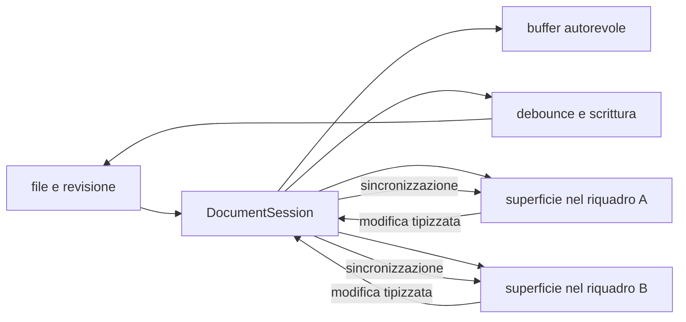

# Editor e anteprima

> **Per chi:** chi usa o modifica l'esperienza di scrittura.
> **Risultato:** capire la sessione documento, il buffer condiviso, il
> salvataggio e le responsabilità locali.

## Modalità

Il catalogo delle modalità vive sulla superficie (`SurfaceModeful`) e nelle
factory che la montano, non nei contratti generici `EditorSurface` e
`TextEditorSurface`. La superficie Markdown dichiara:

- **sorgente** (`source`), con la sintassi esplicita;
- **live preview** (`live_preview`), che mantiene l'editing e riduce il rumore
  della sintassi;
- **lettura** (`reading`), che mostra la resa senza cursore di testo.

Il `defaultMode` di Markdown è `live_preview`. Plain text dichiara soltanto
`source`, con `defaultMode: "source"`. Fallback, viewer ed error non sono
modeful e non espongono un catalogo.

Il provider Markdown interpreta la sorgente. La shell possiede CodeMirror,
focus, selezione, scroll, tema e lifecycle.

## Flusso

## Documento e superficie

Un documento aperto in più riquadri condivide, tramite un'unica
`DocumentSession`:

- testo;
- revisione di base;
- stato dirty;
- coda di salvataggio;
- bozza;
- ultimo esito di scrittura.

La sessione coordina questo buffer autorevole e il suo lifecycle. Ogni
superficie conserva invece:

- cursore e selezioni;
- scroll;
- modalità;
- focus;
- la propria history nativa di undo e redo.

Questa distinzione impedisce di creare due copie concorrenti dello stesso
buffer e, allo stesso tempo, evita che il cursore di un riquadro muova quello
dell'altro. Il pannello collega e scollega le superfici visibili, ma non
coordina il buffer, il salvataggio o il fan-out delle modifiche.

## Offset e terminatori

Il contratto Rust usa span in byte UTF-8. CodeMirror usa offset JavaScript. Il
ponte di conversione è una responsabilità esplicita e coperta da test.

La sorgente conserva i terminatori di riga. Caricare o sincronizzare un
documento non deve normalizzare CRLF involontariamente.

## Undo, redo e selezione

L'editor offre due piani distinti:

1. undo e redo del contenuto, legati alla superficie;
2. undo di un comando applicato dal core, descritto nel suo esito.

Nel piano del contenuto, i comandi visibili sono `Mod-z` per annullare e
`Mod-y` per rifare. Sono disponibili anche `Mod-Shift-z` su macOS e
`Ctrl-Shift-z` su Linux per rifare. `Mod-u` annulla l'ultima selezione e `Alt-u`
la rifà; su macOS il redo della selezione è `Mod-Shift-u`. `Mod` indica il
modificatore della piattaforma.

Gli undo e redo del contenuto sono disponibili anche negli eventi di modifica
del browser `historyUndo` e `historyRedo`. Le battute adiacenti vengono
raggruppate secondo le regole native dell'editor; composizione, incolla,
cancellazione, sostituzione e modifiche multi-cursore conservano i propri
confini osservabili. La history della selezione è distinta da quella del
contenuto.

Una modifica ricevuta da un altro riquadro aggiorna il testo ma non diventa una
battuta nella history della superficie destinataria. Se il cambio esterno è
disgiunto, i rami locali restano disponibili e seguono il nuovo testo. Se
invece tocca in modo ambiguo il contenuto che una superficie potrebbe ancora
annullare, l'editor mantiene il testo esterno e scarta in sicurezza i rami undo
e redo di quella superficie. Questa perdita conservativa impedisce a un undo
stale di riportare contenuto già sovrascritto.

## Salvataggio e conflitti

La `DocumentSession` accoda le scritture per documento. Il core applica la
revisione di base. Un contenuto esterno più recente produce un conflitto
esplicito.

Il rilascio dell'ultima tab esegue il flush della scrittura e, se necessario,
della bozza prima di chiudere la sessione; il lifecycle del riquadro e
dell'editor resta separato da quello del documento. Durante la conferma di una
cancellazione gli editor del documento restano aperti ma in sola lettura finché
la decisione non risolve.

## Preview e contenuto non fidato

La preview usa le forme prodotte dal provider e le policy della webview. HTML
grezzo o contenuto attivo non deve diventare automaticamente codice eseguibile.

La UI dichiarativa di un plugin WASM dovrà passare da
`UiNode::validate_untrusted()` prima di raggiungere la shell; questo lavoro è
tracciato nell'issue [#10](https://github.com/Fubeo/Fub/issues/10).

## Superfici condivise

`TextEngine` è il motore testuale della shell e
`DocumentSurfaceRegistry` è il registro interno che sceglie la superficie per
ogni documento. Il registro appartiene alla shell (`apps/client/src`), mentre
ogni factory appartiene all'owner della registrazione che la espone; la shell
registra le factory Markdown e plain text.

L'API pubblica del registro è `register` (con disposer), `select` e `mount`.
`select` espone soltanto la chiave opaca della selezione; la factory resta
interna e `mount` è l'unico costruttore pubblico della superficie.

Un override sceglie una sola registrazione: per `registrationId`, per
`owner` più `formatKey`, oppure per `owner` più `family` e `profile`.
Stringhe, factory nude, bag opzionali e forme malformate non sono override
validi. Se l'input è malformato o la registrazione indicata è stata rimossa, la
superficie mostra un errore esplicito e non applica un fallback silenzioso.

Il `destroy()` pubblico di una superficie montata e il disposer della
registrazione sono idempotenti. La disinstallazione rimuove i binding e
distrugge le superfici gestite; una superficie creata mentre la factory
disinstalla rientrantemente la propria registrazione viene pulita e il mount
fallisce, senza restituire una superficie non gestita.

Il pannello riusa la superficie soltanto quando coincide la chiave opaca di
selezione (`r.selectionKey === selected.key`). `family` e `profile` non sono
l'identità di riuso: più registrazioni con la stessa coppia restano
distinguibili. La selezione passa da override, `formatKey` esatto, `species`,
coppia `family`-`profile` non ambigua, viewer a byte, fallback testuale e
superficie di errore. Le collisioni sui binding esatti nominano entrambi gli
owner e non applicano “vince l'ultimo”; più corrispondenze `family`-`profile`
mostrano un errore visibile con entrambi gli owner.

Il fallback testuale è una superficie DOM con `family: "text"` e
`profile: "fallback"`, non un `TextEditorSurface`. Il viewer ha famiglia
`viewer`; gli errori hanno famiglia `error`. `DomSurface` espone
`role="region"`, aggiorna `aria-readonly` e `dataset.surfaceTheme`, e ha un
`destroy()` idempotente.

`TextEditorSurface` è generico e offre `setDoc`, `syncDoc`, `selections` e
`revealByteOffset`; non conosce Markdown. `MarkdownEditorSurface` con profilo
`markdown` aggiunge `setSyntaxForms` e `setLivePreview`. `PlainTextSurface` con
profilo `plain-text` non espone API Markdown vuote. Plain text è un client
architetturale della shell, non una funzionalità del vault: questa distinzione
non descrive un percorso in cui l'utente apre file `.txt` dal vault. Il fake
host tratta come documento soltanto `.md`.

L'identità del formato resta temporanea: `surfaceRequestForDocument(id)`
inferisce path ed estensione senza ricevere `handledExtensions`. Markdown usa
`md` e `markdown` o l'id `text/markdown`; testo piano usa `plain`, `text` e
`txt` o l'id `text/plain`; byte usa `bin`, `blob`, `bytes`, `dat`, `opaque` e
`binary`. Ogni altro id produce `family: "text"` e `profile: "unknown"` e
raggiunge il fallback testuale. Un'estensione gestita da un provider, come
`note` o `fubsheet`, non diventa automaticamente Markdown. `handledExtensions`
e `VaultInfo.extensions` restano dati per esploratore e note di cartella, non
identità del formato; non esiste un `format_id` IPC e `FormatDescriptor.id` in
Rust non è un campo di `VaultInfo`.

`PaneMode` resta l'ABI `source | live_preview | reading` di
`ViewContext.mode`. Il pannello conserva la modalità persistita del riquadro e
calcola `effectiveMode` rispetto al catalogo della superficie: il valore
persistito può restare `live_preview` anche per plain text, mentre chrome e
contesto seguono `effectiveMode`; il contesto pubblica `live_preview` solo se
la superficie attiva lo dichiara.

Il pannello applica `surface.setMode(effectiveMode)` e non invoca
`setLivePreview`: su Markdown `setMode` mappa già `live_preview`, `source` e
`reading`. Il commutatore `#mode-switch` si ricostruisce dal catalogo della
superficie con il focus. Senza documento o con fallback, viewer o error non
modeful il commutatore non crea bottoni; Markdown conserva Sorgente, Live e
Lettura con le chiavi i18n esistenti. Non esiste un `DocumentModeRegistry`
parallelo.

L'arbitrato della tastiera è centralizzato nella shell e segue l'ordine
overlay transitorio, editor locale in modifica, superficie attiva, profilo
attivo, comandi del documento, comandi del riquadro e comandi globali. I livelli
di superficie e profilo sono punti di estensione no-op. Il percorso non
intercetta undo/redo nativi: i tre accordi di `PASSED_TO_EDITOR` restano
dell'editor quando il focus è dentro `.cm-editor`.

Un riquadro o una finestra vuoti contengono il solo chrome, senza un
`EditorView` Markdown finto. La `DocumentSession` coordina buffer, salvataggio,
bozza, conflitti e lifecycle; il pannello collega le superfici e aggiorna la
resa. Nessun profilo invia una chiamata IPC o WASM per ogni battuta.

Non esiste una griglia (`GridEngine`) né un percorso utente `.fubsheet`; il
contratto generico non consegna `live_preview` a questi percorsi.

## Dove si trova

- `apps/client/src/editors/core/registry.ts`
- `apps/client/src/editors/bootstrap.ts`
- `apps/client/src/editors/text/factories.ts`
- `apps/client/src/editor/`
- `apps/client/src/panels/document.ts`
- `apps/client/src/state/`
- `apps/client/src/ui/arbitration.ts`
- `apps/client/src/ui/keyboard.ts`
- `crates/fub-abi/src/edit.rs`
- `crates/fub-abi/src/session.rs`
- `crates/fub-kernel/src/drafts.rs`
