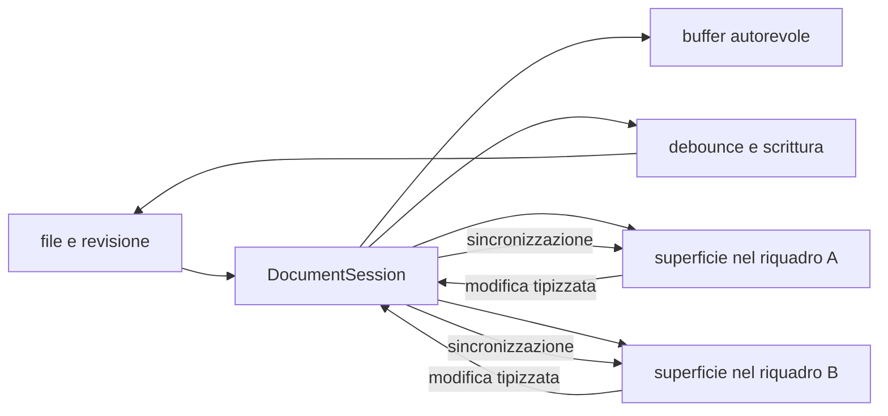

# Editor e anteprima

> **Per chi:** chi usa o modifica l'esperienza di scrittura.
> **Risultato:** capire la sessione documento, il buffer condiviso, il
> salvataggio e le responsabilità locali.

## Modalità

Ogni superficie dichiara le modalità che supporta. Il documento Markdown offre:

- **sorgente**, con la sintassi esplicita;
- **live preview**, che mantiene l'editing e riduce il rumore della sintassi;
- **lettura**, che mostra la resa senza cursore di testo.

La superficie plain text offre soltanto **sorgente**: non simula capacità
Markdown. Il commutatore della shell legge la dichiarazione della superficie
attiva; cambiando tab cambia anche l'insieme dei pulsanti e delle scorciatoie
disponibili.

## Flusso

## Documento e superficie

Un documento aperto in più riquadri condivide, tramite un'unica
`DocumentSession`:

- testo;
- revisione di base;
- stato dirty;
- coda di salvataggio;
- bozza;
- ultimo esito di scrittura.

La sessione coordina questo buffer autorevole e il suo lifecycle. Ogni
superficie conserva invece:

- cursore e selezioni;
- scroll;
- modalità;
- focus;
- la propria history nativa di undo e redo.

Questa distinzione impedisce di creare due copie concorrenti dello stesso
buffer e, allo stesso tempo, evita che il cursore di un riquadro muova quello
dell'altro. Il pannello collega e scollega le superfici visibili, ma non
coordina il buffer, il salvataggio o il fan-out delle modifiche.

## Offset e terminatori

Il contratto Rust usa span in byte UTF-8. CodeMirror usa offset JavaScript. Il
ponte di conversione è una responsabilità esplicita e coperta da test.

La sorgente conserva i terminatori di riga. Caricare o sincronizzare un
documento non deve normalizzare CRLF involontariamente.

## Undo, redo e selezione

L'editor offre due piani distinti:

1. undo e redo del contenuto, legati alla superficie;
2. undo di un comando applicato dal core, descritto nel suo esito.

Nel piano del contenuto, i comandi visibili sono `Mod-z` per annullare e
`Mod-y` per rifare. Sono disponibili anche `Mod-Shift-z` su macOS e
`Ctrl-Shift-z` su Linux per rifare. `Mod-u` annulla l'ultima selezione e `Alt-u`
la rifà; su macOS il redo della selezione è `Mod-Shift-u`. `Mod` indica il
modificatore della piattaforma.

Gli undo e redo del contenuto sono disponibili anche negli eventi di modifica
del browser `historyUndo` e `historyRedo`. Le battute adiacenti vengono
raggruppate secondo le regole native dell'editor; composizione, incolla,
cancellazione, sostituzione e modifiche multi-cursore conservano i propri
confini osservabili. La history della selezione è distinta da quella del
contenuto.

Una modifica ricevuta da un altro riquadro aggiorna il testo ma non diventa una
battuta nella history della superficie destinataria. Se il cambio esterno è
disgiunto, i rami locali restano disponibili e seguono il nuovo testo. Se
invece tocca in modo ambiguo il contenuto che una superficie potrebbe ancora
annullare, l'editor mantiene il testo esterno e scarta in sicurezza i rami undo
e redo di quella superficie. Questa perdita conservativa impedisce a un undo
stale di riportare contenuto già sovrascritto.

## Salvataggio e conflitti

La `DocumentSession` accoda le scritture per documento. Il core applica la
revisione di base. Un contenuto esterno più recente produce un conflitto
esplicito.

Il rilascio dell'ultima tab esegue il flush della scrittura e, se necessario,
della bozza prima di chiudere la sessione; il lifecycle del riquadro e
dell'editor resta separato da quello del documento. Durante la conferma di una
cancellazione gli editor del documento restano aperti ma in sola lettura finché
la decisione non risolve.

## Preview e contenuto non fidato

La preview usa le forme prodotte dal provider e le policy della webview. HTML
grezzo o contenuto attivo non deve diventare automaticamente codice eseguibile.

La UI dichiarativa di un plugin WASM dovrà passare da
`UiNode::validate_untrusted()` prima di raggiungere la shell; questo lavoro è
tracciato nell'issue [#10](https://github.com/Fubeo/Fub/issues/10).

## Superfici condivise

`DocumentSurfaceRegistry` sceglie la superficie con precedenza esplicita:
override dell'utente, formato, specie della sorgente, fallback testuale, viewer
per byte ed errore. Le collisioni nominano entrambi gli owner; la rimozione di
un owner distrugge le istanze che possiede.

`TextEngine` è il motore testuale condiviso. Markdown e plain text sono percorsi
utente distinti montati dal registro sullo stesso motore; `FormulaProfile`
alimenta la formula bar e l'unico editor in-cell riusabile della griglia.

La `DocumentSession` coordina buffer, salvataggio, bozza, conflitti e lifecycle;
il pannello collega le superfici e aggiorna la resa. Nessun profilo invia una
chiamata IPC o WASM per ogni battuta.

Popup e keymap locale precedono i comandi della superficie. La shell ordina poi
i layer superficie, profilo, documento, riquadro e globale. I comandi
indisponibili sulla superficie attiva non entrano nella palette né nel router;
i renderer non installano listener globali propri.

## Formato pilota `.fubsheet`

Il formato persistente della griglia è un documento JSON testuale versionato.
Conserva input, ordine, dimensioni, stile, proprietà e identità stabili di
sheet, righe e colonne. L'indirizzo A1 dipende invece dall'ordine corrente:
riordinare una riga sposta l'indirizzo senza cambiare l'identità della cella.

La superficie mostra intestazioni, celle e selezione rettangolare in una
viewport virtualizzata. Supporta tastiera, editor in-cell, formula bar,
copia/incolla TSV e undo/redo del workbook. Commit, cancel e blur sono
espliciti; una modifica peer strutturata conserva la bozza locale, mentre una
riscrittura completa autorevole la annulla.

Valori calcolati, AST delle formule, dipendenze, cache ed errori non vengono
salvati nel file: il valutatore Rust li ricostruisce dai dati autorevoli. Se il
valutatore non è disponibile, anche perché il bundle `fub.sheet` è disabilitato,
la griglia resta modificabile e mostra gli input grezzi. Nessuna battuta
attraversa IPC; la valutazione parte dopo il commit e una risposta stantia non
sostituisce lo stato corrente.

Outline, ricerca e proprietà sono proiezioni del workbook, non un adattamento a
`DocumentModel`. Il protocollo della vertical slice è ancora interno: ABI e WIT
saranno estesi soltanto dopo la misura di finestre, operazioni e lifecycle.

## Dove si trova

- `apps/client/src/editor/`
- `apps/client/src/editors/core/`
- `apps/client/src/panels/document.ts`
- `apps/client/src/state/`
- `crates/fub-abi/src/edit.rs`
- `crates/fub-abi/src/session.rs`
- `crates/fub-kernel/src/drafts.rs`
- `crates/fub-format-sheet/src/lib.rs`
