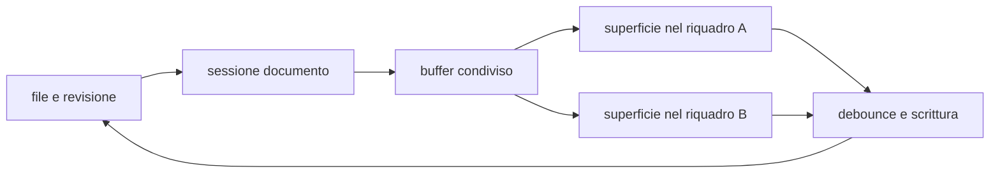

# Editor e anteprima

> **Per chi:** chi usa o modifica l'esperienza di scrittura.
> **Risultato:** capire buffer, modalità, salvataggio e responsabilità locali.

## Modalità

Il documento Markdown può essere mostrato come:

- **sorgente**, con la sintassi esplicita;
- **live preview**, che mantiene l'editing e riduce il rumore della sintassi;
- **lettura**, che mostra la resa senza cursore di testo.

Il provider Markdown interpreta la sorgente. La shell possiede CodeMirror,
focus, selezione, scroll, tema e lifecycle.

## Flusso

## Documento e superficie

Un documento aperto in più riquadri condivide:

- testo;
- revisione di base;
- stato dirty;
- coda di salvataggio;
- bozza;
- ultimo esito di scrittura.

Ogni superficie conserva invece:

- cursore e selezioni;
- scroll;
- modalità;
- focus;
- pila locale di undo.

Questa distinzione impedisce di creare due copie concorrenti dello stesso
buffer e, allo stesso tempo, evita che il cursore di un riquadro muova quello
dell'altro.

## Offset e terminatori

Il contratto Rust usa span in byte UTF-8. CodeMirror usa offset JavaScript. Il
ponte di conversione è una responsabilità esplicita e coperta da test.

La sorgente conserva i terminatori di riga. Caricare o sincronizzare un
documento non deve normalizzare CRLF involontariamente.

## Undo

Esistono due piani distinti:

1. undo locale dell'editor, legato alla superficie;
2. undo di un comando applicato dal core, descritto nel suo esito.

Una modifica ricevuta da un altro riquadro aggiorna il testo ma non entra nella
pila locale come se fosse stata digitata lì.

## Salvataggio e conflitti

La shell accoda le scritture per documento. Il core applica la revisione di
base. Un contenuto esterno più recente produce un conflitto esplicito.

Una chiusura non deve distruggere la superficie prima che flush e protezione
della bozza abbiano avuto il proprio esito.

## Preview e contenuto non fidato

La preview usa le forme prodotte dal provider e le policy della webview. HTML
grezzo o contenuto attivo non deve diventare automaticamente codice eseguibile.

La UI dichiarativa di un plugin WASM dovrà passare da
`UiNode::validate_untrusted()` prima di raggiungere la shell; questo lavoro è
tracciato nell'issue [#10](https://github.com/Fubeo/Fub/issues/10).

## Superfici condivise

Il motore testuale contiene già parti riusabili, ma il profilo Markdown è ancora
composto con esse. L'estrazione di un `TextEngine` generico non è architettura
corrente: richiede un secondo cliente reale ed è tracciata nell'issue
[#11](https://github.com/Fubeo/Fub/issues/11).

La regola che guida quel lavoro è semplice: la shell può fornire motori comuni;
un plugin li configura, ma non invia codice JavaScript o un'operazione IPC per
ogni battuta.

## Dove si trova

- `apps/client/src/editor/`
- `apps/client/src/panels/document.ts`
- `apps/client/src/state/`
- `crates/fub-abi/src/edit.rs`
- `crates/fub-abi/src/session.rs`
- `crates/fub-kernel/src/drafts.rs`
