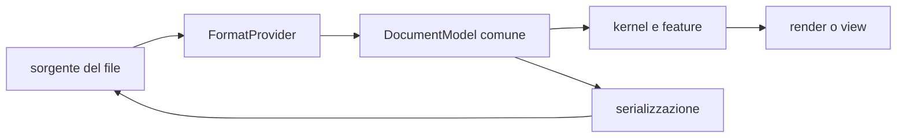

# Panoramica del prodotto

> **Domanda:** che cosa offre Fub, senza confondere il prodotto corrente con le
> idee future?

## In breve

Fub è un'app desktop local-first per lavorare su un vault di file. I documenti
restano file leggibili e modificabili da altri programmi. Il core non incorpora
Markdown: usa contratti comuni e provider sostituibili.

Le capacità correnti si concentrano su scrittura, organizzazione, ricerca,
navigazione dei collegamenti, sicurezza delle modifiche ed estensibilità.

## Principi

### I file dell'utente restano autorevoli

Il testo vive nel vault, non in un database proprietario obbligatorio. Fub può
creare metadati e indici nella cartella `.fub/`, ma distingue ciò che non può
essere ricostruito dalle cache eliminabili.

### Local-first

La normale apertura, modifica e ricerca non richiedono account o servizio
remoto. Il workspace corrente non include un client HTTP nel percorso
principale dell'app.

### Formati come provider

`fub-kernel` lavora su `DocumentModel`, `DocId`, query, comandi ed eventi. Il
provider Markdown conosce frontmatter, wikilink, tag e sintassi specifica.

### Estensione senza rami speciali

Comandi, view, indici, import, export, sintassi e renderer entrano attraverso
registri. Le feature ufficiali sono provider nativi; i componenti di terzi
possono attraversare il runtime WASM quando la relativa interfaccia è servita.

## Capacità correnti

### Vault e file

- apertura di un vault;
- albero di file e cartelle;
- creazione, lettura, scrittura e rinomina;
- cestino con ripristino;
- bozze e versioning;
- organizzazione della sidebar;
- indici e anagrafe ricostruibili.

### Scrittura

- editor CodeMirror;
- sorgente, live preview e lettura;
- frontmatter;
- wikilink, tag, heading, task, tabelle, callout ed embed supportati dal
  provider Markdown;
- revisioni e conflitti espliciti;
- sincronizzazione fra più riquadri sullo stesso documento.

### Navigazione e conoscenza

- ricerca full-text persistente;
- backlink e vicini;
- risoluzione di link per nome, alias e path;
- outline, proprietà e tag;
- Graph View resa dalla shell.

### Estensibilità

- contratto Rust e WIT;
- registri generici per provider;
- feature ufficiali selezionabili con feature Cargo;
- plugin nativi nel composition root;
- runtime WASM funzionante per lifecycle e comandi;
- capability applicate nel kernel.

## Stato delle grandi aree

| Area | Stato |
|---|---|
| Markdown local-first | disponibile nel codice |
| editor, preview e shell | disponibili nel codice |
| ricerca, backlink e grafo | disponibili nel codice |
| plugin nativi | disponibili nel codice |
| runtime WASM | parziale, M5 in corso |
| installazione di plugin di terzi | non completata |
| superfici di editing riusabili | proposta in issue, non architettura corrente |
| database, sync, collaborazione, publishing, AI e marketplace | non sono capacità consegnate |

Una descrizione dettagliata di un'idea non la rende parte del prodotto. Lo stato
autorevole è in [`../project/status.md`](../project/status.md).

## Approfondimenti

- [Vault e file](vault-and-files.md)
- [Editor e anteprima](editor-and-preview.md)
- [Ricerca, link e grafo](search-links-and-graph.md)
- [Plugin ed estensioni](plugins-and-extensions.md)
- [Architettura](../architecture/overview.md)
