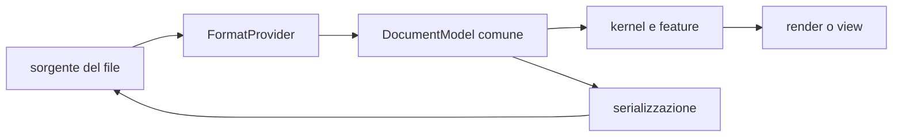

# Panoramica del prodotto

> **Domanda:** che cosa offre Fub, senza confondere il prodotto corrente con le
> idee future?

## In breve

Fub è un'app desktop local-first per lavorare su un vault di file. I documenti
restano file leggibili e modificabili da altri programmi. Il core non incorpora
Markdown: usa contratti comuni e provider sostituibili.

Le capacità correnti si concentrano su scrittura, organizzazione, ricerca,
navigazione dei collegamenti, sicurezza delle modifiche ed estensibilità.

## Principi

### I file dell'utente restano autorevoli

Il testo vive nel vault, non in un database proprietario obbligatorio. Fub può
creare metadati e indici nella cartella `.fub/`, ma distingue ciò che non può
essere ricostruito dalle cache eliminabili.

### Local-first

La normale apertura, modifica e ricerca non richiedono account o servizio
remoto. La build predefinita include un client HTTP (feature `http-client` di
`fub-host`). Chi lo usa passa dalla `Guard` e deve avere il permesso
`fub:network`, che si può spegnere per ogni componente. Sync e pubblicazione
si connettono soltanto all'endpoint configurato sulla macchina.

### Confine della prima release

La prima release resta local-first e non include la sincronizzazione
distribuita del vault. Watcher, catch-up e riaggancio (`rejoin`) riallineano
soltanto lo stato locale; la sincronizzazione fra superfici riguarda i
riquadri e le sessioni dello stesso workspace locale.

Non vengono promessi due repliche, un trasporto, la convergenza fra dispositivi
o l'assenza di perdita in caso di guasti distribuiti. Questa capacità utente
non è quindi pubblicata.

### Formati come provider

`fub-kernel` lavora su `DocumentModel`, `DocId`, query, comandi ed eventi. Il
provider Markdown conosce frontmatter, wikilink, tag e sintassi specifica.

### Estensione senza rami speciali

Comandi, view, indici, import, export, sintassi e renderer entrano attraverso
registri. Le feature ufficiali sono provider nativi; i componenti di terzi
possono attraversare il runtime WASM quando la relativa interfaccia è servita.

## Capacità correnti

### Vault e file

- apertura di un vault;
- albero di file e cartelle;
- creazione, lettura, scrittura e rinomina;
- cestino con ripristino;
- bozze e versioning;
- organizzazione della sidebar;
- indici e anagrafe ricostruibili.

### Scrittura

- editor CodeMirror per Markdown e plain text;
- griglia `.fubsheet` virtualizzata con tastiera, selezione, editor in-cell,
  formula bar, TSV e undo dedicato;
- sorgente, live preview e lettura per Markdown;
- frontmatter;
- wikilink, tag, heading, task, tabelle, callout ed embed supportati dal
  provider Markdown;
- revisioni e conflitti espliciti;
- sincronizzazione fra più riquadri dello stesso documento nella stessa
  sessione locale.

La shell monta Markdown, plain text e `.fubsheet` attraverso
`DocumentSurfaceRegistry`. I profili testuali condividono `TextEngine`; la
griglia incorpora `FormulaProfile` e delega il calcolo autorevole al motore
Rust, con fallback sugli input grezzi quando non è disponibile.

### Navigazione e conoscenza

- ricerca full-text persistente;
- backlink e vicini;
- risoluzione di link per nome, alias e path;
- outline, proprietà e tag;
- Graph View resa dalla shell.

### Estensibilità

- contratto Rust e WIT;
- registri generici per provider;
- feature ufficiali selezionabili con feature Cargo;
- plugin nativi nel composition root;
- runtime WASM per lifecycle, comandi, formati, view e griglia nei casi
  esercitati;
- inventario macchina con installazione, consenso, enabled/disabled, restart e
  remove;
- capability applicate nel kernel.

## Stato delle grandi aree

| Area | Stato |
|---|---|
| Markdown local-first | disponibile nel codice |
| editor, preview e shell | disponibili nel codice |
| ricerca, backlink e grafo | disponibili nel codice |
| plugin nativi | disponibili nel codice |
| runtime WASM e provider M5 | consegnati in `main` |
| installazione di plugin di terzi | percorso file singolo disponibile in `main` |
| database, sincronizzazione distribuita, collaborazione, publishing, AI e marketplace | non sono capacità consegnate |

Una descrizione dettagliata di un'idea non la rende parte del prodotto. Lo
stato autorevole è in [`../project/status.md`](../project/status.md).

## Approfondimenti

- [Vault e file](vault-and-files.md)
- [Editor e anteprima](editor-and-preview.md)
- [Ricerca, link e grafo](search-links-and-graph.md)
- [Plugin ed estensioni](plugins-and-extensions.md)
- [Architettura](../architecture/overview.md)
