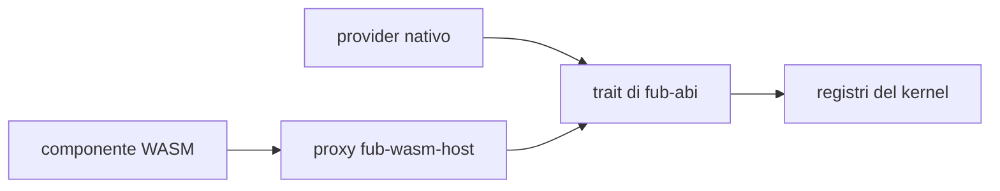

# Plugin ed estensioni

> **Per chi:** chi vuole capire come Fub cresce senza modificare il kernel.
> **Risultato:** distinguere feature ufficiali, provider nativi e componenti WASM.

## Tre livelli

### Feature ufficiali

Vivono in `fub-features` e sono abilitate da feature Cargo indipendenti. Sono
codice fidato distribuito con l'app, ma entrano attraverso gli stessi trait e
registri usati dalle estensioni.

### Provider nativi

Sono oggetti Rust montati dall'host. Hanno accesso soltanto ai servizi forniti
dal contratto, ma condividono il processo e il livello di fiducia del binario.

### Componenti WASM

Sono componenti `wasm32-wasip2` caricati da `fub-wasm-host`. L'adattatore
implementa i trait Rust e reinoltra le chiamate attraverso il component model.

Il kernel riceve il trait, non un enum `Native | Wasm`.

## Cosa può registrare un bundle

Il contratto comprende famiglie per:

- formato;
- comando;
- view;
- indice;
- eventi;
- import ed export;
- sintassi e renderer;
- servizi.

Un bundle dichiara manifest, versione ABI, fiducia, permessi e registrazioni.
L'host possiede mount, attivazione, disattivazione e smontaggio.

## Permessi

I permessi sono capability con namespace e, quando serve, parametri. Il kernel
applica la policy tramite un solo `Guard`.

Un componente WASM non riceve filesystem o rete direttamente. Le host function
inoltrano a un `HostApi` già protetto. Le famiglie non linkate rendono
impossibile il mount e vengono nominate nell'errore.

## Stato del runtime WASM

In `main` sono consegnati:

- caricamento e istanziazione di un componente;
- manifest e lifecycle `Plugin`;
- `CommandProvider`, `FormatProvider`, `ViewProvider` e `GridProvider` nei
  casi esercitati;
- `IndexProvider` ed `EventHandler` inbound reali, con feed, query, flush,
  close, `up_to_date`, reconcile e consegna delle notifiche nello stesso
  registro del nativo;
- lettura del modello ed eventi host;
- inventario macchina, installazione, consenso, enabled/disabled, restart e
  remove tramite il percorso desktop;
- catalogo firmato con installazione, aggiornamento, rollback e revoca;
- errori e permessi tipizzati;
- timeout a epoche e limite di memoria;
- validazione della UI non fidata, teardown e parità nativo/WASM nei casi
  coperti.

Anche un provider consegnato non è montato automaticamente: capability dichiarata, consenso
`granted`, scelta `enabled` e capability effettiva del `Guard` restano fatti
distinti. Il percorso è consegnato in `main`; le famiglie ancora differite
restano elencate nella pagina di stato.

## Compatibilità

Il manifest dichiara la versione ABI. L'host accetta la stessa major e una minor
non superiore, perché il contratto congelato cresce soltanto per aggiunta.

Un plugin più nuovo dell'host viene rifiutato prima dell'attivazione. Una
versione non valida non viene interpretata per tentativi.

## Limiti per gli autori

- un componente non invia DOM, callback o estensioni CodeMirror;
- il lavoro breve deve rispettare la deadline;
- il lavoro lungo usa i job;
- una capability non concessa produce un errore, non accesso parziale;
- UI e payload ricorsivi hanno limiti di profondità;
- lo storage è namespaced per plugin;
- la disponibilità di una famiglia host va verificata prima di assumerla.

La procedura tecnica è in
[`../development/plugin-authoring.md`](../development/plugin-authoring.md).
