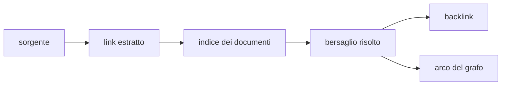

# Ricerca, link e grafo

> **Per chi:** chi cerca informazioni o segue relazioni nel vault.
> **Risultato:** distinguere indice, risoluzione dei link, backlink e resa.

## Ricerca

La ricerca full-text è una feature ufficiale. Mantiene un indice persistente e
incrementale, ma il vault resta la fonte autorevole.

Durante una ricostruzione, il canale dati espone lo stato
dell'indicizzazione. Un indice assente o incompatibile può essere rigenerato.

Le query attraversano la porta generica dell'indice; non nasce un comando IPC
per ogni filtro.
Il linguaggio è un albero di clausole in OR e letterali in AND con negazione
per foglia. Le foglie testo, regex e task vivono nell'indice full-text;
proprietà, tag, cartella, path, estensione e link usano i metadati e il grafo
del kernel. Testo significa termini in AND o frase esatta, con tolleranza
esatta o refusi che restringono invece di allargare; `case_sensitive` e le
regex lavorano sui campi memorizzati con limiti dichiarati di pattern,
documenti e byte. La stessa espressione vale per ricerca globale, viste,
query salvate e ricerca incorporata: il pianificatore instrada ogni foglia al
proprietario e ricompone l'AND/OR senza divergenze.

La riga della barra di ricerca ha una sintassi propria, compilata in quella
stessa espressione dalla regola `fub_abi::rules::search_syntax`. La sua gemella
TypeScript è legata da una fixture, così la barra della shell, `fub-cli search`
e i blocchi `query` incorporati leggono le stesse parole allo stesso modo:

- parole separate da spazi in AND, `"frase esatta"`, `-x` per negare, `OR`
  maiuscolo fra alternative e `( … )` per raggruppare;
- `/regex/`, e i filtri di proprietà `[chiave]`, `[chiave:valore]`,
  `[chiave:>v]`, `[chiave:<v]`, con valori numerici, booleani o date ISO
  confrontati per specie;
- gli operatori `tag:`, `path:`, `folder:`, `file:`, `content:`, `heading:`,
  `ext:`, `task:todo`, `task:done` e `match-case:`, con valore anche fra
  virgolette.

Un nome seguito da `:` che non è un operatore resta testo, così un orario o un
URL non producono un errore. Un errore di sintassi porta la specie e la
colonna, e la barra lo mostra al posto dei risultati. Un gruppo negato non è
ammesso, e un'espressione che dopo la distribuzione supera 32 alternative viene
rifiutata.

I tag di una nota sono quelli nel testo e quelli dichiarati dalla chiave `tags`
del frontmatter, come elenco o come stringa separata da virgole o spazi. Il
kernel e l'indice full-text applicano la stessa regola.

## Link

Il provider estrae dalla sorgente l'intento del link:

- wikilink;
- URL;
- path;
- heading o ancora;
- embed.

Il kernel risolve l'intento rispetto al vault e agli indici correnti. La
sorgente conserva ciò che l'utente ha scritto; la risoluzione è un dato
derivato.
Wikilink e path seguono regole diverse: il primo risolve per path con slash,
nome e alias con priorità deterministica fra omonimi; il secondo solo per
path relativo al documento. Heading e blocchi condividono slug e ancore
canoniche; un punto rinominato apre la nota senza inventare una destinazione.
Completamento e cambio rapido propongono nomi per pertinenza senza riordinare
nella shell, e la rinomina riscrive soltanto i wikilink che nominavano la nota.
Il pannello mostra incoming, outgoing con contesto per riferimento, menzioni
non collegate in entrata e in uscita con filtro, e la conversione esplicita
della menzione in `[[bersaglio]]` con revisione e span dichiarati.
Il pannello tag mostra gerarchia piatta o ad albero, ordinamento per nome o
conteggio e selezione multipla per esemplare; click e selezione lanciano la
stessa domanda tag dell'indice tramite RunSearch. Pannelli collegati e backlink
nel documento sono opzioni di presentazione degli stessi dati, non indici
duplicati.

Passando sopra un wikilink in Lettura, dopo un breve ritardo compare la nota
collegata in una scheda di sola lettura; in Live serve Ctrl/Cmd, per non
disturbare chi scrive. La scheda legge dal canale dati come gli embed, non apre
sessioni né buffer, e si chiude uscendo dal link e dalla scheda o con Esc. Un
link che non si risolve non apre niente.

## Backlink e vicini

Un backlink parte dal documento sorgente e conserva un contesto leggibile. Le
query per vicini e direzione usano gli stessi dati di identità del grafo.

Un file non letto o non parsato non può produrre link affidabili; l'apertura lo
dichiara invece di inventare un grafo completo.

## Graph View

Il provider ufficiale prepara un payload dichiarativo con nodi e archi. La
shell possiede il renderer Canvas e l'interazione. Il kernel non conosce pixel,
camera o animazioni. Il payload dichiara vista locale fino a tre passi, gruppi
per cartella o primo tag, filtri per orfani e allegati e timestamp di modifica;
assenti valgono il grafo globale. Posizione e animazione restano stato effimero
della shell.

Questo confine deve restare stabile:

- il provider decide **quali dati** mostrare;
- la shell decide **come** disegnarli;
- il frontend non legge strutture interne del kernel;
- refresh e lifecycle seguono il registro delle view.

Il Canvas occupa una superficie separata dallo stato testuale e dall'elenco
delle note. L'elenco si apre con mouse o tastiera, mostra 50 note per pagina e
scorre nel proprio spazio, senza intercettare i gesti del grafo. L'inquadratura
iniziale attende che la superficie abbia dimensioni valide.

La modularizzazione del renderer è tracciata nell'issue
[#12](https://github.com/Fubeo/Fub/issues/12). La prova di scala e durata è
nell'issue [#6](https://github.com/Fubeo/Fub/issues/6).

## Comportamenti da non confondere

| Comportamento | Autorità |
|---|---|
| testo del link | file |
| tipo e span del link | modello prodotto dal formato |
| bersaglio risolto | kernel e indice |
| risultato della ricerca | provider di indice |
| payload della view | provider Graph View |
| posizione e animazione dei nodi | shell |
| preferenze grafiche | stato della shell |

- la Graph View non sostituisce la ricerca testuale;
- un arco non prova che il bersaglio sia ancora raggiungibile dopo una modifica
  non indicizzata;
- il layout visuale non è dato persistente del documento;
- il comando esplicito **Riscalda** riattiva il loop; il runner lo verifica con
  un campione di 120 frame, senza tenere il lavoro acceso indefinitamente;
- per cardinalità fino a 400 nodi la repulsione è esatta O(n²); da 401 a 2000
  nodi usa Barnes–Hut con costo atteso O(n log n) e collisioni; oltre 2000 usa
  Barnes–Hut atteso e omette le collisioni;
- lo sleep del loop è preservato quando alpha, camera e trascinamento non
  richiedono lavoro;
- i valori osservati e i criteri provvisori sono raccolti nel
  [budget di performance](performance-budget.md#budget-proposti-e-stato) e nei
  [criteri di acceptance](acceptance.md);
- il benchmark misura una fixture deterministica, non ogni grafo possibile:
  quadtree con nodi clustered o coincidenti può avvicinarsi al caso peggiore
  O(n²), quindi il risultato a 10k non è una garanzia universale;
- le issue [#6](https://github.com/Fubeo/Fub/issues/6) e
  [#12](https://github.com/Fubeo/Fub/issues/12) sono chiuse; il residuo heap
  trasferito a [#56](https://github.com/Fubeo/Fub/issues/56) è stato verificato
  e chiuso.
