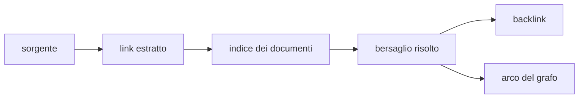

# Ricerca, link e grafo

> **Per chi:** chi cerca informazioni o segue relazioni nel vault.
> **Risultato:** distinguere indice, risoluzione dei link, backlink e resa.

## Ricerca

La ricerca full-text è una feature ufficiale. Mantiene un indice persistente e
incrementale, ma il vault resta la fonte autorevole.

Durante una ricostruzione, il canale dati espone lo stato
dell'indicizzazione. Un indice assente o incompatibile può essere rigenerato.

Le query attraversano la porta generica dell'indice; non nasce un comando IPC
per ogni filtro.

## Link

Il provider estrae dalla sorgente l'intento del link:

- wikilink;
- URL;
- path;
- heading o ancora;
- embed.

Il kernel risolve l'intento rispetto al vault e agli indici correnti. La
sorgente conserva ciò che l'utente ha scritto; la risoluzione è un dato
derivato.

## Backlink e vicini

Un backlink parte dal documento sorgente e conserva un contesto leggibile. Le
query per vicini e direzione usano gli stessi dati di identità del grafo.

Un file non letto o non parsato non può produrre link affidabili; l'apertura lo
dichiara invece di inventare un grafo completo.

## Graph View

Il provider ufficiale prepara un payload dichiarativo con nodi e archi. La
shell possiede il renderer Canvas e l'interazione. Il kernel non conosce pixel,
camera o animazioni.

Questo confine deve restare stabile:

- il provider decide **quali dati** mostrare;
- la shell decide **come** disegnarli;
- il frontend non legge strutture interne del kernel;
- refresh e lifecycle seguono il registro delle view.

Il Canvas occupa una superficie separata dallo stato testuale e dall'elenco
delle note. L'elenco si apre con mouse o tastiera, mostra 50 note per pagina e
scorre nel proprio spazio, senza intercettare i gesti del grafo. L'inquadratura
iniziale attende che la superficie abbia dimensioni valide.

La modularizzazione del renderer è tracciata nell'issue
[#12](https://github.com/Fubeo/Fub/issues/12). La prova di scala e durata è
nell'issue [#6](https://github.com/Fubeo/Fub/issues/6).

## Comportamenti da non confondere

| Comportamento | Autorità |
|---|---|
| testo del link | file |
| tipo e span del link | modello prodotto dal formato |
| bersaglio risolto | kernel e indice |
| risultato della ricerca | provider di indice |
| payload della view | provider Graph View |
| posizione e animazione dei nodi | shell |
| preferenze grafiche | stato della shell |

- la Graph View non sostituisce la ricerca testuale;
- un arco non prova che il bersaglio sia ancora raggiungibile dopo una modifica
  non indicizzata;
- il layout visuale non è dato persistente del documento;
- il comando esplicito **Riscalda** riattiva il loop; il runner lo verifica con
  un campione di 120 frame, senza tenere il lavoro acceso indefinitamente;
- per cardinalità fino a 400 nodi la repulsione è esatta O(n²); da 401 a 2000
  nodi usa Barnes–Hut con costo atteso O(n log n) e collisioni; oltre 2000 usa
  Barnes–Hut atteso e omette le collisioni;
- lo sleep del loop è preservato quando alpha, camera e trascinamento non
  richiedono lavoro;
- i valori osservati e i criteri provvisori sono raccolti nel
  [budget di performance](performance-budget.md#budget-proposti-e-stato) e nei
  [criteri di acceptance](acceptance.md);
- il benchmark misura una fixture deterministica, non ogni grafo possibile:
  quadtree con nodi clustered o coincidenti può avvicinarsi al caso peggiore
  O(n²), quindi il risultato a 10k non è una garanzia universale.
