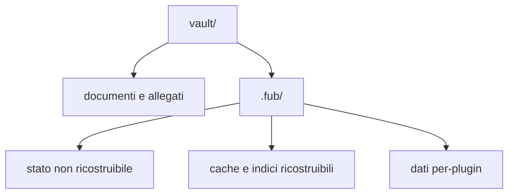

# Vault e file

> **Per chi:** chi vuole capire che cosa Fub legge, scrive e conserva.
> **Risultato:** distinguere documenti, stato autorevole e dati ricostruibili.

## Il vault

Un vault è una cartella scelta dall'utente. I path pubblici sono relativi alla
radice e usano `/`; nel contratto sono rappresentati da `DocId`.

Fub non sposta i documenti in un contenitore proprietario. Un file Markdown
resta un file Markdown e può essere aperto da altri strumenti.

## Apertura

L'apertura procede a fasi:

1. riconosce la struttura del vault;
2. rende disponibili albero e operazioni di base;
3. legge e indicizza i documenti;
4. segnala i file non leggibili senza rendere inutilizzabile l'intero vault.

Durante l'indicizzazione la ricerca espone lo stato del lavoro invece di
restituire silenziosamente un risultato incompleto.

## Modifiche sicure

Le scritture usano una revisione di base. Se il file è cambiato da quando una
modifica è stata calcolata, l'esito è un conflitto, non una sovrascrittura
silenziosa.

Le operazioni principali emettono eventi tipizzati. Rename e cancellazione
aggiornano identità, indici e sessioni attraverso il kernel e l'host, invece di
essere semplici chiamate filesystem dalla UI.

## Rinomine e archiviazione recuperabili

Prima di una rinomina Fub fotografa la revisione del file e le modifiche
necessarie ai backlink. Pubblica quindi un intent schema 1 sotto `.fub/` prima
di spostare dati per-documento o contenuto. Se il processo si interrompe, la
riapertura attende l'indice completo e confronta i byte osservati con la
preimmagine: riprende la rinomina in avanti, completa i backlink già preparati
oppure termina un rollback già dichiarato.

La posizione dei file non basta a giustificare una sovrascrittura. Se compare
una destinazione, cambia la sorgente o entrambe le posizioni sono ambigue, Fub
lascia l'intent ispezionabile e segnala un conflitto. Un record illeggibile o
prodotto da uno schema futuro non blocca il recupero degli altri record. Lo
spazio per-documento rimasto a metà di una migrazione (`*.in-progress`) è
l'unica copia di quei dati: la raccolta degli spazi orfani non lo cancella.

`vault.archive` applica la stessa regola a un insieme di file. Verifica tutte le
sorgenti, le revisioni e le destinazioni prima della prima mossa e pubblica un
record durevole dell'intero batch. Dopo ogni file registra l'avanzamento. Una
riapertura può quindi riconciliare sia una mossa già registrata sia una mossa
conclusa appena prima dell'interruzione, senza ripeterla e senza toccare una
destinazione estranea. I file completati formano un'unica operazione annullabile
nell'esito del comando.

## Destinazione delle nuove note

`files.new-note-folder` è un'impostazione del vault. Il valore vuoto crea le
note nella radice; un nome semplice viene creato nella cartella configurata,
mentre un path esplicito conserva la propria cartella. La scelta del nome libero
e il controllo delle collisioni avvengono nel kernel insieme alla scrittura,
senza una verifica separata nella shell.

## Albero dei file

L'explorer chiede un livello per volta all'anagrafe del kernel, che contiene
ogni voce del disco e non solo i documenti. Dopo sottocartelle e note mostra
quindi anche allegati e file che nessun provider riconosce. Immagini, audio,
video e PDF si aprono nel visualizzatore in sola lettura. Per gli altri file la
shell avvisa che non c'è un visualizzatore e non tenta di leggerli come testo.
La finestra di duecento voci per livello vale per note e file insieme.
Dal menu contestuale un allegato si rinomina, conservando l'estensione, e si
cestina come una nota: il kernel lo toglie dall'anagrafe con `EntryRemoved` e
il ripristino lo rimette dov'era, byte per byte.

## Cartelle nuove

Il comando `folder.create` (`path` obbligatorio) crea una cartella vuota,
insieme alle cartelle mancanti sopra di lei. L'explorer lo invoca dal menu
contestuale di una cartella o del titolo del pannello; la palette lo raggiunge
come ogni altro comando. Il nome segue le regole di un documento che nasce:
recinto del vault, `.fub/`, nomi nascosti e caratteri riservati sono
rifiutati, e una cartella esclusa dalle impostazioni non viene creata. Se il
path è già occupato da una cartella o da un file, l'esito è un conflitto e il
disco resta invariato. La prova a vuoto esegue lo stesso controllo senza
scrivere. La creazione non è annullabile dal registro dei comandi.

## Bozze

Una bozza protegge testo che non è ancora diventato una scrittura riuscita sul
documento. Le bozze appartengono al vault e non sostituiscono il file
autorevole.

Il lifecycle dell'editor deve eseguire flush, eventuale persistenza della bozza
e teardown nell'ordine previsto quando si chiude l'ultima superficie.

## Cestino

La cancellazione sposta la voce nel cestino del vault. Un sidecar può ricordare
la posizione originale e consentire il ripristino.

Il sidecar è un aiuto, non l'unica copia della nota. Se manca o non è
compatibile, il comportamento di degrado deve preservare il contenuto e usare
una destinazione sicura.

L'impostazione di vault `files.trash` sceglie dove finisce una nota cancellata
dalla shell. `vault` (default) usa il cestino interno. `system` usa il comando
`trash.os`, che prova il cestino del sistema operativo e, se non è disponibile,
sposta la nota nel cestino interno; la shell segnala il ripiego. Col cestino
del vault la cancellazione non chiede conferma e offre «Annulla» nell'avviso;
col cestino di sistema, da cui Fub non può ripristinare, chiede conferma.
Svuotare il cestino interno resta un comando irreversibile separato.

## Versioning

Il versioning conserva snapshot del contenuto. `version.restore` cattura la
revisione del documento, quindi verifica che il riferimento alla versione
esista e che il blob sia leggibile e integro (dimensione e impronta FNV-1a).
La scrittura condizionata usa quella revisione come confronto e scambio (CAS).
Per gli writer cooperativi, una modifica intervenuta durante la lettura viene
rifiutata come conflitto.
Per gli writer esterni il controllo è best-effort: una modifica già osservabile
al confronto produce lo stesso conflitto. Un riferimento o un blob non valido e
gli errori di lettura o confronto non modificano né il documento né l'indice
delle versioni. Le garanzie di un errore di scrittura dipendono dal supporto:
per i file regolari sostituibili il valore precedente resta intatto; symlink,
hardlink e filesystem senza conteggio dei nomi richiedono invece la scrittura
in-place descritta nel riferimento tecnico.

Il pannello cronologia mostra il testo di una versione oppure il suo confronto
riga per riga con la nota attuale. Il testo di una versione si può anche
copiare negli appunti, senza scrivere nel vault. Il confronto riassume le righe uguali
lontane dai cambiamenti e dichiara quante righe non mostra oltre il limite del
pannello. Se una delle due versioni non è testo, o la parte diversa è troppo
grande, il pannello lo dice invece di calcolarlo.

Quando riesce, il ripristino è una scrittura normale: fotografa prima il
contenuto sostituito e, se il contenuto cambia, crea una nuova versione; quando
esiste una versione precedente, il comando dichiara anche il ripristino inverso.

## Cartelle esterne

Le cartelle esterne non vengono scoperte né collegate automaticamente. Dopo aver
scelto un path assoluto, l'utente può usare i comandi generici `mount.add`
(`name`, `target`, `namespace`), `mount.list` e `mount.remove` (`name`).
L'elenco restituisce rotte tipizzate con namespace stabile e target; i path
relativi risolti nel namespace restano recintati, senza attraversare `..`,
separatori Windows o symlink. Sono rifiutati target e antenati symlink/reparse,
root del vault, `.fub/`, cartelle sovrapposte, alias e filesystem che non
forniscono identità e stat senza seguire i collegamenti. Se una destinazione
registrata è scollegata o cambia identità, Fub apre comunque il vault con la
rotta inattiva e una diagnostica; `mount.remove` resta disponibile. Il registro
resta nel vault, ma il contenuto esterno resta fuori da scansione e snapshot:
scollegarlo o rimuovere la rotta non cancella né sposta alcun file esterno.

## Cartella `.fub/`

La classificazione precisa è in
[`../reference/on-disk-layout.md`](../reference/on-disk-layout.md).

La regola importante è per voce, non per cartella:

- impostazioni, organizzazione, bozze, versioni e storage di un plugin possono
  contenere dati non ricostruibili;
- anagrafe e indici possono essere ricreati dal vault;
- un file sconosciuto non va cancellato soltanto perché si trova sotto
  `.fub/data/`.

## Compatibilità con altri strumenti

Fub comprende convenzioni usate nei vault Markdown, tra cui frontmatter YAML,
wikilink, tag, heading, ancore ed embed. Il provider decide la semantica del
formato; il kernel conserva path e sorgente senza incorporare regole Markdown.

Le proprietà del frontmatter restano nel file. Un vault può dichiararne il tipo
per nome nell'impostazione versionata `properties.types`; questa dichiarazione
sceglie widget e semantica di query, ma non rinomina chiavi convenzionali né
sposta valori in un database. Gli aggiornamenti strutturati modificano la sola
chiave interessata e conservano commenti, ordine, virgolette, terminatori e
corpo non coinvolti. YAML incompatibile o non rappresentabile resta disponibile
in modalità sorgente.

## Snapshot globale e backup

Lo snapshot globale offline comprende l'intero stato autorevole del vault:
documenti, allegati, file sconosciuti, `.trash/`, stato autorevole sotto
`.fub/` e storage autorevole dei plugin. La configurazione macchina è esclusa.
Le cache dichiarate ricostruibili vengono invalidate e ricostruite alla
riapertura, non copiate come se fossero autorità. In particolare,
`.fub/data/plugins/<id>/` è cache soltanto se contiene `.fub-cache-root`; senza
quel marker resta storage autorevole legacy.

`fub_kernel::snapshot` prepara e valida in memoria un manifest schema 1 con
path relativo normalizzato, classe, owner, schema quando applicabile, size e
digest SHA-256. Il kernel non possiede il `FormatRegistry`: documenti, allegati
e sconosciuti hanno la classe unica `user`, mentre i dati core, del cestino,
sidecar e plugin hanno classi proprie. Rifiuta prima di ogni mutazione schema
futuro, entry mancante o duplicata, traversal, symlink/file speciali e mismatch
di size o digest.
La base revision è il digest deterministico del manifest autorevole live e viene
ricontrollata immediatamente prima del commit.

L'applicazione richiede un vault chiuso e quiescente e una radice già canonica,
senza symlink. Un lock sibling stabile, staging privato, record persistente e
le fasi `prepare`/`commit`/`finalize` conservano il contenitore precedente fino
alla pubblicazione verificata. Dopo un crash, l'host esegue la recovery prima
dell'apertura: riconosce soltanto i propri artefatti con schema e transaction id
validi, completa o annulla la fase deterministica e preserva file ignoti. La
garanzia all-or-old-or-new vale tra writer cooperativi; writer esterni,
filesystem senza rename/fsync durevoli e rollback impossibile restano limiti
espliciti.

Per lo schema 1 la pubblicazione usa directory POSIX `0700` e file `0600`;
owner, ACL, xattr e bit executable non sono portabili nel manifest e quindi
non vengono preservati. Su Windows ACL e proprietà restano quelle applicate
dal filesystem alla creazione dello staging, normalmente ereditate dal
parent, e non sono rappresentate né garantite dallo snapshot.

Questo flusso è distinto da `fub.versioning`:
`version.restore` ripristina un solo documento con CAS per-file e non è una
transazione dell'intero vault. È distinto anche dal drill backup/restore offline
dell'issue [#7](https://github.com/Fubeo/Fub/issues/7), che conserva il proprio
fixture e manifesto indipendente. La feature `fub.backup` resta invece uno
snapshot namespaced delle sole note nello stesso vault.

## Limiti

- Fub non sincronizza automaticamente il vault con un servizio remoto;
- il backup completo include ogni dato classificato come autorevole;
- eliminare l'intera `.fub/` può perdere impostazioni, organizzazione, bozze,
  versioni e dati di plugin;
- eliminare soltanto una cache è sicuro solo quando il riferimento tecnico la
  dichiara ricostruibile.

La prova del drill storico è tracciata nell'issue
[#7](https://github.com/Fubeo/Fub/issues/7); il suo fixture resta distinto dalla
verifica del protocollo globale #5.
