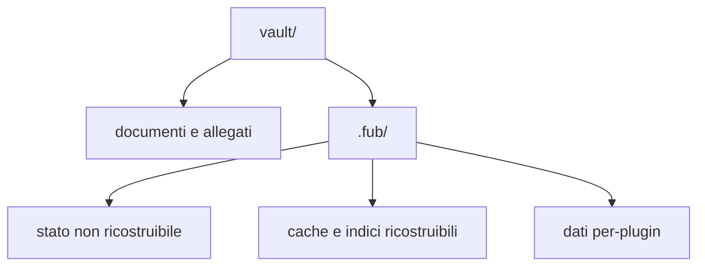

# Vault e file

> **Per chi:** chi vuole capire che cosa Fub legge, scrive e conserva.
> **Risultato:** distinguere documenti, stato autorevole e dati ricostruibili.

## Il vault

Un vault è una cartella scelta dall'utente. I path pubblici sono relativi alla
radice e usano `/`; nel contratto sono rappresentati da `DocId`.

Fub non sposta i documenti in un contenitore proprietario. Un file Markdown
resta un file Markdown e può essere aperto da altri strumenti.

## Apertura

L'apertura procede a fasi:

1. riconosce la struttura del vault;
2. rende disponibili albero e operazioni di base;
3. legge e indicizza i documenti;
4. segnala i file non leggibili senza rendere inutilizzabile l'intero vault.

Durante l'indicizzazione la ricerca espone lo stato del lavoro invece di
restituire silenziosamente un risultato incompleto.

## Modifiche sicure

Le scritture usano una revisione di base. Se il file è cambiato da quando una
modifica è stata calcolata, l'esito è un conflitto, non una sovrascrittura
silenziosa.

Le operazioni principali emettono eventi tipizzati. Rename e cancellazione
aggiornano identità, indici e sessioni attraverso il kernel e l'host, invece di
essere semplici chiamate filesystem dalla UI.

## Bozze

Una bozza protegge testo che non è ancora diventato una scrittura riuscita sul
documento. Le bozze appartengono al vault e non sostituiscono il file
autorevole.

Il lifecycle dell'editor deve eseguire flush, eventuale persistenza della bozza
e teardown nell'ordine previsto quando si chiude l'ultima superficie.

## Cestino

La cancellazione sposta la voce nel cestino del vault. Un sidecar può ricordare
la posizione originale e consentire il ripristino.

Il sidecar è un aiuto, non l'unica copia della nota. Se manca o non è
compatibile, il comportamento di degrado deve preservare il contenuto e usare
una destinazione sicura.

## Versioning

Il versioning conserva snapshot del contenuto. Uno snapshot non è il documento
corrente e non deve essere applicato con una scrittura parziale. Il ripristino
atomico è tracciato nell'issue
[#5](https://github.com/Fubeo/Fub/issues/5).

## Cartella `.fub/`

La classificazione precisa è in
[`../reference/on-disk-layout.md`](../reference/on-disk-layout.md).

La regola importante è per voce, non per cartella:

- impostazioni, organizzazione, bozze, versioni e storage di un plugin possono
  contenere dati non ricostruibili;
- anagrafe e indici possono essere ricreati dal vault;
- un file sconosciuto non va cancellato soltanto perché si trova sotto
  `.fub/data/`.

## Compatibilità con altri strumenti

Fub comprende convenzioni usate nei vault Markdown, tra cui frontmatter YAML,
wikilink, tag, heading, ancore ed embed. Il provider decide la semantica del
formato; il kernel conserva path e sorgente senza incorporare regole Markdown.

## Limiti

- Fub non sincronizza automaticamente il vault con un servizio remoto;
- il backup completo deve includere ogni dato classificato come autorevole;
- eliminare l'intera `.fub/` può perdere impostazioni, organizzazione, bozze,
  versioni e dati di plugin;
- eliminare soltanto una cache è sicuro solo quando il riferimento tecnico la
  dichiara ricostruibile.

La prova periodica di backup e ripristino è tracciata nell'issue
[#7](https://github.com/Fubeo/Fub/issues/7).
