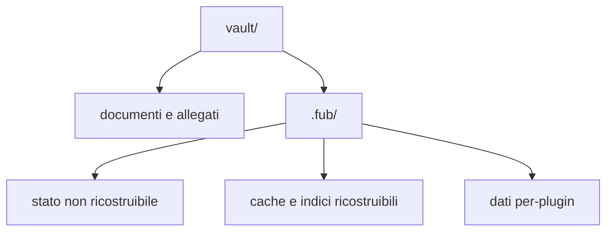

# Vault e file

> **Per chi:** chi vuole capire che cosa Fub legge, scrive e conserva.
> **Risultato:** distinguere documenti, stato autorevole e dati ricostruibili.

## Il vault

Un vault è una cartella scelta dall'utente. I path pubblici sono relativi alla
radice e usano `/`; nel contratto sono rappresentati da `DocId`.

Fub non sposta i documenti in un contenitore proprietario. Un file Markdown
resta un file Markdown e può essere aperto da altri strumenti.

## Apertura

L'apertura procede a fasi:

1. riconosce la struttura del vault;
2. rende disponibili albero e operazioni di base;
3. legge e indicizza i documenti;
4. segnala i file non leggibili senza rendere inutilizzabile l'intero vault.

Durante l'indicizzazione la ricerca espone lo stato del lavoro invece di
restituire silenziosamente un risultato incompleto.

## Modifiche sicure

Le scritture usano una revisione di base. Se il file è cambiato da quando una
modifica è stata calcolata, l'esito è un conflitto, non una sovrascrittura
silenziosa.

Le operazioni principali emettono eventi tipizzati. Rename e cancellazione
aggiornano identità, indici e sessioni attraverso il kernel e l'host, invece di
essere semplici chiamate filesystem dalla UI.

## Bozze

Una bozza protegge testo che non è ancora diventato una scrittura riuscita sul
documento. Le bozze appartengono al vault e non sostituiscono il file
autorevole.

Il lifecycle dell'editor deve eseguire flush, eventuale persistenza della bozza
e teardown nell'ordine previsto quando si chiude l'ultima superficie.

## Cestino

La cancellazione sposta la voce nel cestino del vault. Un sidecar può ricordare
la posizione originale e consentire il ripristino.

Il sidecar è un aiuto, non l'unica copia della nota. Se manca o non è
compatibile, il comportamento di degrado deve preservare il contenuto e usare
una destinazione sicura.

## Versioning

Il versioning conserva snapshot del contenuto. `version.restore` cattura la
revisione del documento, quindi verifica che il riferimento alla versione
esista e che il blob sia leggibile e integro (dimensione e impronta FNV-1a).
La scrittura condizionata usa quella revisione come confronto e scambio (CAS).
Per gli writer cooperativi, una modifica intervenuta durante la lettura viene
rifiutata come conflitto.
Per gli writer esterni il controllo è best-effort: una modifica già osservabile
al confronto produce lo stesso conflitto. Un riferimento o un blob non valido e
gli errori di lettura o confronto non modificano né il documento né l'indice
delle versioni. Le garanzie di un errore di scrittura dipendono dal supporto:
per i file regolari sostituibili il valore precedente resta intatto; symlink,
hardlink e filesystem senza conteggio dei nomi richiedono invece la scrittura
in-place descritta nel riferimento tecnico.

Quando riesce, il ripristino è una scrittura normale: fotografa prima il
contenuto sostituito e, se il contenuto cambia, crea una nuova versione; quando
esiste una versione precedente, il comando dichiara anche il ripristino inverso.

## Cartella `.fub/`

La classificazione precisa è in
[`../reference/on-disk-layout.md`](../reference/on-disk-layout.md).

La regola importante è per voce, non per cartella:

- impostazioni, organizzazione, bozze, versioni e storage di un plugin possono
  contenere dati non ricostruibili;
- anagrafe e indici possono essere ricreati dal vault;
- un file sconosciuto non va cancellato soltanto perché si trova sotto
  `.fub/data/`.

## Compatibilità con altri strumenti

Fub comprende convenzioni usate nei vault Markdown, tra cui frontmatter YAML,
wikilink, tag, heading, ancore ed embed. Il provider decide la semantica del
formato; il kernel conserva path e sorgente senza incorporare regole Markdown.

## Snapshot globale e backup

Lo snapshot globale offline comprende l'intero stato autorevole del vault:
documenti, allegati, file sconosciuti, `.trash/`, stato autorevole sotto
`.fub/` e storage autorevole dei plugin. La configurazione macchina è esclusa.
Le cache dichiarate ricostruibili vengono invalidate e ricostruite alla
riapertura, non copiate come se fossero autorità.

`fub_kernel::snapshot` prepara e valida in memoria un manifest schema 1 con
path relativo normalizzato, classe, owner, schema quando applicabile, size e
digest SHA-256. Il kernel non possiede il `FormatRegistry`: documenti, allegati
e sconosciuti hanno la classe unica `user`, mentre i dati core, del cestino,
sidecar e plugin hanno classi proprie. Rifiuta prima di ogni mutazione schema
futuro, entry mancante o duplicata, traversal, symlink/file speciali e mismatch
di size o digest.
La base revision è il digest deterministico del manifest autorevole live e viene
ricontrollata immediatamente prima del commit.

L'applicazione richiede un vault chiuso e quiescente. Un lock sibling stabile,
staging privato, record persistente e le fasi `prepare`/`commit`/`finalize`
conservano il contenitore precedente fino alla pubblicazione verificata. Dopo un
crash, l'host esegue la recovery prima dell'apertura: riconosce soltanto i
propri artefatti con schema e transaction id validi, completa o annulla la
fase deterministica e preserva file ignoti. La garanzia all-or-old-or-new vale
tra writer cooperativi; writer esterni, filesystem senza rename/fsync durevoli
e rollback impossibile restano limiti espliciti.

Questo flusso è distinto da `fub.versioning`:
`version.restore` ripristina un solo documento con CAS per-file e non è una
transazione dell'intero vault. È distinto anche dal drill backup/restore offline
dell'issue [#7](https://github.com/Fubeo/Fub/issues/7), che conserva il proprio
fixture e manifesto indipendente. La feature `fub.backup` resta invece uno
snapshot namespaced delle sole note nello stesso vault.

## Limiti

- Fub non sincronizza automaticamente il vault con un servizio remoto;
- il backup completo include ogni dato classificato come autorevole;
- eliminare l'intera `.fub/` può perdere impostazioni, organizzazione, bozze,
  versioni e dati di plugin;
- eliminare soltanto una cache è sicuro solo quando il riferimento tecnico la
  dichiara ricostruibile.

La prova è tracciata nell'issue
[#7](https://github.com/Fubeo/Fub/issues/7), ancora aperta finché CI non la
verifica.
