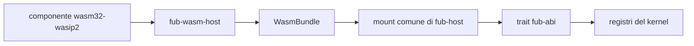

# M5: runtime WASM

> **Stato aggiornato per:** `main` al commit
> `cf50f60fd17e53d11e74ff2e7af96d572f69b10e`, 9 settembre 2026.

## Gate di integrazione

Vale la [governance audit](status.md#governance-di-integrazione): nessun merge
in `main` prima di G15/GO. Un incremento M5 verificato su una branch non
certifica il suo port nella linea audit né completa la milestone.

## Obiettivo

Dimostrare che un componente WASM può usare gli stessi trait dei provider
nativi, con compatibilità, capability, limiti e lifecycle applicati
dall'host.

M5 non consiste nel collegare Wasmtime. È completa quando un autore può seguire
un percorso documentato, esercitato end-to-end e privo di rami speciali nel
kernel.

## Architettura consegnata

## Fatto

### Runtime

- Wasmtime component model;
- binding dal WIT vivo;
- assenza di WASI;
- limite di memoria;
- epoch interruption per la deadline;
- trap convertite in errore;
- istanza condivisa e non rientrante;
- teardown senza abbattere l'host.

### Contratto

- manifest e versione ABI;
- lifecycle `Plugin`;
- `CommandProvider`;
- `FormatProvider` opzionale via proxy WASM;
- `ViewProvider` opzionale via export WIT `view`;
- lettura del modello;
- eventi host;
- capability negate come errori tipizzati;
- arena per forme ricorsive;
- parità osservabile nei casi nativo/WASM coperti.

### Esempi

- `esempi/ping-wasm/`;
- `esempi/modello-wasm/`;
- `esempi/eventi-wasm/`;
- `esempi/ciclo-wasm/`;
- `esempi/format-wasm/`, percorso fuori workspace per il provider di formato;
- `esempi/view-wasm/`, percorso end-to-end per `ViewProvider`.

Il percorso `format-wasm` viene costruito dai test e dimostra le operazioni
supportate e i fallimenti tipizzati del confine.

Gli esempi vengono costruiti dai sorgenti durante i test.

### Confine host dei formati

`FormatSource` è una porta host-agnostica: prepara `FormatProvider` e le
risorse possedute prima di costruire il `Workspace`. L'host registra i provider
prima della costruzione del workspace; le risorse preparate restano vive per
tutta la sessione e vengono rilasciate anche in caso di rollback.

`fub-wasm-host` espone ora un'interfaccia `format` opzionale: `WasmBundle`
prepara descriptor e capability dichiarati e restituisce un proxy
`FormatProvider` per `parse`, `render_html` e `serialize`. Il modello in ingresso
e quello restituito dal guest attraversano la validazione del confine fidato;
output malformato e trap diventano `FormatError`, senza propagarsi come stato
parziale o abbattere l'host. La validazione è `O(V+E)`, accetta DAG ordinari e
rifiuta cicli, riferimenti fuori indice, profondità oltre 64, span non validi,
JSON non valido e materializzazione oltre 8 Mi unità pesate.

`InstalledPluginManager` prepara una sola volta lo snapshot per apertura dei
plugin `enabled` con consenso `granted`, caricando ogni bundle selezionato una
sola volta e restituendo bundle e `PreparedFormatSource` sotto la stessa
`StartupValidity`/lease. È cablato come `StartupSource`, non come
`FormatSource`. Un componente selezionato corrotto o non caricabile, oppure
un'export `format` presente ma incompatibile, produce una diagnostica tipizzata
e viene saltato per quella apertura senza impedire l'apertura del vault. Un
bundle caricato resta utilizzabile per le altre interfacce se la preparazione
del provider di formato fallisce, con la diagnostica corrispondente.
Un'invalidazione concorrente revoca il token: l'apertura stantia fa rollback e
non pubblica alcuna sessione. Lease e risorse preparate appartengono alla
sessione o al rollback; nessuna `Operation` del manager viene trattenuta dalla
sessione.

Il percorso esercitato copre un componente fuori workspace con parse, render,
errore dichiarato dal guest, modello malformato, trap e serialize. I test
coprono anche rollback di snapshot stantio e chiusura con drain delle aperture;
questo non implica ancora parità oltre a questi casi, né rende disponibili
implicitamente capability host al componente.

### Decisioni sui provider

`FormatProvider` è implementato e ha parità nativo/WASM per le operazioni
coperte `parse`, `render_html` e `serialize`. Errori dichiarati dal guest,
modelli malformati e trap sono coperti end-to-end nel percorso WASM e vengono
recuperati come `FormatError`, ma non costituiscono un confronto di parità
nativo/WASM.

`IndexProvider` non viene aggiunto senza un componente che ne possieda una
route e provi il feed, la query, il flush e la close. `EventHandler` inbound
resta deferred finché un componente deve reagire a `Notice`; non va confuso
con `host-events`, già supportato per il percorso outbound verso il guest.

## Consegnato nel percorso ViewProvider

L'interfaccia WIT `view` è un'export opzionale sulla stessa `Instance` del
`Plugin`. Le `ViewSpec` dichiarano parametri che l'host valida; `interests` è
infallibile: un trap fa paniare il proxy e il confine `Workspace` converte il
panic in `PluginError::Internal`. `render_view` usa `ReadApi` e `on_action`
usa `HostApi`.

Il guard di fiducia protegge sia render sia action: per `Trust::Community`,
`Html` e `WebView` sono rifiutati prima della shell; `Trust::Core` è ammesso. Il
preflight dell'albero verifica root e riferimenti, assenza di cicli (DAG),
profondità massima 64 e budget di 8 Mi unità pesate. La stessa istanza non è
rientrante: la rientranza è un errore tipizzato.

Un trap invalida il guest ma lascia vivo l'host; il teardown può riportare
l'errore. La parità verificata è limitata a spec/interests/render/`Replace`/
`Patch`. `IndexProvider` e `EventHandler` inbound restano deferred. L'esempio
minimo è `esempi/view-wasm/`, con test di mount, parametri, render, `Replace`,
`Patch` e smontaggio.

### UI non fidata

La validazione attiva è completata per provider `Trust::Community`:
`UiNode::validate_untrusted()` viene applicato prima della shell e vale anche
per gli aggiornamenti restituiti da una action. `Trust::Core` può produrre `Html`
e `WebView` secondo la policy.

### Discovery e installazione

Manca su `main` un percorso supportato che:

1. trova il componente;
2. legge manifest e import;
3. valida ABI e capability;
4. monta;
5. invoca;
6. disattiva;
7. rimuove;
8. dimostra zero risorse residue.

La [PR #23](https://github.com/Fubeo/Fub/pull/23) propone discovery da directory
esplicita, un componente costruito dai sorgenti, prova del lifecycle nativo e
rilascio dell'istanza dopo attivazione fallita. La CI sul candidato `66141ad`
è conclusa con successo, ma la PR resta draft per l'adattamento ai confini
audit: il banco non deve chiamare il guest sotto `Custody<Workspace>` e deve
preservare il lifecycle esplicito `BundleMount` già presente in quella linea.
L'incremento non è incluso nella sezione consegnata.

La [PR #26](https://github.com/Fubeo/Fub/pull/26) ne porta soltanto discovery
sulla linea audit, con candidati corrotti indipendenti da quelli validi,
file `.part` invisibili e duplicati espliciti. Conserva `BundleMount` e non
reintroduce il protocollo temporale della PR #23. Il lifecycle resta da
adattare anche nelle porte di produzione: spostare soltanto il banco non
soddisfa C-04. Né #26 né il fix CAS #27 chiudono #8.

`InstalledPluginStore` fornisce agli host nativi una radice di configurazione
passata esplicitamente, inventario, consenso e scelta enabled persistenti,
installazione e rimozione sicure, collisioni esplicite e integrità verificata
dei componenti.
La composizione desktop sceglie una sola configurazione e monta allo startup
soltanto i componenti enabled con consenso `granted`, filtrati prima del load
e della validazione attiva. Il banco attraversa store, comando WASM e restart
enabled/disabled. Restano gestione desktop di installazione, scelte e rimozione,
IPC e guida dello stesso ciclo end-to-end.
Componente installato, storage persistente del plugin, scelta di abilitazione e
istanza montata restano separati. `InstalledPluginStore` non salva né scopre
componenti installati in `.fub/plugins/` e non cancella quella directory.

## Criteri di completamento

M5 è completa quando:

- [ ] #8 dimostra il percorso installazione-esecuzione-rimozione;
- #10: View consegnata = export WIT `view` + spec validata + `interests`/render
  equivalenti al provider nativo + action `Replace`/`Patch` + trap/panic
  convertito a `PluginError::Internal` al confine `Workspace`, senza richiedere
  discovery, `IndexProvider` o `EventHandler` inbound futuri;
- [ ] il tutorial riproduce lo stesso percorso dei test;
- [ ] un plugin incompatibile viene rifiutato prima del mount;
- [ ] un permesso negato non lascia stato parziale;
- [ ] timeout, memoria e trap hanno test end-to-end;
- [ ] mount e teardown rilasciano istanza, registrazioni e handler;
- [ ] il kernel non distingue backend nativo e WASM;
- [ ] la documentazione corrente descrive i limiti reali.

Le checklist sono ammesse qui perché questa pagina è stato di progetto e viene
eliminata quando la milestone è conclusa.

## Rischi

| Rischio | Presidio |
|---|---|
| espansione del WIT senza consumatori | provider aggiunto con esempio reale |
| policy duplicata | un solo `Guard` |
| UI attiva non fidata | validazione prima dell'IPC |
| chiamata infinita | deadline a epoche |
| memoria senza limite | store limiter |
| mount parziale | transazione e teardown |
| differenza nativo/WASM | test di parità |
| tutorial non riproducibile | stesso artefatto e stessa sequenza dell'e2e |

## Issue

- [#8 — percorso end-to-end](https://github.com/Fubeo/Fub/issues/8)
- [#10 — provider e UI non fidata](https://github.com/Fubeo/Fub/issues/10)

## Dopo M5

Quando i criteri sono soddisfatti:

- questa pagina viene eliminata;
- il risultato entra nel changelog;
- le capacità correnti restano nelle guide;
- le motivazioni stabili restano negli ADR;
- il lavoro successivo vive in nuove issue.
