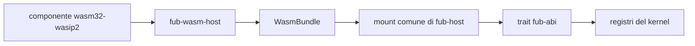

# M5: runtime WASM

> **Stato aggiornato per:** `main` al commit
> `7c263d2950176846bc45d85381c72f46b822bfd8`, 18 settembre 2026.

## Stato della milestone

M5 è consegnata in `main` dalla
[PR #53](https://github.com/Fubeo/Fub/pull/53), merge commit
`7c263d2950176846bc45d85381c72f46b822bfd8`.

La governance audit è conclusa: G14 è completo 56/56 e G15/GO è registrato.
Le run push post-merge
[CI 35331754822](https://github.com/Fubeo/Fub/actions/runs/35331754822) e
[NPM supply chain 35331754778](https://github.com/Fubeo/Fub/actions/runs/35331754778)
sono entrambe verdi sul merge SHA. I rischi residui accettati sono documentati
come limiti correnti, non come gate di integrazione.

## Obiettivo

Dimostrare che un componente WASM può usare gli stessi trait dei provider
nativi, con compatibilità, capability, limiti e lifecycle applicati dall'host.

Il criterio è soddisfatto in `main`: un autore può seguire un percorso
documentato, esercitato end-to-end e privo di rami speciali nel kernel. Questa
pagina è ora una **retrospettiva della milestone**, mantenuta temporaneamente
per la riconciliazione formale di #8 e #10.

## Architettura consegnata

## Fatto

### Runtime

- Wasmtime component model;
- binding dal WIT vivo;
- assenza di WASI;
- limite di memoria;
- epoch interruption per la deadline;
- trap convertite in errore;
- istanza condivisa e non rientrante;
- teardown senza abbattere l'host.

### Contratto

- manifest e versione ABI;
- lifecycle `Plugin`;
- `CommandProvider`;
- `FormatProvider` opzionale via proxy WASM;
- `ViewProvider` opzionale via export WIT `view`;
- lettura del modello;
- eventi host;
- capability negate come errori tipizzati;
- arena per forme ricorsive;
- parità osservabile nei casi nativo/WASM coperti.

### Esempi

- `esempi/ping-wasm/`;
- `esempi/modello-wasm/`;
- `esempi/eventi-wasm/`;
- `esempi/ciclo-wasm/`;
- `esempi/format-wasm/`, percorso fuori workspace per il provider di formato;
- `esempi/view-wasm/`, percorso end-to-end per `ViewProvider`.

Il percorso `format-wasm` viene costruito dai test e dimostra le operazioni
supportate e i fallimenti tipizzati del confine.

Gli esempi vengono costruiti dai sorgenti durante i test.

### Confine host dei formati

`FormatSource` è una porta host-agnostica: prepara `FormatProvider` e le
risorse possedute prima di costruire il `Workspace`. L'host registra i provider
prima della costruzione del workspace; le risorse preparate restano vive per
tutta la sessione e vengono rilasciate anche in caso di rollback.

`fub-wasm-host` espone ora un'interfaccia `format` opzionale: `WasmBundle`
prepara descriptor e capability dichiarati e restituisce un proxy
`FormatProvider` per `parse`, `render_html` e `serialize`. Il modello in ingresso
e quello restituito dal guest attraversano la validazione del confine fidato;
output malformato e trap diventano `FormatError`, senza propagarsi come stato
parziale o abbattere l'host. La validazione è `O(V+E)`, accetta DAG ordinari e
rifiuta cicli, riferimenti fuori indice, profondità oltre 64, span non validi,
JSON non valido e materializzazione oltre 8 Mi unità pesate.

`InstalledPluginManager` prepara una sola volta lo snapshot per apertura dei
plugin `enabled` con consenso `granted`, caricando ogni bundle selezionato una
sola volta e restituendo bundle e `PreparedFormatSource` sotto la stessa
`StartupValidity`/lease. È cablato come `StartupSource`, non come
`FormatSource`. Un componente selezionato corrotto o non caricabile, oppure
un'export `format` presente ma incompatibile, produce una diagnostica tipizzata
e viene saltato per quella apertura senza impedire l'apertura del vault. Un
bundle caricato resta utilizzabile per le altre interfacce se la preparazione
del provider di formato fallisce, con la diagnostica corrispondente.
Un'invalidazione concorrente revoca il token: l'apertura stantia fa rollback e
non pubblica alcuna sessione. Lease e risorse preparate appartengono alla
sessione o al rollback; nessuna `Operation` del manager viene trattenuta dalla
sessione.

Il percorso esercitato copre un componente fuori workspace con parse, render,
errore dichiarato dal guest, modello malformato, trap e serialize. I test
coprono anche rollback di snapshot stantio e chiusura con drain delle aperture;
questo non implica ancora parità oltre a questi casi, né rende disponibili
implicitamente capability host al componente.

### Decisioni sui provider

`FormatProvider` è implementato e ha parità nativo/WASM per le operazioni
coperte `parse`, `render_html` e `serialize`. Errori dichiarati dal guest,
modelli malformati e trap sono coperti end-to-end nel percorso WASM e vengono
recuperati come `FormatError`, ma non costituiscono un confronto di parità
oltre ai casi esercitati.

`ViewProvider` è consegnato con export WIT `view`, spec/interests/render,
azioni `Replace`/`Patch`, validazione non fidata e teardown. `GridProvider` è
consegnato con protocollo Grid v1 in ABI/WIT, provider nativo e proxy WASM:
negozia famiglia/versione, finestre, patch, invalidazioni, fallback e
ownership senza chiamate al provider sotto il lock.

`IndexProvider` e `EventHandler` inbound restano deferred: non vengono
promessi senza una route e un componente che provino feed/query/flush/close o
la reazione a `Notice`. `host-events` outbound resta invece supportato.

## Consegnato nel percorso ViewProvider

L'interfaccia WIT `view` è un'export opzionale sulla stessa `Instance` del
`Plugin`. Le `ViewSpec` dichiarano parametri che l'host valida; `interests` è
infallibile: un trap fa paniare il proxy e il confine `Workspace` converte il
panic in `PluginError::Internal`. `render_view` usa `ReadApi` e `on_action`
usa `HostApi`.

Il guard di fiducia protegge sia render sia action: per `Trust::Community`,
`Html` e `WebView` sono rifiutati prima della shell; `Trust::Core` è ammesso. Il
preflight dell'albero verifica root e riferimenti, assenza di cicli (DAG),
profondità massima 64 e budget di 8 Mi unità pesate. La stessa istanza non è
rientrante: la rientranza è un errore tipizzato.

Un trap invalida il guest ma lascia vivo l'host; il teardown può riportare
l'errore. La parità verificata è limitata a spec/interests/render/`Replace`/
`Patch`. `IndexProvider` e `EventHandler` inbound restano deferred. L'esempio
minimo è `esempi/view-wasm/`, con test di mount, parametri, render, `Replace`,
`Patch` e smontaggio.

### UI non fidata

La validazione attiva è completata per provider `Trust::Community`:
`UiNode::validate_untrusted()` viene applicato prima della shell e vale anche
per gli aggiornamenti restituiti da una action. `Trust::Core` può produrre `Html`
e `WebView` secondo la policy.

### Discovery e installazione

Nel tree corrente il percorso prodotto è supportato dalla shell e dal manager
installato:

1. `install_plugin` legge un file scelto esplicitamente, valida manifest e ABI
   e pubblica blob e inventario senza montare o chiamare il guest;
2. il record parte con `consent = undecided` e `enabled = false`;
3. `set_installed_plugin_consent` registra `denied` o `granted` per gli esatti
   byte installati, senza concedere capability;
4. `set_installed_plugin_enabled` registra la selezione e riconcilia il
   runtime, ma il mount avviene soltanto per `enabled && granted`;
5. il riavvio rilegge lo snapshot persistente e filtra prima di load,
   validazione attiva e istanziazione;
6. la disabilitazione esegue teardown e ritira il claim in tutti i vault
   interessati;
7. `remove_installed_plugin` richiede lo stato disabilitato, ritira il record
   e pulisce il blob senza toccare `.fub/plugins/<id>/`.

`list_installed_plugins` legge solo metadata e stato runtime: non compila,
istanza o chiama il guest. Duplicati di id, digest alterati, file
incompleti, ABI incompatibile e collisioni CAS producono errori espliciti;
non esiste upgrade implicito. Una reinstallazione ha nuova identità e nuovo
consenso. Un componente selezionato corrotto o non caricabile viene
diagnosticato e saltato per quell'apertura senza impedire il vault.

La [PR #53](https://github.com/Fubeo/Fub/pull/53) integra in `main` la
consegna della fase 10 insieme alla chiusura audit. #8 e #10 restano **OPEN**
come tracker per la verifica formale dei criteri e per il commento di chiusura,
non perché manchi il percorso prodotto in `main`.

## Capacità M5 consegnate

In `main@7c263d…` M5 comprende:

- `CommandProvider`, `FormatProvider`, `ViewProvider` e `GridProvider`
  nei percorsi nativi/WASM esercitati;
- component model Wasmtime, manifest, ABI, capability, timeout, memoria, trap e
  output malformati gestiti al confine;
- UI non fidata con validazione per `Trust::Community`;
- installazione da file, consenso, stato `enabled`, restart, teardown e
  rimozione da disabilitato;
- rollback degli snapshot startup stantii e ownership delle risorse preparate;
- Grid v1 in ABI/WIT, provider nativo, proxy WASM e client shell con
  negoziazione, finestre, patch, invalidazioni e fallback;
- esempi riproducibili, inclusi `format-wasm`, `view-wasm` e
  `grid-wasm`.

La parità dichiarata resta limitata alle operazioni e ai casi coperti dai test:
la consegna di una famiglia non implica automaticamente tutte le future
operazioni della stessa famiglia.

## Limiti volutamente non promessi

- `IndexProvider` WASM non è esposto finché una route reale non prova
  feed/query/flush/close;
- `EventHandler` inbound non è esposto finché un componente reale non prova
  la reazione a `Notice`; `host-events` outbound resta supportato;
- deadline a epoche e limite di memoria confinano il guest, ma non costituiscono
  una quota assoluta CPU/RAM dell'intero processo;
- operazioni non esercitate dagli esempi e dai test di parità non vengono
  promesse per inferenza.

Questi sono confini del prodotto corrente, non lavoro necessario a rendere
valida l'integrazione già avvenuta.

## Residui trasferiti ad altre issue

- [#8](https://github.com/Fubeo/Fub/issues/8): riconciliare uno per uno i
  criteri del percorso end-to-end con l'evidenza in `main` e lasciare il
  commento di chiusura;
- [#10](https://github.com/Fubeo/Fub/issues/10): riconciliare i criteri sui
  provider e sulla UI non fidata e lasciare il commento di chiusura;
- eventuale esposizione futura di `IndexProvider` o `EventHandler` inbound
  richiede lavoro e criteri propri; non viene riaperta implicitamente dentro M5.

## Rischi accettati

I rischi WASM accettati a G15 restano tracciati nel registro audit:

| Rischio | Limite corrente |
|---|---|
| `WASM-002` | `IndexProvider` e `EventHandler` inbound non sono esposti |
| `WASM-003` | deadline e memoria confinano il guest, senza quota assoluta del processo |

Gli altri rischi accettati da G15, come writer esterni e rename concorrenti,
appartengono alle pagine permanenti di storage e lifecycle e non sono gate M5.

## Issue

- [#8 — percorso end-to-end](https://github.com/Fubeo/Fub/issues/8)
- [#10 — provider e UI non fidata](https://github.com/Fubeo/Fub/issues/10)

## Stato documentale

Questa pagina diventa una **retrospettiva della milestone**. Non viene eliminata
nella prima PR di riconciliazione: resta finché #8 e #10 non hanno ricevuto il
commento di chiusura.

Dopo la chiusura formale di entrambe le issue, i limiti permanenti devono
restare in
[Runtime dei plugin](../architecture/plugin-runtime.md) e nella
[guida per gli autori](../development/plugin-authoring.md); a quel punto questa
scheda di progetto può essere rimossa senza perdere informazioni normative.
