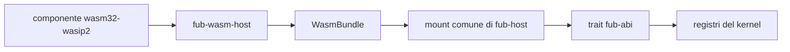

# M5: runtime WASM

> **Stato aggiornato per:** `main` al commit
> `5d8af02050700c738e73461a7a0a98059d91dfc2`, 25 agosto 2026.

## Obiettivo

Dimostrare che un componente WASM può usare gli stessi trait dei provider
nativi, con compatibilità, capability, limiti e lifecycle applicati
dall'host.

M5 non consiste nel collegare Wasmtime. È completa quando un autore può seguire
un percorso documentato, esercitato end-to-end e privo di rami speciali nel
kernel.

## Architettura consegnata

## Fatto

### Runtime

- Wasmtime component model;
- binding dal WIT vivo;
- assenza di WASI;
- limite di memoria;
- epoch interruption per la deadline;
- trap convertite in errore;
- istanza condivisa e non rientrante;
- teardown senza abbattere l'host.

### Contratto

- manifest e versione ABI;
- lifecycle `Plugin`;
- `CommandProvider`;
- lettura del modello;
- eventi host;
- capability negate come errori tipizzati;
- arena per forme ricorsive;
- parità osservabile nei casi nativo/WASM coperti.

### Esempi

- `esempi/ping-wasm/`;
- `esempi/modello-wasm/`;
- `esempi/eventi-wasm/`;
- `esempi/ciclo-wasm/`.

Gli esempi vengono costruiti dai sorgenti durante i test.

## In corso

### Provider

`ViewProvider` deve attraversare il confine con un caso non banale. Gli altri
provider vengono aggiunti soltanto insieme a un esempio o test che dimostri la
necessità.

### UI non fidata

Ogni `UiNode` prodotto da un componente deve passare da
`UiNode::validate_untrusted()`. HTML, webview e forme fidate devono essere
rifiutati prima dell'IPC.

### Discovery e installazione

Manca un percorso supportato che:

1. trova il componente;
2. legge manifest e import;
3. valida ABI e capability;
4. monta;
5. invoca;
6. disattiva;
7. rimuove;
8. dimostra zero risorse residue.

## Criteri di completamento

M5 è completa quando:

- [ ] #8 dimostra il percorso installazione-esecuzione-rimozione;
- [ ] #10 completa la view non fidata e i provider necessari;
- [ ] il tutorial riproduce lo stesso percorso dei test;
- [ ] un plugin incompatibile viene rifiutato prima del mount;
- [ ] un permesso negato non lascia stato parziale;
- [ ] timeout, memoria e trap hanno test end-to-end;
- [ ] mount e teardown rilasciano istanza, registrazioni e handler;
- [ ] il kernel non distingue backend nativo e WASM;
- [ ] la documentazione corrente descrive i limiti reali.

Le checklist sono ammesse qui perché questa pagina è stato di progetto e viene
eliminata quando la milestone è conclusa.

## Rischi

| Rischio | Presidio |
|---|---|
| espansione del WIT senza consumatori | provider aggiunto con esempio reale |
| policy duplicata | un solo `Guard` |
| UI attiva non fidata | validazione prima dell'IPC |
| chiamata infinita | deadline a epoche |
| memoria senza limite | store limiter |
| mount parziale | transazione e teardown |
| differenza nativo/WASM | test di parità |
| tutorial non riproducibile | stesso artefatto e stessa sequenza dell'e2e |

## Issue

- [#8 — percorso end-to-end](https://github.com/Fubeo/Fub/issues/8)
- [#10 — provider e UI non fidata](https://github.com/Fubeo/Fub/issues/10)

## Dopo M5

Quando i criteri sono soddisfatti:

- questa pagina viene eliminata;
- il risultato entra nel changelog;
- le capacità correnti restano nelle guide;
- le motivazioni stabili restano negli ADR;
- il lavoro successivo vive in nuove issue.
