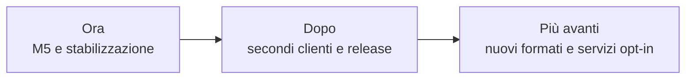

# Roadmap

> **Stato aggiornato per:** 25 agosto 2026.

La roadmap descrive ordine e direzione. Le attività eseguibili e i criteri di
accettazione vivono nelle GitHub Issues.

## Ora

### Completare M5

- discovery e installazione di un componente;
- proxy dei provider richiesti da casi reali;
- view WASM e validazione non fidata;
- errori, timeout, memoria e teardown dimostrati end-to-end.

Issue: [#8](https://github.com/Fubeo/Fub/issues/8) e
[#10](https://github.com/Fubeo/Fub/issues/10).

### Stabilizzare i dati

- ripristino atomico;
- backup e restore provati;
- nessuna perdita silenziosa su snapshot, schema o storage plugin.

Issue: [#5](https://github.com/Fubeo/Fub/issues/5) e
[#7](https://github.com/Fubeo/Fub/issues/7).

### Misurare la Graph View

- modularizzare senza cambiare il contratto dati;
- dimostrare determinismo, teardown, scala e durata.

Issue: [#6](https://github.com/Fubeo/Fub/issues/6) e
[#12](https://github.com/Fubeo/Fub/issues/12).

## Dopo

### Secondo cliente delle superfici

Un caso reale diverso da Markdown deve dimostrare quali parti dell'editor sono
motore comune e quali appartengono al profilo. Soltanto allora si consolida
l'API interna.

Issue: [#11](https://github.com/Fubeo/Fub/issues/11).

### Contratto dei temi

Chiudere compatibilità, discovery, selezione, anteprima e guida per autori senza
pubblicare forme prive di consumatori.

Issue: [#13](https://github.com/Fubeo/Fub/issues/13).

### Prima release

- installazione verificata;
- changelog e versioni coerenti;
- WIT e schemi controllati;
- SBOM e audit;
- artifact per le piattaforme supportate;
- documentazione di avvio provata da una macchina pulita.

## Più avanti

Queste direzioni richiedono una proposta, un owner e un caso reale:

- secondo formato oltre Markdown;
- servizi di rete opt-in;
- sincronizzazione con garanzie esplicite;
- collaborazione;
- publishing;
- integrazioni AI;
- ecosistema di distribuzione dei plugin.

Una direzione non autorizza a creare in anticipo tipi ABI, porte IPC o cartelle
di documentazione.

## Fuori ambito corrente

- database come sostituto obbligatorio dei file;
- marketplace senza formato di pacchetto e sicurezza completati;
- esecuzione di JavaScript di plugin nella webview;
- accesso WASI generale;
- un framework universale di superfici prima del secondo cliente;
- specifiche dettagliate di prodotti non approvati.

## Regola di passaggio

Un elemento entra nella documentazione di prodotto soltanto quando:

1. il comportamento è implementato;
2. il percorso principale è testato;
3. errori e limiti sono dichiarati;
4. il contratto stabile ha una fonte autorevole;
5. il lavoro residuo è tracciato in issue.
