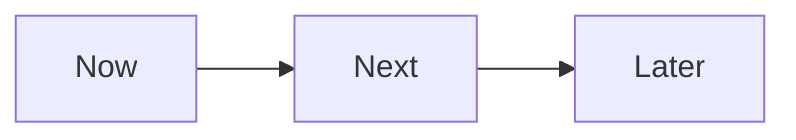

# Roadmap

> **Stato:** pianificato  
> **Fonte di verità:** issue aperte

La roadmap contiene soltanto lavoro aperto e prioritario. I dettagli e i criteri di accettazione vivono nelle issue collegate.

## Now

1. [#8 — percorso end-to-end WASM](https://github.com/Fubeo/Fub/issues/8)
2. [#6 — prova di scala della Graph View](https://github.com/Fubeo/Fub/issues/6)
3. Chiudere o accettare [RFC 0001](../rfcs/0001-shared-editing-surfaces.md) dopo il secondo cliente reale.

## Next

1. [#5 — applicazione atomica degli snapshot](https://github.com/Fubeo/Fub/issues/5)
2. [#7 — prova completa di backup e ripristino](https://github.com/Fubeo/Fub/issues/7)
3. Pubblicare una guida WASM soltanto quando #8 copre lo stesso percorso.

## Later

1. [#9 — endurance e riconciliazione della sincronizzazione](https://github.com/Fubeo/Fub/issues/9)
2. Estendere i proxy WASM una superficie alla volta, con parità nativo/WASM.
3. Introdurre nuovi formati o superfici solo con clienti e test reali.

Le voci completate vengono rimosse da questa pagina e registrate nel [CHANGELOG](../../CHANGELOG.md).
