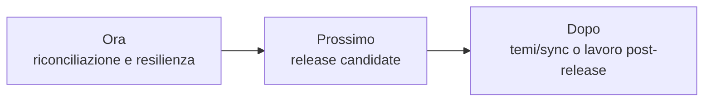

# Roadmap

> **Stato aggiornato per:** `main` al commit
> `7c263d2950176846bc45d85381c72f46b822bfd8`, 18 settembre 2026.

La roadmap descrive ordine e direzione. Le GitHub Issues restano il tracker
operativo; una issue aperta non implica automaticamente che la capacità
corrispondente manchi da `main`.

## Capacità consegnate

### M5 — runtime WASM e percorso prodotto

M5 è implementata in `main` dalla
[PR #53](https://github.com/Fubeo/Fub/pull/53), merge commit
`7c263d2950176846bc45d85381c72f46b822bfd8`.

Sono consegnati il component model Wasmtime, lifecycle e capability, limiti,
installazione, consenso, `enabled`, restart, rimozione, UI non fidata e i
provider `CommandProvider`, `FormatProvider`, `ViewProvider` e
`GridProvider` nei percorsi esercitati.

Le issue [#8](https://github.com/Fubeo/Fub/issues/8) e
[#10](https://github.com/Fubeo/Fub/issues/10) restano aperte per la
**verifica formale dei criteri e il commento di chiusura**, non perché queste
capacità siano assenti da `main`.

### Fase 10 — superfici condivise e Grid v1

La fase 10 di [#11](https://github.com/Fubeo/Fub/issues/11) è consegnata in
`main`: Grid v1 attraversa ABI/WIT, mirror TypeScript, SDK/testkit, host
nativo e proxy WASM; la shell negozia famiglia/versione, usa finestre e patch e
mantiene fallback, ownership e teardown.

Il TODO di progetto resta temporaneamente come matrice di verifica finché #11
non è formalmente chiusa e le invarianti permanenti non sono state trasferite
nelle pagine di architettura.

### Remediation audit

La remediation audit è implementata in `main`. G14 è chiuso 56/56 e G15/GO è
registrato sulla PR #53; le run push post-merge sul merge SHA sono verdi. I
rischi accettati rimangono limiti correnti documentati, non un vincolo di
integrazione ancora aperto.

## Ora — riconciliazione e resilienza

### Riconciliare tracker e PR storiche

La prima attività è riallineare issue, PR impilate e documentazione storica con
la baseline `main@7c263d…`, senza riscrivere i record audit immutabili.

Per #8, #10 e #11 la capacità è consegnata; va completata la verifica formale
dei criteri e registrata la chiusura del tracker.

### Verifica di completamento

Finché le rispettive matrici non sono concluse, queste issue restano in
**verifica di completamento**:

- [#7 — backup e ripristino](https://github.com/Fubeo/Fub/issues/7);
- [#12 — Graph View 2.0](https://github.com/Fubeo/Fub/issues/12);
- [#13 — contratto dei temi](https://github.com/Fubeo/Fub/issues/13);
- [#17 — baseline visuali CI](https://github.com/Fubeo/Fub/issues/17).

Lo stato aperto del tracker non viene usato come prova di capacità mancante:
ogni chiusura richiede invece confronto tra criteri, test, documentazione e
CI effettivamente presenti in `main`.

### Decisioni realmente residue

#### #5 — ripristino atomico degli snapshot

[#5](https://github.com/Fubeo/Fub/issues/5) conserva un residuo reale:
validazione preventiva, atomicità, conflitto di revisione, fallimenti
intermedi e prova end-to-end devono essere completati contro i criteri
dell'issue.

#### #9 — endurance e riconciliazione sync

[#9](https://github.com/Fubeo/Fub/issues/9) va classificata rispetto alla
release: o entra nei criteri del primo release candidate, oppure viene
esplicitamente rinviata al lavoro post-release. Il rinvio non equivale a
chiusura dell'issue.

## Prossimo — primo release candidate

Dopo la riconciliazione e le decisioni residue, preparare il primo release
candidate sulla linea `main`.

Il candidato deve almeno avere:

- versione, changelog e compatibilità degli schemi coerenti;
- WIT frozen e compatibilità ABI verificate;
- test applicativi e guard pertinenti verdi;
- supply chain Rust e NPM verde con SBOM;
- benchmark osservazionali registrati;
- visuali e accessibilità verificate per le superfici incluse nella release;
- artifact per le piattaforme supportate;
- documentazione di avvio e installazione coerente con il prodotto consegnato.

G14 e G15/GO sono evidenza storica già soddisfatta della baseline corrente, non
passi futuri del release candidate.

Versione, tag e distribuzione seguono le
[regole correnti](../development/versioning-and-releases.md).

## Dopo — temi, sync o lavoro post-release

Il lavoro successivo dipende dalle verifiche e dalla decisione su #9. Può
includere evoluzione dell'ecosistema temi, sync/collaborazione o altre capacità
non necessarie al primo release candidate.

Restano volutamente fuori dalla promessa corrente le famiglie WASM non
consegnate, tra cui `IndexProvider` e `EventHandler` inbound, finché non
esistono route, consumatori e prove end-to-end adeguate.

## Regola di avanzamento

Una capacità passa alla sezione consegnata quando è presente in `main` e ha
evidenza sufficiente nei test e nella documentazione. Una issue può restare
aperta durante la verifica formale senza retrocedere automaticamente una
capacità già consegnata.

Per lo stato puntuale e i limiti correnti, vedere
[Stato del progetto](status.md).
