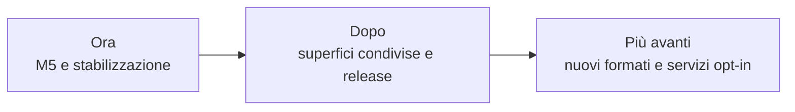

# Roadmap

> **Stato aggiornato per:** `main`, 9 settembre 2026.

La roadmap descrive ordine e direzione. Le GitHub Issues restano il tracker
delle attività eseguibili. Un prossimo passo approvato può avere un TODO
operativo in `project/` quando l'issue non è sufficiente a conservare una
sequenza tecnica estesa.

## Vincolo di integrazione

La [governance corrente](status.md#governance-di-integrazione) mantiene in
vigore il piano audit di `fix/audit-integration`: prima di G15/GO non si
integra in `main`, neppure una PR M5 o documentale verde. I candidati vanno
riconciliati con il lavoro audit e certificati nuovamente dopo l'integrazione.
Questa roadmap stabilisce l'ordine del lavoro, non deroga ai gate audit.

## Ora

### Riconciliare le linee prima di M5

Certificare il fix CAS #27 anche nelle run push e PR; poi integrare la
riconciliazione #25 e discovery #26 nella linea audit. Adattare #23 al lifecycle
audit senza callback sotto il lock del workspace, compresi i percorsi di
produzione, e riallineare #24 al risultato effettivo. Preservare il lavoro
esclusivo di entrambe le linee. Non ritirare il piano audit per aggirare G15.

### Completare M5

La CI di riferimento di `main` è tornata verde dopo la correzione dei blocchi
Markdown in #22; il runtime WASM segue la riconciliazione delle linee.

- discovery e installazione di un componente;
- proxy dei provider richiesti da casi reali;
- view WASM e validazione non fidata;
- errori, timeout, memoria e teardown dimostrati end-to-end.

Issue: [#8](https://github.com/Fubeo/Fub/issues/8) e
[#10](https://github.com/Fubeo/Fub/issues/10). La
[PR #23](https://github.com/Fubeo/Fub/pull/23) è il primo incremento nativo in
revisione, ancora draft per l'adattamento audit, non il completamento della
milestone. Installazione, consenso, inventario e abilitazione persistenti nel
percorso prodotto restano distinti dal banco di sviluppo.

### Stabilizzare i dati

- ripristino atomico;
- backup e restore provati;
- nessuna perdita silenziosa su snapshot, schema o storage plugin.

Issue: [#5](https://github.com/Fubeo/Fub/issues/5) e
[#7](https://github.com/Fubeo/Fub/issues/7).

### Misurare la Graph View

- modularizzare senza cambiare il contratto dati;
- dimostrare determinismo, teardown, scala e durata.

Issue: [#6](https://github.com/Fubeo/Fub/issues/6) e
[#12](https://github.com/Fubeo/Fub/issues/12).

### Completare le evidenze visuali

Il passaggio del banco in CI non chiude la revisione delle baseline. Provenienza,
foglio di contatto, ripetibilità nello stesso ambiente, soglie e diagnosi del
drift restano in [#17](https://github.com/Fubeo/Fub/issues/17), tracker unico che
ha assorbito #16. Non rigenerare immagini per nascondere regressioni.

## Dopo

### Proseguire le superfici condivise

Le fasi 0–4 del piano sono concluse su `main`: il motore testuale ha già il
secondo cliente e `DocumentSession` è estratta. Il seguito parte dalla fase 5,
`DocumentSurfaceRegistry`, con risoluzione, collisioni esplicite e fallback.

Seguono modalità e tastiera per superficie, formato pilota `.fubsheet`,
vertical slice della griglia e misura del protocollo. L'estensione ABI/WIT
resta l'ultima fase, dopo casi reali, limiti e teardown verificati.

- Tracker: [issue #11](https://github.com/Fubeo/Fub/issues/11).
- Piano operativo:
  [TODO — superfici di editing condivise](todo-superfici-di-editing-condivise.md).

### Contratto dei temi

Chiudere compatibilità, discovery, selezione, anteprima e guida per autori senza
pubblicare forme prive di consumatori.

Issue: [#13](https://github.com/Fubeo/Fub/issues/13).

### Prima release

Prima della release va decisa esplicitamente la classificazione di
[#9](https://github.com/Fubeo/Fub/issues/9): blocker da completare oppure
lavoro successivo con motivazione. La collocazione fra le direzioni future
non è, da sola, un'accettazione del rischio della sincronizzazione esistente.

- installazione verificata;
- changelog e versioni coerenti;
- WIT e schemi controllati;
- SBOM e audit;
- artifact per le piattaforme supportate;
- documentazione di avvio provata da una macchina pulita;
- matrice audit G14 e G15/GO sullo stesso candidato, prima del merge finale.

Versione, tag e distribuzione seguono le
[regole correnti](../development/versioning-and-releases.md), non una nuova
policy implicita introdotta dalla roadmap.

## Più avanti

Queste direzioni richiedono una proposta, un owner e un caso reale:

- formati ulteriori oltre al pilota delle superfici condivise;
- servizi di rete opt-in;
- sincronizzazione con garanzie esplicite;
- collaborazione;
- publishing;
- integrazioni AI;
- ecosistema di distribuzione dei plugin.

La prova di convergenza, disconnessioni e riavvio della sincronizzazione
esistente resta in [#9](https://github.com/Fubeo/Fub/issues/9): non è una
garanzia già consegnata.

Una direzione non autorizza a creare in anticipo tipi ABI, porte IPC o cartelle
di documentazione.

## Fuori ambito corrente

- database come sostituto obbligatorio dei file;
- marketplace senza formato di pacchetto e sicurezza completati;
- esecuzione di JavaScript di plugin nella webview;
- accesso WASI generale;
- superfici universali o contratti pubblici senza casi reali e misure;
- specifiche dettagliate di prodotti non approvati.

## Regola di passaggio

Un elemento entra nella documentazione di prodotto soltanto quando:

1. il comportamento è implementato;
2. il percorso principale è testato;
3. errori e limiti sono dichiarati;
4. il contratto stabile ha una fonte autorevole;
5. il lavoro residuo è tracciato in issue.
