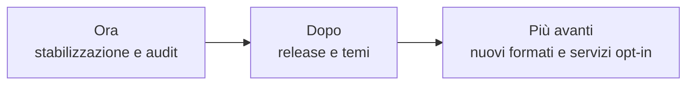

# Roadmap

> **Stato aggiornato per:** candidato `audit-close` della
> [PR #50](https://github.com/Fubeo/Fub/pull/50), basato su
> `fix/audit-integration`, 18 settembre 2026.

La roadmap descrive ordine e direzione. Le GitHub Issues restano il tracker
delle attività eseguibili. Un prossimo passo approvato può avere un TODO
operativo in `project/` quando l'issue non è sufficiente a conservare una
sequenza tecnica estesa.

## Vincolo di integrazione

La [governance corrente](status.md#governance-di-integrazione) mantiene in
vigore il piano audit: la PR #50 è il candidato G14 56/56, ma non si integra in
`main` prima dei required checks sul commit finale e di un G15/GO esplicito.
Questa roadmap stabilisce l'ordine del lavoro e non deroga a quei gate.

## Ora

### M5, fase 10 e remediation consegnate nel candidato

La PR #50 contiene inventario persistente, installazione, consenso sugli esatti
byte, scelta `enabled`, startup autorizzato, restart e rimozione; collisioni,
digest alterati e file incompleti restano errori espliciti.

I provider `ViewProvider`, `FormatProvider` e `GridProvider` attraversano i
percorsi nativo/WASM coperti, con validazione UI non fidata, finestre globali,
fallback, ownership e teardown. La remediation conclusiva chiude le race di
view/doc-search/grid, i confini lock/capability e la parità tema. #8 e #10
restano tracker aperti fino al record G15 e alla promozione in `main`.

### Stabilizzare i dati

- ripristino atomico;
- backup e restore provati;
- nessuna perdita silenziosa su snapshot, schema o storage plugin.

Issue: [#5](https://github.com/Fubeo/Fub/issues/5) e
[#7](https://github.com/Fubeo/Fub/issues/7).

### Misurare la Graph View

- modularizzare senza cambiare il contratto dati;
- dimostrare determinismo, teardown, scala e durata.

Issue: [#6](https://github.com/Fubeo/Fub/issues/6) e
[#12](https://github.com/Fubeo/Fub/issues/12).

### Completare le evidenze visuali

Il passaggio del banco in CI non chiude la revisione delle baseline. Provenienza,
foglio di contatto, ripetibilità nello stesso ambiente, soglie e diagnosi del
drift restano in [#17](https://github.com/Fubeo/Fub/issues/17), tracker unico che
ha assorbito #16. Non rigenerare immagini per nascondere regressioni.

## Consegne sulla base audit corrente

M5 e fase 10 sono integrate in `fix/audit-integration`; la PR #50 aggiunge
matrice 56/56 e remediation finale. ABI/WIT, mirror TypeScript, provider
nativo, componente WASM, client shell a finestre/patch, fallback, ownership e
teardown sono presenti. La consegna diventa definitiva solo dopo required
checks, G15/GO, merge in `main` e verifica post-merge.

- Tracker: [issue #11](https://github.com/Fubeo/Fub/issues/11).
- Piano operativo:
  [TODO — superfici di editing condivise](todo-superfici-di-editing-condivise.md).

## Dopo

### Contratto dei temi

Chiudere compatibilità, discovery, selezione, anteprima e guida per autori senza
pubblicare forme prive di consumatori.

Issue: [#13](https://github.com/Fubeo/Fub/issues/13).

### Prima release

Prima della release va decisa esplicitamente la classificazione di
[#9](https://github.com/Fubeo/Fub/issues/9): blocker da completare oppure
lavoro successivo con motivazione. La collocazione fra le direzioni future
non è, da sola, un'accettazione del rischio della sincronizzazione esistente.

- installazione verificata;
- changelog e versioni coerenti;
- WIT e schemi controllati;
- SBOM e audit;
- artifact per le piattaforme supportate;
- documentazione di avvio provata da una macchina pulita;
- matrice audit G14 e G15/GO sullo stesso candidato, prima del merge finale.

Versione, tag e distribuzione seguono le
[regole correnti](../development/versioning-and-releases.md), non una nuova
policy implicita introdotta dalla roadmap.

## Più avanti

Queste direzioni richiedono una proposta, un owner e un caso reale:

- formati ulteriori oltre al pilota delle superfici condivise;
- servizi di rete opt-in;
- sincronizzazione con garanzie esplicite;
- collaborazione;
- publishing;
- integrazioni AI;
- ecosistema di distribuzione dei plugin.

La prova di convergenza, disconnessioni e riavvio della sincronizzazione
esistente resta in [#9](https://github.com/Fubeo/Fub/issues/9): non è una
garanzia già consegnata.

Una direzione non autorizza a creare in anticipo tipi ABI, porte IPC o cartelle
di documentazione.

## Fuori ambito corrente

- database come sostituto obbligatorio dei file;
- marketplace senza formato di pacchetto e sicurezza completati;
- esecuzione di JavaScript di plugin nella webview;
- accesso WASI generale;
- superfici universali o contratti pubblici senza casi reali e misure;
- specifiche dettagliate di prodotti non approvati.

## Regola di passaggio

Un elemento entra nella documentazione di prodotto soltanto quando:

1. il comportamento è implementato;
2. il percorso principale è testato;
3. errori e limiti sono dichiarati;
4. il contratto stabile ha una fonte autorevole;
5. il lavoro residuo è tracciato in issue.
