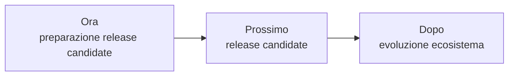

# Roadmap

> **Stato aggiornato per `main@94f3f3e17c813b7cee4334f2ad37f35c482487de`, 20 settembre 2026.**

La roadmap descrive direzione e ordine. Le GitHub Issues restano il tracker
operativo; una capacità già consegnata non torna incompleta soltanto perché un
follow-up è aperto.

## Capacità consegnate

### M5 — runtime WASM

La PR #53 ha consegnato component model Wasmtime, lifecycle, capability,
installazione, consenso, `enabled`, restart, remove, UI non fidata e i provider
Command/Format/View/Grid nei percorsi esercitati. #8 e #10 sono chiuse.

`IndexProvider` e `EventHandler` inbound non vengono promessi: il lavoro
futuro è tracciato in #57. Le quote assolute CPU/RAM di processo sono #58.

### Superfici condivise e Grid v1

`DocumentSession`, `DocumentSurfaceRegistry`, `.fubsheet`, `GridEngine` e
Grid v1 sono in `main`. I guard rendono meccaniche due invarianti: ogni binding
usa profili registrati; ogni famiglia pubblica ha shell, fallback, mirror,
nativo e WASM. La scena Grid è certificata in entrambe le luci e il TODO
operativo è stato rimosso dopo il trasferimento delle invarianti.

### Temi e Graph View

#13, #12, #56 e #6 sono chiuse. Il contratto tema, preview/revert, artefatti
generati, visuali e accessibilità sono consegnati. La Graph View ha moduli
separati, determinismo, lifecycle, benchmark 2k/10k e gate hard sull'heap.

## Ora — preparazione del primo release candidate

1. completare #5, ripristino atomico degli snapshot del database;
2. classificare #9 rispetto al primo release candidate.

## Prossimo — primo release candidate

Il candidato deve avere almeno:

- versione, changelog e compatibilità degli schemi coerenti;
- WIT frozen e compatibilità ABI verificate;
- test e guard pertinenti verdi;
- supply chain Rust/NPM con SBOM;
- benchmark richiesti registrati;
- visuali e accessibilità delle superfici incluse;
- artifact per le piattaforme supportate;
- documentazione di avvio e installazione coerente col prodotto.

## Dopo

Lavoro post-release può includere l'evoluzione delle famiglie WASM differite,
sync/collaborazione e altre capacità non necessarie al primo candidato.

## Regola di avanzamento

Una capacità è consegnata quando è in `main` e possiede evidenza sufficiente
nei test e nella documentazione. Un criterio trasferito deve avere una issue
proprietaria esplicita; non può essere spuntato per inferenza.

Per il dettaglio corrente vedere [Stato del progetto](status.md).
