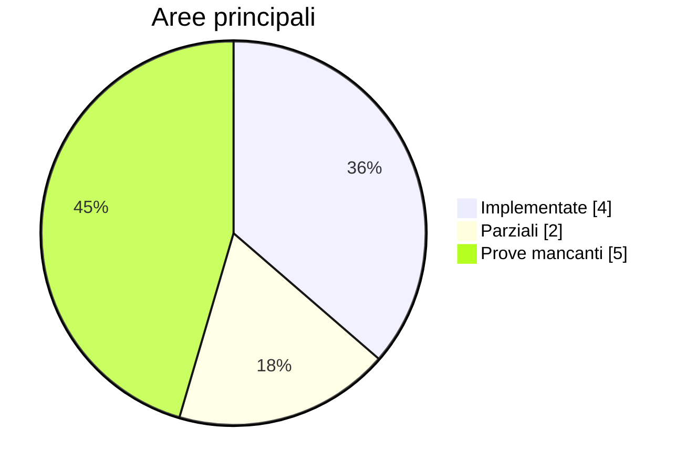

# Stato del progetto

> **Aggiornato:** 25 agosto 2026  
> **Fonte di verità:** codice, test e issue aperte

## Quadro corrente

| Area | Stato | Prova o limite |
|---|---|---|
| Vault e Markdown | implementato | parsing, editing sorgente, link, tag e persistenza |
| Ricerca e viste | implementato | indici incrementali e provider ufficiali |
| Shell ed editor | implementato | CodeMirror, UI dichiarativa e banco visuale |
| Contratto Rust/WIT | implementato | conformità e additività in CI |
| Runtime WASM | parziale | lifecycle e primi proxy; percorso utente incompleto |
| Superfici di editing condivise | proposto | RFC 0001, nessun contratto pubblico |

## Prove aperte

- [#5 — ripristino atomico degli snapshot](https://github.com/Fubeo/Fub/issues/5)
- [#6 — scala e durata della Graph View](https://github.com/Fubeo/Fub/issues/6)
- [#7 — esercitazione backup/ripristino](https://github.com/Fubeo/Fub/issues/7)
- [#8 — percorso end-to-end WASM](https://github.com/Fubeo/Fub/issues/8)
- [#9 — endurance della sincronizzazione](https://github.com/Fubeo/Fub/issues/9)

## Interpretazione

Una feature non diventa “completa” perché il contratto esiste. Il percorso deve essere raggiungibile, testato e documentato. Le issue sopra rappresentano prove mancanti o percorsi incompleti, non una seconda specifica del prodotto.
