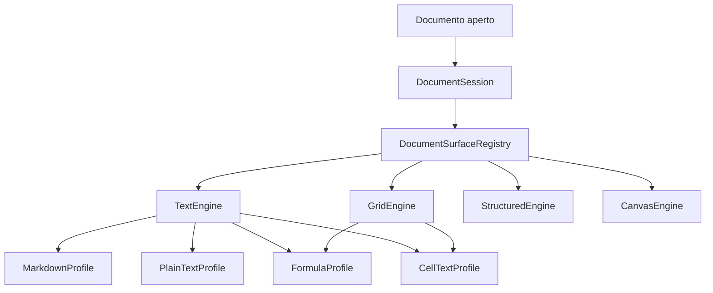

# TODO — modularità delle superfici di editing

> **Stato:** prossimo passo approvato, non ancora avviato.
> **Tracker:** [issue #11](https://github.com/Fubeo/Fub/issues/11).
> **Aggiornato:** 25 agosto 2026.
> **Origine:** recupero e revisione del piano storico sulle superfici
> condivise, conservato nella cronologia Git al commit
> `5d8af02050700c738e73461a7a0a98059d91dfc2`.
> **Regola di uscita:** quando il lavoro è concluso, le invarianti stabili
> confluiscono nelle pagine di architettura e in un eventuale ADR; questo TODO
> viene eliminato.

## Obiettivo

Fub deve riusare gli stessi motori di interazione in formati e funzionalità
diverse. Un futuro foglio di calcolo deve poter usare, dentro una cella e nella
barra delle formule, lo stesso motore testuale già usato da Markdown, senza
duplicare CodeMirror, cursore, undo, tema, IME, clipboard, accessibilità o
lifecycle.

Il lavoro parte come architettura interna della shell. Nessun tipo entra in
`fub-abi` o nel WIT prima che almeno due clienti reali ne abbiano dimostrato
forma, limiti e fallback.

La regola architetturale è:

> **La shell fornisce famiglie di superfici di editing. I formati e i plugin le
> scelgono, le configurano e le alimentano; non le reimplementano.**

## Risultato atteso



Il documento conserva una sola autorità. Ogni superficie conserva invece il
proprio cursore, scroll, selezione, modalità e undo locale.

## Fonti e confini correnti

Fonti principali da verificare prima di ogni fase:

- [`apps/client/src/editor/editor.ts`](../../apps/client/src/editor/editor.ts);
- [`apps/client/src/editor/editor-commands.ts`](../../apps/client/src/editor/editor-commands.ts);
- [`apps/client/src/panels/document.ts`](../../apps/client/src/panels/document.ts);
- [`apps/client/src/state/layout.ts`](../../apps/client/src/state/layout.ts);
- [`apps/client/src/ui/custom.ts`](../../apps/client/src/ui/custom.ts);
- [`crates/fub-abi/src/format.rs`](../../crates/fub-abi/src/format.rs);
- [`crates/fub-abi/src/model.rs`](../../crates/fub-abi/src/model.rs);
- [`crates/fub-abi/src/ui.rs`](../../crates/fub-abi/src/ui.rs);
- [`crates/fub-abi/wit/fub/abi.wit`](../../crates/fub-abi/wit/fub/abi.wit).

Documentazione collegata:

- [Editor e anteprima](../product/editor-and-preview.md);
- [Frontend e IPC](../architecture/frontend-and-ipc.md);
- [Modello del documento](../architecture/document-model.md);
- [Runtime dei plugin](../architecture/plugin-runtime.md);
- [ADR 0189 — IPC sottile e tipizzato](../decisions/0189-ipc-sottile-e-tipizzato.md);
- [ADR 0190 — sessioni documento e undo](../decisions/0190-sessioni-documento-e-undo.md);
- [ADR 0191 — UI dichiarativa e renderer](../decisions/0191-ui-dichiarativa-e-renderer.md);
- [ADR 0193 — ownership e teardown](../decisions/0193-ownership-lifecycle-e-teardown.md).

## Distinzioni obbligatorie

### Motore e profilo

Il motore risolve problemi meccanici condivisi. Il profilo aggiunge semantica
di dominio.

| Livello | Responsabilità |
|---|---|
| `TextEngine` | buffer CodeMirror, selezioni, undo, focus, lifecycle, tema, line ending, aggiornamenti programmatici |
| `MarkdownProfile` | Markdown, live preview, wikilink, tag, callout, completamenti e comandi specifici |
| `PlainTextProfile` | testo senza semantica aggiuntiva |
| `FormulaProfile` | formule, riferimenti A1, funzioni e completamenti |
| `CellTextProfile` | editing breve o multilinea, commit e cancel |

Un profilo fidato può produrre estensioni CodeMirror. Un plugin WASM non può
trasferire closure JavaScript, oggetti DOM o estensioni CodeMirror.

### Superficie e formato

Un formato può avere più superfici e una superficie può servire più formati.
`FormatProvider` continua a trasformare la sorgente nel modello comune; non
diventa proprietario dell'editor.

### Documento e superficie

`DocumentSession` possiede contenuto o modello autorevole, revisione, dirty,
coda di salvataggio, bozza, conflitto, sottoscrittori e lifecycle del documento.

La superficie possiede cursore o cella attiva, selezione, scroll, zoom,
modalità, undo locale e stato visuale ripristinabile.

### Servizio condiviso e plugin

CodeMirror è un servizio della shell, non un plugin dal quale dipendono altri
plugin. Questa scelta evita dipendenze plugin→plugin, copie incompatibili,
accesso arbitrario alla webview e chiamate IPC o WASM per ogni battuta.

## Invarianti

### Documento

- [ ] Un documento aperto in più riquadri ha un solo buffer autorevole.
- [ ] Ogni superficie conserva cursore, scroll e undo propri.
- [ ] Debounce e coda di salvataggio sono per documento.
- [ ] Una modifica esterna non sovrascrive un buffer sporco.
- [ ] Le scritture restano guardate dalla revisione.
- [ ] Bozze, rename, delete e close vengono coordinati una sola volta.
- [ ] L'ultima tab esegue flush, eventuale bozza e teardown nell'ordine deciso.

### Motore testuale

- [ ] Il core non importa Markdown, wikilink, tag, live preview o `SyntaxForm`.
- [ ] Selezioni e offset continuano a usare byte UTF-8 ai confini.
- [ ] CRLF e file misti seguono la politica esistente.
- [ ] Cambiare documento elimina la history precedente.
- [ ] Sincronizzare un altro riquadro non entra nell'undo locale.
- [ ] Il cambio di tema non ricostruisce il documento.
- [ ] `destroy()` rilascia tutte le risorse possedute.
- [ ] Gli import `@codemirror/*` restano confinati al package testuale.

### Superfici e contratto

- [ ] Ogni superficie ha famiglia, id, modalità e owner stabili.
- [ ] Mount, suspend, resume e destroy hanno semantica esplicita.
- [ ] Famiglia o profilo sconosciuti producono un fallback leggibile.
- [ ] Unregister e unload non lasciano renderer, timer, observer o comandi vivi.
- [ ] Nessuna superficie manda IPC per carattere.
- [ ] Il contratto pubblico non contiene DOM, callback JS o tipi CodeMirror.
- [ ] Tutto ciò che attraversa il confine è serializzabile e rappresentabile in WIT.
- [ ] Nativo e WASM ricevono la stessa semantica.
- [ ] Payload grandi usano finestre o operazioni incrementali.
- [ ] Ogni capability pubblica dichiara versione, limiti e fallback.

## Vocabolario e API interne candidate

Queste firme sono candidate interne. Non sono un contratto approvato.

```ts
export type SurfaceFamily =
  | "text"
  | "grid"
  | "structured"
  | "canvas"
  | "viewer";

export interface SurfaceViewState {
  version: number;
  value: unknown;
}

export interface EditorSurface {
  readonly family: SurfaceFamily;
  readonly surfaceId: string;

  focus(target?: unknown): void;
  setReadOnly(readOnly: boolean): void;
  setTheme(theme: Theme): void;

  captureViewState(): SurfaceViewState;
  restoreViewState(state: SurfaceViewState): void;

  suspend(): void;
  resume(): void;
  destroy(): void;
}

export interface TextEditorSurface extends EditorSurface {
  readonly family: "text";

  replaceDocument(text: string): void;
  synchronizeDocument(text: string): void;
  currentText(): string;

  selections(): EditorSelections;
  revealByteOffset(offset: number): void;
  reconfigure(request: TextProfileRequest): void;
}

export interface TextProfileRequest {
  profile: string;
  configuration?: unknown;
}

export interface SurfaceMountContext {
  paneId: string;
  documentId: string;
  parent: HTMLElement;
  session: DocumentSession;
}

export interface SurfaceFactory {
  readonly family: string;
  mount(
    request: SurfaceRequest,
    context: SurfaceMountContext,
  ): EditorSurface;
}

export interface SurfaceRegistration {
  owner: string;
  family: string;
  factory: SurfaceFactory;
}

export interface DocumentSurfaceRegistry {
  register(registration: SurfaceRegistration): () => void;
  resolve(request: SurfaceRequest): SurfaceFactory | null;
  mount(
    request: SurfaceRequest,
    context: SurfaceMountContext,
  ): EditorSurface;
}
```

Ogni registrazione restituisce il proprio unregister. Il bundle non conosce la
mappa interna e non la svuota manualmente.

## Struttura candidata

La struttura seguente è una destinazione, non un vincolo per il primo commit.
Durante la migrazione `apps/client/src/editor/editor.ts` può restare come adapter.

```text
apps/client/src/editors/
├── core/
│   ├── surface.ts
│   ├── registry.ts
│   ├── selector.ts
│   ├── session.ts
│   ├── commands.ts
│   ├── modes.ts
│   └── view-state.ts
├── text/
│   ├── engine.ts
│   ├── surface.ts
│   ├── selection.ts
│   ├── line-endings.ts
│   ├── synchronization.ts
│   ├── theme.ts
│   └── profiles/
│       ├── markdown/
│       ├── plain-text.ts
│       ├── formula.ts
│       └── cell-text.ts
├── grid/
│   ├── engine.ts
│   ├── model.ts
│   ├── viewport.ts
│   ├── selection.ts
│   ├── clipboard.ts
│   ├── keyboard.ts
│   ├── cell-editor.ts
│   ├── formula-bar.ts
│   ├── accessibility.ts
│   └── protocol.ts
├── structured/
│   └── README.md
└── bootstrap.ts
```

## Piano di implementazione

### Fase 0 — caratterizzare il comportamento corrente

Lavoro:

- [ ] inventariare tutti gli import `@codemirror/*`;
- [ ] classificare ogni responsabilità come generica o Markdown;
- [ ] elencare le assunzioni Markdown nel pannello documenti;
- [ ] conservare baseline visuali nelle due luci;
- [ ] aggiungere test per history, sincronizzazione, UTF-8, CRLF e teardown;
- [ ] verificare due riquadri sullo stesso documento e undo locali distinti.

Criterio di uscita: nessuna differenza visiva e nessuna modifica a Rust, IPC o
WIT.

### Fase 1 — estrarre `TextEngine`

Estrarre costruzione di `EditorView`, listener, aggiornamenti programmatici,
replace, sincronizzazione, line ending, offset UTF-8, focus, reveal, read-only,
tema, lifecycle e stato visuale.

Lasciare fuori parser Markdown, live preview, wikilink, tag, completamenti,
`SyntaxForm` e comandi dipendenti dalla sintassi.

Criteri di uscita:

- [ ] i test preesistenti restano verdi;
- [ ] il motore non importa codice Markdown;
- [ ] la vecchia factory funziona tramite adapter;
- [ ] tema e resa restano identici;
- [ ] non nasce un nuovo canale IPC.

### Fase 2 — rendere Markdown un profilo

- [ ] spostare language support e live preview;
- [ ] spostare wikilink, tag e completamenti;
- [ ] spostare la configurazione di `SyntaxForm`;
- [ ] classificare uno per uno i comandi dell'editor;
- [ ] mantenere nel core soltanto comandi con semantica condivisa;
- [ ] riconfigurare il profilo senza perdere la history.

Criterio di uscita: tutte le funzioni dell'editor corrente passano da
`MarkdownProfile` e nel motore non compare la parola `markdown`.

### Fase 3 — aggiungere clienti reali

Creare `PlainTextProfile` e `FormulaProfile`. Il profilo formula parte con
single line configurabile, operatori, numeri, stringhe, riferimenti A1,
completamento di funzioni e fogli, commit e cancel espliciti.

Creare una fixture che monti insieme Markdown, plain text e formula. Una
correzione al core deve raggiungere tutti senza modificare i profili.

Criterio di uscita: l'astrazione è dimostrata da almeno due clienti reali,
coperti end-to-end.

### Fase 4 — estrarre `DocumentSession`

- [ ] estrarre mappa dei buffer, queue, timer, revisione e dirty;
- [ ] centralizzare modifiche esterne, rename, delete e close;
- [ ] notificare la sessione con operazioni tipizzate;
- [ ] sincronizzare le altre superfici dalla sessione;
- [ ] lasciare nel pannello layout, tab, DOM, focus e mount;
- [ ] escludere cursore, scroll, cella attiva e undo locale dalla sessione.

Criterio di uscita: il pannello non implementa più il protocollo di salvataggio
e la sessione muore correttamente dopo l'ultima tab.

### Fase 5 — introdurre `DocumentSurfaceRegistry`

Ordine iniziale di risoluzione:

1. override esplicito dell'utente;
2. binding esatto per `format_id`;
3. binding per specie della sorgente;
4. fallback testuale;
5. viewer read-only per sorgenti a byte;
6. superficie di errore esplicita.

Le collisioni nominano entrambi gli owner e non usano silenziosamente
“l'ultimo vince”.

Criteri di uscita:

- [ ] il pannello non chiama direttamente `createEditor()`;
- [ ] Markdown e plain text vengono scelti dal registro;
- [ ] una famiglia assente mostra il fallback;
- [ ] unregister rimuove binding e istanze possedute.

### Fase 6 — modalità e tastiera per superficie

Ogni superficie dichiara modalità proprie. La griglia non eredita concetti come
`live_preview`.

Ordine di arbitrato:

1. popup o modalità transitoria;
2. editor locale in modifica;
3. superficie attiva;
4. profilo attivo;
5. comandi del documento;
6. comandi del riquadro;
7. comandi globali.

Il commutatore della shell legge la superficie attiva. Non vengono aggiunti
listener globali isolati nei renderer.

### Fase 7 — formato pilota `.fubsheet`

Creare `crates/fub-format-sheet/` con formato testuale e schema versionato.

Principi:

- identità persistente della cella come `RowId + ColumnId`;
- A1 come proiezione dell'ordine corrente;
- input, ordine, dimensioni, stile e versione persistiti;
- AST, valore, dipendenze, A1, cache ed errori derivati;
- workbook autorevole separato da `DocumentModel`;
- outline, ricerca e proprietà esposti come proiezioni comuni.

Non iniziare da XLSX: OOXML, ZIP, stili e relazioni oscurerebbero la prova
architetturale.

### Fase 8 — vertical slice di `GridEngine`

Consegnare:

- [ ] una sheet visibile con righe, colonne e intestazioni;
- [ ] viewport virtualizzata e overscan limitato;
- [ ] cella attiva e selezione rettangolare;
- [ ] navigazione completa da tastiera;
- [ ] un solo editor in-cell riusabile;
- [ ] formula bar basata su `TextEngine`;
- [ ] commit, cancel e politica di blur;
- [ ] copia e incolla TSV come una sola operazione;
- [ ] undo del workbook separato dall'undo testuale;
- [ ] lettura e scrittura `.fubsheet`;
- [ ] accessibilità con `role="grid"` e focus ripristinato.

Nessun carattere digitato attraversa IPC o WASM. Il commit produce una
`GridOperation`, poi passa dalla `DocumentSession` e dalla scrittura guardata.

La prima versione delle formule comprende numeri, stringhe, operatori,
parentesi, riferimenti, intervalli, `SUM`, `AVERAGE`, `MIN`, `MAX`, `IF`, errori
tipizzati e rilevamento dei cicli. L'evaluatore autorevole resta in Rust.

### Fase 9 — misurare il protocollo

Prima di pubblicare tipi, rispondere con il vertical slice a queste domande:

1. dato minimo per scegliere una superficie;
2. owner del binding formato→superficie;
3. scope della scelta;
4. negoziazione della versione;
5. fallback;
6. finestre di celle e operazioni incrementali;
7. ritorno delle celle dipendenti;
8. persistenza dello stato visuale;
9. unload del bundle;
10. capability richieste;
11. localizzazione di errori e stati mancanti;
12. comportamento di una shell che non conosce una versione.

Un tipo entra nel contratto soltanto se ha almeno due clienti, non espone il
framework frontend, attraversa WIT, possiede limiti e fallback, funziona
nativamente e via WASM e non richiede chiamate per battuta.

### Fase 10 — ABI, WIT e WASM

Soltanto dopo la misura:

- [ ] aggiungere i tipi minimi in `fub-abi`;
- [ ] aggiornare WIT vivo e verificarne l'additività;
- [ ] aggiornare mirror TypeScript e fake host;
- [ ] aggiornare `MemoryHost` e `fub-testkit`;
- [ ] implementare il proxy in `fub-wasm-host`;
- [ ] integrare inventario, ownership e lifecycle dei bundle;
- [ ] creare un esempio WASM con griglia piccola;
- [ ] provare parità nativo↔WASM;
- [ ] provare fallback su shell priva della griglia;
- [ ] documentare limiti, versioni e negoziazione.

Una futura famiglia `structured` per DOCX riusa sessioni, registry, lifecycle,
comandi e salvataggio, ma non forza CodeMirror a diventare un editor visuale
rich text.

## Test e presidi CI

### Matrice minima

- `TextEngine`: line ending, sincronizzazione minima, UTF-8, selezioni, undo,
  read-only, focus, tema, teardown e riconfigurazione;
- profili: mount, configurazione, comandi, completamenti e assenza di dipendenze
  vietate;
- sessioni: buffer condiviso, debounce unico, conflitto, bozza, rename, delete,
  close, modifica esterna, echo e gare deterministiche;
- registry: registrazione, collisione, owner, unregister, fallback e versione
  sconosciuta;
- grid: identità, selezione, tastiera, viewport, overlay, formula bar,
  commit/cancel, paste, undo, formule, cicli, serializzazione e migrazione;
- contratto: JSON, Rust↔WIT, additività, mirror TypeScript, host nativo, host
  WASM, fallback, negoziazione ed errori;
- end-to-end: Markdown, plain text e foglio, split, cambio tab, unload, riavvio,
  recupero bozza, conflitto, tema, lingua e sola tastiera.

### Guard da aggiungere

- [ ] nessun import `@codemirror/*` fuori da `apps/client/src/editors/text/`;
- [ ] ogni binding usa famiglia, profilo e fallback registrati;
- [ ] ogni famiglia pubblica ha implementazione shell, fallback, mirror,
  conformità nativa e conformità WASM.

I guard verificano proprietà, non l'ordine estetico dei file.

## Strategia dei commit

Niente big bang. Ogni commit appartiene a una sola specie:

1. test di caratterizzazione;
2. spostamento meccanico;
3. astrazione con adapter;
4. migrazione di un cliente;
5. rimozione dell'adapter;
6. nuova funzionalità.

Ordine raccomandato: test, core testuale, adapter, Markdown, plain text,
formula, guard degli import, `DocumentSession`, registry, modalità, `.fubsheet`,
grid verticale, editor condivisi, undo e accessibilità, misura del protocollo,
ABI, WIT, SDK, proxy WASM, esempio e rimozione degli adapter.

## Rischi da sorvegliare

| Rischio | Segnale | Risposta |
|---|---|---|
| astrazione nominale | il core riceve ancora tipi Markdown | secondo profilo obbligatorio |
| ABI prematura | ogni modifica alla griglia cambia il WIT | protocollo interno fino al vertical slice |
| dipendenza plugin→plugin | il foglio importa Markdown | entrambi consumano servizi della shell |
| chiamata per battuta | lag o code IPC | bozza locale e commit esplicito |
| due verità | frontend e Rust calcolano formule diverse | evaluatore autorevole unico |
| undo ambiguo | `Ctrl-Z` agisce sul livello errato | priorità contestuale e pile separate |
| griglia non accessibile | uso possibile soltanto con mouse | ARIA e tastiera dal primo slice |
| renderer orfano | timer o observer dopo la chiusura | disposer e test di unload |
| payload enorme | workbook intero a ogni refresh | finestre e operazioni incrementali |
| XLSX blocca il lavoro | focus su OOXML invece che sui confini | `.fubsheet` prima di XLSX |
| modello comune gonfio | celle e stili entrano in `DocumentModel` | proiezione, non autorità |
| stato perso | cursore o selezione spariscono | sessione e view state separati |

## Definition of Done

- [ ] Markdown usa `TextEngine` attraverso `MarkdownProfile`.
- [ ] Il core testuale non conosce Markdown.
- [ ] Plain text, formula bar e cell editor usano lo stesso motore.
- [ ] Una correzione al core raggiunge tutti i profili.
- [ ] Il pannello documenti monta le superfici attraverso il registro.
- [ ] Il buffer appartiene alla sessione; cursore, scroll e undo alla superficie.
- [ ] La griglia usa un solo CodeMirror in-cell riusabile.
- [ ] Nessuna battuta genera IPC o WASM.
- [ ] Undo testuale e undo del foglio restano separati.
- [ ] Famiglia e profilo sconosciuti hanno un fallback.
- [ ] Disabilitare un owner rimuove registrazioni e istanze.
- [ ] Un plugin WASM può richiedere una superficie conosciuta senza iniettare JS.
- [ ] Rust, WIT, TypeScript, SDK, host nativo e WASM sono conformi.
- [ ] `DocumentModel` resta agnostico rispetto a celle e DOCX.
- [ ] Banchi visuali e di accessibilità coprono testo e griglia.
- [ ] Tutta la CI pertinente è verde.

## Gestione del TODO

L'issue #11 resta il tracker di stato, assegnazione e PR. Questo file conserva
la sequenza tecnica, le invarianti e i criteri che non devono essere compressi
nel corpo dell'issue.

Durante l'esecuzione:

- ogni PR indica fase e criteri di uscita coperti;
- le checklist vengono aggiornate soltanto quando il comportamento è su `main`;
- modifiche architetturali correnti aggiornano
  [`frontend-and-ipc.md`](../architecture/frontend-and-ipc.md);
- comportamento utente consegnato aggiorna
  [`editor-and-preview.md`](../product/editor-and-preview.md);
- una scelta pubblica o costosa da invertire genera un ADR;
- al completamento, questo TODO viene rimosso e la cronologia resta in Git.
