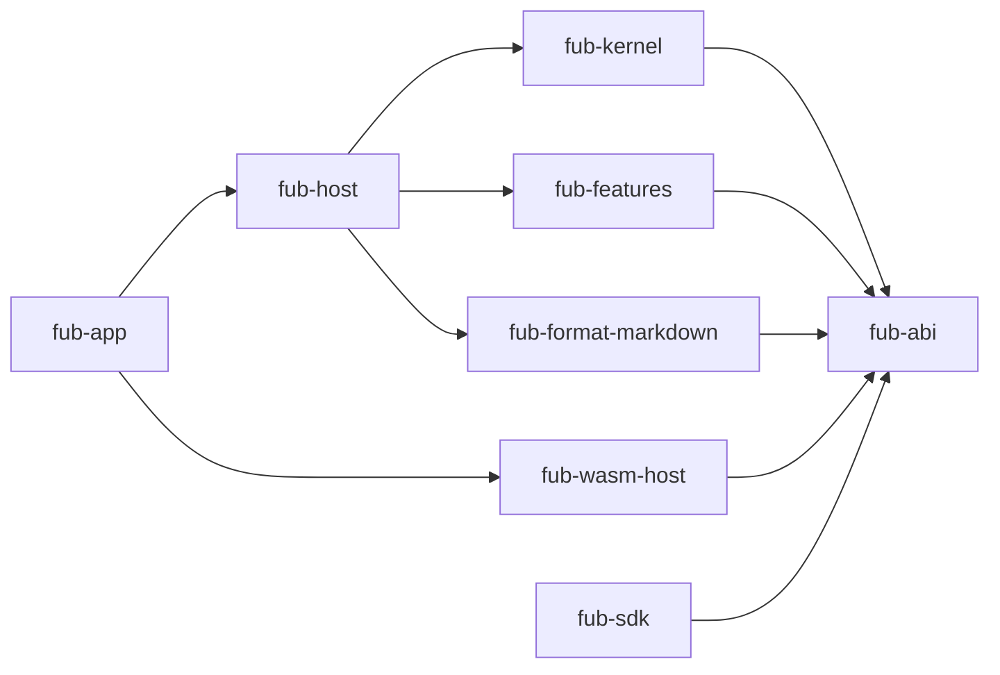

# Riferimento dei componenti

> **Stato:** implementato  
> **Fonte di verità:** workspace e manifest Cargo

| Componente | Percorso | Ruolo |
|---|---|---|
| `fub-abi` | `crates/fub-abi/` | tipi, trait, errori, WIT e rappresentazioni condivise |
| `fub-kernel` | `crates/fub-kernel/` | stato del vault, storage, indici, policy ed eventi |
| `fub-sdk` | `crates/fub-sdk/` | helper per provider e host in memoria |
| `fub-testkit` | `crates/fub-testkit/` | integrazione host/kernel per test |
| `fub-format-markdown` | `crates/fub-format-markdown/` | parser, renderer e serializzazione Markdown |
| `fub-features` | `crates/fub-features/` | funzioni ufficiali come bundle indipendenti |
| `fub-host` | `crates/fub-host/` | sessioni, montaggio, watcher, impostazioni e job |
| `fub-app` | `crates/fub-app/` | binario, configurazione e adattatori Tauri |
| `fub-wasm-host` | `crates/fub-wasm-host/` | runtime Wasmtime e proxy verso `fub-abi` |
| shell | `frontend/` | interfaccia, editor, pannelli, tema e test visuali |
| esempi | `esempi/` | componenti WASM compilati dai test o a mano |
| strumenti | `tools/` | verifiche fuori dal workspace principale |

## Dipendenze

Le dipendenze effettive sono verificate dai test. Questo documento non deve contenere un numero manuale dei crate: il workspace è la fonte di verità.
