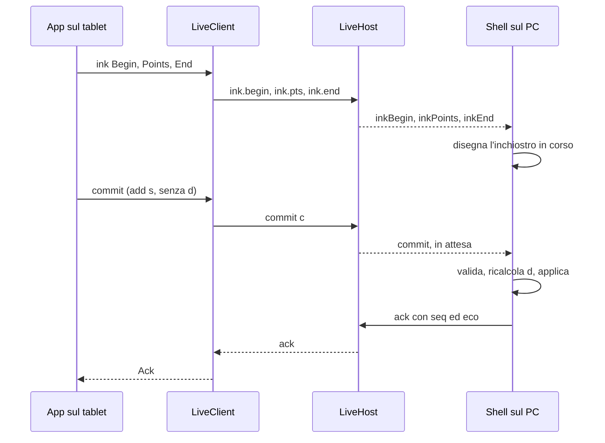

# Sessione live

> **Ambito:** il protocollo della sessione live di FubDraw, versione 1, come lo
> implementa `fub-live`: abbinamento, trasporto, messaggi, limiti, ripresa e
> sicurezza.
> **Fonti autorevoli:** `crates/fub-live/src/protocol/`,
> `crates/fub-live/src/limits.rs`, `crates/fub-live/src/pairing.rs`,
> `crates/fub-live/src/tls.rs`, `crates/fub-live/src/host/`,
> `crates/fub-live/src/client.rs` e le prove in `crates/fub-live/src/tests/`;
> per la composizione nell'app, `crates/fub-app/src/live.rs`.

La sessione live permette a un tablet di scrivere su un disegno aperto sul PC:
il PC mostra il tratto mentre viene tracciato e lo rende durevole quando il
gesto finisce. Le ragioni delle scelte stanno nell'ADR 0204.

## Ruoli e confini

| Ruolo | Chi | Nel crate |
|---|---|---|
| host | Fub sul PC, con il disegno aperto | `LiveHost`: listener, abbinamento, scrittore, commit in attesa |
| scrittore | il tablet | `LiveClient`, il client in Rust dei percorsi B e C |
| shell | la shell di Fub sul PC, con i comandi di `fub-app` | fuori: applica le operazioni, disegna l'inchiostro, risponde |

La sessione ha un solo scrittore e nessun osservatore. Espone un solo
documento.

L'host non applica le operazioni. Le passa alla shell come evento e tiene il
commit in attesa finché la shell non risponde `ack` o `nack`. Il canale verso
la shell quindi non è autorevole: `LiveHost::status` restituisce i commit in
attesa, e `LiveHost::stop` quelli rimasti senza risposta.

`fub-live` non dipende da `fub-abi`, `fub-kernel`, `fub-host` o Tauri,
nemmeno attraverso altri crate. La prova
`the_live_session_stays_outside_the_core` in
[`dependency_invariant.rs`](../../crates/fub-abi/tests/dependency_invariant.rs)
lo verifica; il posto del crate nel sistema è in
[Componenti e confini](../architecture/components-and-boundaries.md).

## Trasporto

- WebSocket su TLS 1.3, su TCP e IPv4.
- Il listener si lega a un solo indirizzo privato di RFC 1918 (10/8,
  172.16/12, 192.168/16), quello scritto nel QR: mai `0.0.0.0`, mai un
  indirizzo pubblico. `candidate_addresses` propone per primo quello della
  rotta predefinita.
- La porta è libera a ogni sessione, oppure quella che il campo `port` di
  `LiveConfig` fissa per le reti con regole firewall.
- Ogni messaggio è un oggetto JSON in un messaggio WebSocket di testo. I frame
  binari chiudono con 1003.
- Messaggio e frame WebSocket arrivano a 24 MiB su entrambi i lati: il default
  di `tungstenite`, 16 MiB per frame, non basterebbe a uno snapshot.
- Il listener vive quanto la sessione e chiude con lei.

## Abbinamento

`LiveHost::start` apre il listener, genera il certificato effimero e il primo
QR. Il QR porta un segreto di 128 bit, monouso, valido 5 minuti.

```text
fubdraw://live?h=<ip>:<porta>&s=<sessione>&k=<segreto>&f=<impronta>&n=<nome>
```

| Parametro | Contenuto |
|---|---|
| `h` | indirizzo IPv4 privato e porta, in decimale; porta diversa da 0 |
| `s` | id di sessione, 64 bit casuali, 11 caratteri base64url |
| `k` | segreto di abbinamento, 128 bit, 22 caratteri base64url |
| `f` | impronta SHA-256 del certificato, 43 caratteri base64url |
| `n` | nome del PC, da 1 a 64 caratteri senza caratteri di controllo |

- Il base64url è senza padding e stretto: lunghezza esatta e bit di coda a
  zero, così ogni valore ha una sola grafia.
- `n` è UTF-8 con la codifica percentuale di RFC 3986: esadecimale maiuscolo,
  e solo per i byte che non sono caratteri non riservati. Lo scrittore lo
  mostra e chiede conferma prima di inviare qualunque dato; in lettura è
  facoltativo.
- La lettura rifiuta parametri sconosciuti o ripetuti, un parametro senza `=`,
  un frammento `#`, un `h` non privato e un testo oltre 1024 byte. Un QR
  alterato non diventa una connessione verso un indirizzo che il QR non
  diceva.
- `Pairing` porta il testo, da mostrare anche in chiaro sotto il disegno, il QR
  in SVG e i millisecondi di validità rimasti. Contiene il segreto: si mostra
  solo sul PC.

Il primo `hello` valido consuma il segreto. Un segreto sbagliato no: il QR
resta buono per lo scrittore che lo ha davvero inquadrato. Alla scadenza la
shell riceve `pairingExpired`.

`LiveHost::renew_pairing` emette un QR nuovo, con un segreto nuovo valido
5 minuti. Mentre uno scrittore è collegato la richiesta è rifiutata. Uno
scrittore abbinato ma fuori dalla connessione perde la ripresa: la shell
riceve `writerReleased` con `pairingRenewed`.

## Certificato e TLS

- A ogni sessione l'host genera una chiave ECDSA P-256 e un certificato
  autofirmato per l'indirizzo su cui ascolta. La chiave resta in memoria,
  dentro `rustls`; la sua copia in DER si azzera appena caricata.
- Il client accetta il certificato la cui impronta SHA-256 è quella di `f`, e
  nessun altro: niente catena, niente CA, niente date, perché l'orologio di un
  tablet può essere sbagliato di anni.
- La firma del handshake si verifica sempre: prova che dall'altra parte c'è chi
  possiede la chiave, non chi ha copiato il certificato.
- Entrambi i lati parlano solo TLS 1.3 con il provider `ring`, senza ticket né
  ripresa di sessione TLS.
- Il client confronta l'impronta prima di mandare qualunque byte
  dell'applicazione. Con un'impronta diversa la connessione finisce con
  `FingerprintMismatch` e il client non riprova.

## Richiesta di upgrade

- Il percorso è esattamente `/live`, senza query; ogni altro risponde 404.
- Un'intestazione `Origin` dev'essere assente o uguale a
  `https://<ip>:<porta>` dell'host; ogni altra risponde 403. Un client in Rust
  non manda `Origin`, un browser sì: una pagina di un altro sito non apre la
  sessione.
- Una richiesta che non è un upgrade WebSocket chiude la connessione.

## Ingresso

Una connessione ha 5 secondi dall'accettazione del socket per arrivare al
`hello`, TLS e upgrade compresi. Fino al `welcome` l'host ne legge al più
64 KiB, handshake TLS e richiesta di upgrade compresi. Al più 8 connessioni
negoziano insieme: oltre, il socket si chiude appena accettato. Mentre la
sessione si chiude, ogni `hello` riceve 1001.

L'host controlla il `hello` in quest'ordine:

1. versione e tipo dell'involucro (4007);
2. forma del `hello` (4002);
3. sessione (4001);
4. con un segreto, uno scrittore già abbinato (4003);
5. segreto, o gettone di ripresa e sua finestra (4004);
6. per una ripresa dopo un 4006, l'attesa di 5 secondi (4006).

Se tutto è in regola l'host accoda, nell'ordine:

1. `welcome`, con un gettone di ripresa nuovo e `lastC`;
2. l'ultimo `snapshot` ricevuto dalla shell;
3. i messaggi `ops` arrivati dopo quello snapshot;
4. i `nack` ricordati dei commit fino a `lastC`.

Se il registro delle operazioni è stato buttato (vedi
[Limiti dell'host](#limiti-dellhost)), al posto di 2 e 3 la shell riceve
`snapshotWanted` e lo scrittore aspetta lo snapshot successivo.

## Messaggi

Ogni messaggio ha la forma `{"v":1,"t":"<tipo>", …}`.

- `v` vale solo l'intero `1`. `1.0`, `"1"` o un valore assente sono una
  versione sconosciuta: 4007.
- Un tipo sconosciuto chiude con 4007. I tipi dell'host, mandati dallo
  scrittore, sono sconosciuti in questa direzione.
- Un messaggio che non è un oggetto JSON, o con `v` o `t` ripetuti, è
  malformato: 4002 prima del `welcome`, 1007 dopo.
- Ogni messaggio dello scrittore ha i campi del suo tipo e nessun altro.
- La misura si controlla prima di leggere il contenuto: oltre il limite del
  tipo la connessione chiude con 1009, o con 4002 per il `hello`.

### Dallo scrittore all'host

| Tipo | Campi | Regole |
|---|---|---|
| `hello` | `session`, `secret` o `resume`, `device`, `caps` | primo messaggio, uno solo; esattamente uno fra `secret` e `resume`; 16 KiB |
| `ink.begin` | `s`, `layer`, `tool`, `fill`, `fillOpacity`, `brush` | inizio di un tratto; 16 KiB |
| `ink.pts` | `s`, `pts` | campioni `[x, y, p, t]`, almeno uno; 64 KiB |
| `ink.end` | `s` | fine del tratto; il commit segue |
| `ink.cancel` | `s` | tratto annullato (palmo, `pointercancel`) |
| `commit` | `c`, `ops` | un gesto concluso; 8 MiB e 10 000 operazioni |
| `view` | `x`, `y`, `scale`, `w`, `h` | la vista dello scrittore; 16 KiB |
| `ping` | `id`, `a` | `a` è l'orologio dello scrittore in ms; 16 KiB |
| `bye` | nessuno | chiusura volontaria, risposta 1000 |

- `device` ha `name`, da 1 a 64 caratteri leggibili, e `kind`, da 1 a 32 byte
  fra `a-z`, `0-9` e `-`.
- `caps` ha i booleani `pressure`, `tilt`, `coalesced` e `predicted`.
- `s` è l'id del futuro elemento: `o` seguito da 8 caratteri base36 minuscoli.
- `layer` è l'id del livello, da 1 a 128 byte senza spazi né caratteri di
  controllo, oppure `#root`.
- `tool` è `pen` o `highlighter`; `fill` è `#rrggbb` minuscolo;
  `fillOpacity` sta fra 0 e 1.
- `brush` è `pf1`, o `pf1` seguito da uno spazio e dai parametri: al più
  1024 caratteri ASCII stampabili.
- In `pts` ogni numero è finito e `p`, la pressione, sta fra 0 e 1.
- In `view` i numeri sono finiti e `scale`, `w`, `h` sono positivi.
- `ping.id` è un intero JSON fino a 2^53 − 1.
- `ops` è un array non vuoto di oggetti annidati al più 128 livelli. Ogni
  oggetto ha un solo campo `op`, un nome di 1–32 byte fra minuscole, cifre e
  `-`. Il resto della forma lo controlla la shell.

Le frequenze sono regole dello scrittore: un `ink.pts` per frame e per tratto,
`view` al cambio di vista e a distanza di almeno 100 ms, `ping` ogni secondo.
L'host conta i messaggi al secondo e, delle frequenze, controlla solo quella
delle viste, con un margine (vedi «Limiti dell'host»).

### Dall'host allo scrittore

| Tipo | Campi | Quando |
|---|---|---|
| `welcome` | `session`, `resume`, `doc`, `limits`, `seq`, `lastC` | dopo un `hello` valido |
| `snapshot` | `seq`, `text` | all'ingresso e dopo ogni cambiamento del PC che non è un'operazione |
| `ops` | `seq`, `ops` | operazioni nate sul PC, o applicate dopo l'ultimo snapshot |
| `ack` | `c`, `seq`, `echo`, `duplicate` | commit applicato; `echo` è la forma canonica |
| `nack` | `c`, `reason`, `detail`, `index` | commit rifiutato |
| `pong` | `id`, `a`, `b` | risposta a `ping`; `b` è l'orologio del PC |
| `error` | `code`, `detail` | prima di una chiusura diversa da 1000 e 1001 |
| `bye` | `reason` | prima di una chiusura con 1000 o 1001 |

- `doc` ha `id` e `title`: al più 1024 caratteri leggibili, l'id non vuoto.
- `text` è il testo SVG completo, al più 20 MiB.
- `reason` di `nack` è uno dei motivi del motore delle operazioni
  ([Operazioni sulla scena](scene-operations.md#3-esiti-e-precondizioni)), in
  kebab-case: `missing-target`, `missing-parent`, `missing-anchor`,
  `duplicate-id`, `invalid-elem`, `locked`, `foreign`, `cycle`, `limit`,
  `read-only`. `detail` sta in 64 KiB; `index` è l'operazione rifiutata.
- `b` è in millisecondi dall'epoca Unix.
- I dettagli di `error`, `nack` e chiusure sono in inglese, per chi legge i log
  dell'altro lato. Il motivo di una chiusura sta in 123 byte.

### Contatori

`c`, `seq` e `lastC` viaggiano come stringhe decimali, la regola di Fub per gli
`u64` in JSON. La grafia è una sola: `"0"`, oppure una cifra diversa da zero
seguita da altre cifre. Un numero JSON al posto della stringa è rifiutato. Il
`c` di un commit parte da `"1"`.

## Sequenza di un tratto

Il diagramma segue un tratto dal tablet alla shell del PC e ritorno.



L'inchiostro compare sul PC prima del commit. Il commit rende il tratto
durevole, e solo la risposta della shell lo toglie dall'attesa.

## Commit e risposte

- Su una connessione i `c` crescono. Un `c` che non supera il precedente
  chiude con 1007.
- Ogni commit diventa l'evento `commit` della shell e resta in attesa nell'host.
  La shell risponde con `ack` o `nack` nominando scrittore e contatore.
- Un `ack` non duplicato entra nel registro come messaggio `ops`, quello che
  ricevono gli scrittori che entrano dopo.
- Un commit oltre 8 MiB, o con più di 10 000 operazioni, non arriva alla shell:
  l'host risponde da sé `nack` con `limit` e la connessione resta aperta. Oltre
  gli 8 MiB del commit l'host legge solo `c`.
- Un commit rimandato dopo una ripresa, ancora in attesa, non arriva due volte
  alla shell: la risposta arriverà. Con altre operazioni chiude con 1007.
- Un commit rimandato che ha già una risposta riceve di nuovo quella risposta.

`lastC` dice allo scrittore quali commit l'host ha già trattato: tutti quelli
prima del primo commit ancora in attesa, o tutti i ricevuti se nessuno aspetta.
Non torna mai indietro.

- Lo scrittore non rimanda i commit fino a `lastC`. Un commit lì sotto senza una
  risposta da rimandare chiude con 1007: ripassarlo alla shell lo applicherebbe
  due volte.
- Gli `ack` fino a `lastC` si dimenticano. Gli ultimi 64 `nack` fino a `lastC`
  si rimandano dopo ogni `welcome`: senza, lo scrittore non saprebbe del
  rifiuto.
- Le risposte sopra `lastC`, arrivate fuori ordine, si ricordano e si rimandano
  quando lo scrittore rimanda il commit.

## Ripresa

Il `welcome` porta un gettone di ripresa di 128 bit, nuovo a ogni ingresso. Lo
scrittore torna con `hello` e `resume` al posto di `secret`.

- La ripresa vale per 2 minuti dalla caduta. Allo scadere la shell riceve
  `writerReleased` con `resumeExpired`, e una ripresa riceve 4004.
- Il gettone precedente vale finché sulla nuova connessione non arriva il primo
  messaggio: se il `welcome` si perde, lo scrittore riprova con quello vecchio.
- Una ripresa valida sostituisce la connessione che l'host tiene ancora, anche
  se non si è accorto che era caduta. La vecchia chiude con 4003; per la shell
  è `writerDisconnected` con `lost`, seguito da `writerConnected` con
  `resumed`.
- Dopo una chiusura con 4006 l'host rifiuta la ripresa per 5 secondi, con
  4006.

Una connessione chiusa senza `bye`, per heartbeat, per coda piena o per troppo
traffico lascia l'abbinamento in attesa della ripresa. `bye`, una violazione
del protocollo o la fine della sessione lo chiudono.

## Limiti del protocollo

Il `welcome` porta i limiti in `limits`, in byte, messaggi al secondo e
millisecondi:

```json
{"message":25165824,"frame":25165824,"inkPts":65536,"commit":8388608,
 "snapshot":20971520,"rate":240,"hello":5000,"heartbeat":10000}
```

| Limite | Valore | Oltre |
|---|---|---|
| messaggio e frame WebSocket | 24 MiB | 1009 |
| `ink.pts` | 64 KiB | 1009 |
| `commit` | 8 MiB e 10 000 operazioni | `nack` con `limit` |
| `snapshot` | 20 MiB | sessione in sola lettura, 4008 |
| ogni altro messaggio | 16 KiB | 1009, o 4002 per il `hello` |
| messaggi al secondo | 240, frame di controllo compresi | 4006 |
| attesa del `hello` | 5 s dal socket accettato | 4002 |
| heartbeat | ping di WebSocket ogni 10 s | due senza risposta chiudono |

I messaggi al secondo si contano su una finestra scorrevole esatta. Un
documento oltre i 20 MiB non apre sessioni: `LiveHost::start` lo rifiuta. Uno
snapshot oltre i 20 MiB a sessione aperta la chiude con 4008.

## Codici di chiusura

| Codice | Significato | Lo scrittore riprova? |
|---|---|---|
| 1000 | `bye` dello scrittore, o «Termina» sul PC | no |
| 1001 | host in chiusura, o coda verso lo scrittore piena | sì, con la ripresa |
| 1002 | WebSocket malformato | no |
| 1003 | frame binario | no |
| 1007 | messaggio non valido dopo il `welcome` | no |
| 1009 | messaggio oltre il limite del suo tipo o del WebSocket | no |
| 4001 | sessione sconosciuta | no |
| 4002 | `hello` non valido, o assente entro 5 s | no |
| 4003 | c'è già uno scrittore, o una ripresa ha preso il posto | no |
| 4004 | segreto scaduto, già usato o sbagliato; gettone non valido o scaduto | no, serve un nuovo QR |
| 4005 | documento chiuso sul PC | no |
| 4006 | troppi messaggi al secondo, viste oltre il loro ritmo, o troppi commit in attesa della shell | sì, con la ripresa dopo 5 s |
| 4007 | versione o tipo non supportati | no |
| 4008 | documento in sola lettura o oltre i limiti | no |

I codici di RFC 6455 dicono che lo scrittore ha mandato qualcosa di sbagliato:
riprovare lo rimanderebbe uguale. Con un codice senza ripresa l'abbinamento
finisce. Prima della chiusura l'host manda `bye` con 1000 e 1001, `error` con
gli altri codici, e aspetta la risposta per 2 secondi.

## Limiti dell'host

Questi limiti non viaggiano nel `welcome`: proteggono la memoria e la
disponibilità del PC. Stanno in
[`limits.rs`](../../crates/fub-live/src/limits.rs).

| Limite | Valore | Oltre |
|---|---|---|
| byte letti prima del `hello` | 64 KiB, upgrade compreso | la connessione chiude |
| connessioni che negoziano insieme | 8 | il socket si chiude appena accettato |
| `view` dello scrittore | raffica di 240, poi una ogni 50 ms | 4006 |
| commit in attesa della shell | 256 e 32 MiB | 4006 |
| `nack` ricordati fino a `lastC` | 64 | si dimenticano i più vecchi |
| registro dopo l'ultimo snapshot | 4 MiB | `snapshotWanted` alla shell |
| registro dopo l'ultimo snapshot | 16 MiB | si butta; chi entra aspetta uno snapshot |
| coda verso lo scrittore | 64 MiB e 4096 messaggi | 1001, coda piena |
| scrittura di un messaggio | 30 s | la connessione cade, coda piena |
| campioni d'inchiostro non letti dalla shell | 256 Ki | si buttano, al loro posto `inkGap` |

- Uno snapshot nuovo nella coda verso lo scrittore toglie gli snapshot e le
  operazioni che lo precedono.
- Una shell che non legge gli eventi non fa crescere la memoria: l'inchiostro
  in eccesso si butta e `inkGap` dice quali tratti cancellare dall'overlay.
- Le viste che un intoppo della rete trattiene arrivano tutte insieme. La
  raffica ammessa è quanto il limite dei messaggi al secondo lascia passare,
  così una raffica non si rifiuta perché è fatta di viste; chi ha taciuto la
  ritrova intera dopo 12 secondi. Il ritmo è il doppio della regola: uno
  scrittore che la rispetta non ci si avvicina.

## L'host e la shell

`LiveHost::start` riceve un `LiveConfig`: indirizzo, porta, nome del PC,
documento e snapshot iniziale. Restituisce il `LiveHost` e la coda degli
eventi, `LiveEvents`.

| Metodo | Cosa fa |
|---|---|
| `info` | sessione, indirizzo, impronta, nome del PC |
| `pairing` | il QR in corso, finché il segreto vale |
| `renew_pairing` | un QR nuovo |
| `send` | manda allo scrittore `ack`, `nack`, `ops` o `snapshot` |
| `status` | stato, scrittore, commit in attesa e contatori |
| `stop` | chiude con un motivo e restituisce i commit senza risposta |

`LiveEvents` consegna gli eventi a gruppi, nell'ordine in cui la sessione li ha
decisi; i campioni dello stesso tratto in coda si riuniscono. L'ultimo evento è
`ended`. I tipi stanno in
[`events.rs`](../../crates/fub-live/src/host/events.rs) e
[`api.rs`](../../crates/fub-live/src/host/api.rs).

Il motivo passato a `stop` decide la chiusura dello scrittore:

| Motivo | Chiusura |
|---|---|
| `HostClosing` | `bye` e 1001, anche per un `LiveHost` lasciato cadere |
| `Terminated` | `bye` e 1000 |
| `DocumentClosed` | `error` e 4005 |
| `ReadOnly` | `error` e 4008 |

La shell non ha un messaggio `bye`: «Termina» è `stop` con `Terminated`.

`send` rifiuta, senza cambiare lo stato:

- una risposta a un commit che non è in attesa;
- un `seq` che torna indietro;
- un messaggio oltre i 24 MiB, o un `nack` con un dettaglio oltre i 64 KiB.

Uno snapshot oltre i 20 MiB invece chiude la sessione con 4008.

I tipi verso la shell hanno una forma JSON con i nomi in camelCase, il tipo in
`t`, gli `u64` come stringhe decimali e le scadenze in millisecondi interi.
`ShellMessage` si legge stretto come i messaggi dello scrittore: i campi del
tipo e nessun altro, ognuno una volta.

## Nell'app

`fub-app` compone la sessione sul runtime di Tauri, che è lo stesso `tokio`. I
cinque comandi `live_*`, il canale degli eventi e gli errori sono nel
[Contratto IPC](ipc-contract.md#sessione-live); il codice è in
[`live.rs`](../../crates/fub-app/src/live.rs).

- Una sessione appartiene alla finestra che l'ha avviata: per le altre il suo
  id è `not_found`.
- Un documento ha al più una sessione, anche finita da sé: una sessione in
  sola lettura resta finché la shell non chiama `live_stop`, che restituisce i
  commit senza risposta.
- L'app chiude da sé una sessione, con `HostClosing`, quando la pagina della
  finestra si ricarica, quando la finestra è distrutta e quando il canale non
  consegna più. All'uscita aspetta al più 3 secondi che tutte le sessioni,
  comprese quelle già in chiusura, abbiano mandato `bye` allo scrittore.
- La porta è l'impostazione di macchina `live.port`, letta a ogni
  `live_start`: con 0, il valore predefinito, il sistema sceglie una porta
  libera; una porta fissa serve a una regola del firewall. Un valore fuori da
  0–65535 vale 0.
- Il nome del PC nel QR è il suo nome di rete, senza il `.local` di macOS e al
  più di 64 caratteri; se non resta un nome valido, il QR non ne porta.

## Il client in Rust

`LiveClient::connect` riceve il QR letto e la configurazione: dispositivo,
capacità, intervallo dei `ping` (1 secondo) e orologio. Si collega, verifica
l'impronta e aspetta il `welcome`.

| Metodo | Cosa fa |
|---|---|
| `ink` | manda inchiostro; mentre la connessione è caduta si butta |
| `view` | manda la vista; al più una ogni 100 ms, e in coda vale solo l'ultima |
| `commit` | numera il gesto e lo tiene finché l'host non risponde |
| `pending` | i commit senza risposta, da riapplicare sopra ogni snapshot |
| `clock` | l'ultima stima dello scarto fra gli orologi |
| `close` | saluta con `bye` e restituisce i commit senza risposta |

- Il client manda al più 120 messaggi al secondo, metà del limite dell'host:
  una raffica che la rete consegna tutta insieme dopo un intoppo non lo supera.
- I campioni dello stesso tratto in coda si riuniscono, al più 256 per
  messaggio: stanno nei 64 KiB anche con la grafia più lunga di un numero.
- Oltre 1024 messaggi effimeri in coda, l'inchiostro nuovo si butta.
- In volo stanno al più 128 commit e 16 MiB, metà del tetto dell'host: una
  ripresa che li rimanda tutti non lo supera.
- Un commit oltre gli 8 MiB o le 10 000 operazioni è rifiutato prima di
  partire.
- Dopo 25 secondi di silenzio dell'host la connessione è caduta.
- La ripresa riprova con un'attesa che raddoppia da 250 ms a 5 s, entro i
  2 minuti. Dopo il `welcome` scarta i commit fino a `lastC` e rimanda gli
  altri in ordine. Ricorda gli ultimi 256 `nack` per non segnalarli due volte.
- Quando la sessione finisce, l'evento `Ended` porta la causa e i commit senza
  risposta: l'app può salvarli come disegno separato, così nessun tratto si
  perde in silenzio.

Il client distanzia le viste di almeno 100 ms. In coda resta solo l'ultima,
che parte appena è il suo turno: così la posizione finale arriva sempre, e dopo
una ripresa il client la rimanda. Un `ink.pts` per frame dipende invece da
quanto spesso l'app chiama `ink`.

## Orologi

`ping` e `pong` stimano lo scarto fra l'orologio dello scrittore e quello del
PC. Fra i 32 campioni più recenti vale quello con il giro più breve, perché è
quello in cui la rete ha aggiunto meno rumore.

- Il client misura il giro intero.
- L'host vede solo l'andata: `b − a` è lo scarto più il ritardo di andata, e il
  ritardo lo stima con la metà del giro più breve dei propri heartbeat.
- La shell riceve ogni stima nuova come evento `clock` e la ritrova in
  `status`.

## Modello di sicurezza

| Minaccia | Contromisura nel crate | Rischio residuo |
|---|---|---|
| chi ascolta il Wi-Fi | TLS 1.3 su ogni connessione | dimensioni e ritmo dei messaggi |
| uomo nel mezzo attivo | impronta del certificato nel QR, firma del handshake verificata | nessuno nel crate |
| dispositivo estraneo sulla rete | segreto monouso di 128 bit, valido 5 minuti, consegnato col QR | chi fotografa il QR prima del tablet |
| pagina web di un altro sito | percorso `/live` e `Origin` dell'host | nessuno nel crate |
| contenuto ostile in un commit | forma e misura controllate; la validazione resta alla shell | quello della validazione della shell |
| esaurimento di risorse | limiti del protocollo e dell'host, un solo scrittore | nessuno nel crate |
| indirizzo alterato nel QR | lettura stretta, solo indirizzi privati | nessuno nel crate |

- Il listener esiste solo mentre una sessione è aperta, e ascolta solo
  sull'indirizzo privato del QR.
- Segreti e gettoni si confrontano a tempo costante, si azzerano in memoria e
  non compaiono nei `Debug`.
- L'id di sessione non è un segreto, ma non si indovina: una connessione verso
  la porta sbagliata finisce con 4001 prima di arrivare al segreto.
- La sessione espone un solo documento e non accetta richieste diverse da
  quelle di questa pagina.
- Il crate non usa codice `unsafe`.

## Cosa non è nel crate

- **Percorso A.** Il client web, la CA locale con vincoli di nome e la
  modalità dimostrazione su `http` non sono implementati: il crate serve solo
  `wss` con certificato effimero.
- **Scelta del client.** Restano aperti fino alle misure del prototipo il
  percorso del client sul tablet, Fub desktop (B) o app compagna (C), e per
  l'app compagna dove vive e come si distribuisce. `LiveClient` serve
  entrambi i percorsi.
- **Validazione delle operazioni.** La shell valida e applica i commit con lo
  stesso motore delle modifiche locali, ricalcola `d` e produce `ack`, `nack`
  ed eco canonica. Il crate controlla solo forma e misura.
- **Inchiostro sul PC.** L'overlay, la sua sostituzione con l'elemento vero,
  la cancellazione di un tratto il cui commit non arriva e il recupero quando
  la shell resta indietro sono della shell, in
  [Disegni](../product/drawing.md#sessione-live).
- **Composizione nell'app.** I comandi Tauri, il canale verso la shell e
  l'impostazione `live.port` sono in `fub-app` ([Nell'app](#nellapp)).
  L'avviso per un QR inutilizzato, la spiegazione del firewall e il pannello
  di diagnostica sono della shell, nella stessa pagina.
- **Sul tablet.** La lettura del QR dentro l'app e la conferma con il nome
  del PC spettano all'app. Lo schema `fubdraw://` non si registra nel
  sistema, così nessuna pagina web avvia un abbinamento.
- **Codice breve.** Un codice da digitare al posto del QR non porta
  l'impronta del certificato, e senza impronta il client non sa a chi si
  collega. Servirà uno scambio di chiavi autenticato dal codice e legato alla
  connessione TLS, come CPace o SPAKE2 sull'impronta, da progettare con la
  scelta del client. Fino ad allora l'abbinamento passa solo dal QR.
- **Ritrovamento sulla rete.** Niente mDNS: basta il QR.
