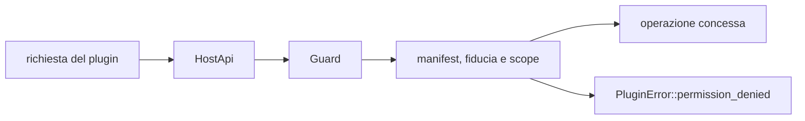

# Permessi e sicurezza

> **Ambito:** fiducia dei bundle, capability, confini del vault, runtime WASM e
> contenuto non fidato.
> **Fonti autorevoli:** `fub-abi::Gate`, kernel, `fub-wasm-host` e CSP Tauri.

## Modello di fiducia

| Livello | Significato |
|---|---|
| `core` | componente del prodotto |
| `verified` | estensione verificata secondo la policy |
| `community` | estensione installata dalla comunità |
| `development` | estensione locale di sviluppo |
| `revoked` | dichiarata ma non eseguibile |

`revoked` non è un livello più basso: equivale all'assenza del diritto di
attivarsi.

## Capability

I permessi sono una mappa namespaced. Una capability può avere parametri, per
esempio scope, host consentiti o limiti.

Il flusso è:

Un solo `Guard` applica la policy. Gli adattatori nativi e WASM non mantengono
copie divergenti delle regole.

## Famiglie di accesso

| Famiglia | Esempio di controllo |
|---|---|
| lettura vault | radice, tipo di voce e path relativo |
| scrittura vault | capability esplicita, revisione e atomicità |
| storage plugin | namespace dell'id proprietario |
| query | provider e scope serviti |
| eventi e job | maschera, budget, fatti propri e nomi di job propri |
| rete | metodo, host e limiti |
| tempo e random | quantità e disponibilità |
| impostazioni | livello scrivibile e chiave dichiarata |
| transfer | handle e contenuto, non path arbitrari |

L'elenco esatto delle funzioni vive nel contratto.

## Path fence

Ogni path del vault viene canonicalizzato e verificato contro la radice.
Symlink, componenti `..`, differenze di separatore e maiuscole non devono
consentire una fuga.

Un handle di transfer non diventa automaticamente un path filesystem.

## Temi installati

Un tema non riceve capability e non può dichiarare permessi. L'host accetta
soltanto il contratto `theme-1`, un id sicuro e il namespace
`theme://<id>/`; installazione e lettura rifiutano symlink, traversal e file
non regolari. La pubblicazione avviene da staging con rename atomico e non
sovrascrive un id esistente. I limiti correnti sono 64 KiB per il manifest,
4 MiB per ciascun foglio/skin, 1.024 asset, 64 MiB per asset e 256 MiB totali.

Il client rivalida fogli, skin, asset, ruoli e contrasto prima del mount. Una
preview dalle Impostazioni non cambia la scelta persistente: annullamento o
chiusura rimontano il tema autorevole precedente; un bundle non leggibile o
rifiutato non ottiene un mount parziale.

## Runtime WASM

Il runtime:

- usa Wasmtime component model;
- non collega WASI;
- non concede filesystem o rete direttamente;
- serve soltanto le famiglie host disponibili;
- applica limite di memoria;
- interrompe chiamate oltre la deadline;
- converte trap in errori tipizzati;
- limita la ricorsione delle forme;
- smonta registrazioni e risorse.

Il componente condivide un'istanza fra i propri provider e non è rientrante.

## UI non fidata

`UiNode` può rappresentare forme fidate e non fidate. Un componente di terzi
non può ottenere:

- HTML arbitrario;
- webview;
- JavaScript;
- DOM;
- listener globali;
- estensioni CodeMirror.

Ogni albero WASM passa dalla validazione non fidata prima della serializzazione
IPC. Il percorso `ViewProvider` applica lo stesso controllo prima di inoltrare
la forma alla shell; i provider ancora differiti non creano un bypass.

Alcuni intenti `Custom` fanno eseguire alla shell un'azione con un privilegio
del processo, cioè scrivere negli appunti: `fub.clipboard.text` e
`settings.export`. L'elenco è `fub_abi::ui::privileged_intent`. Il kernel
accetta questi intenti soltanto da provider `Core`, sia come `ViewUpdate` di
una view sia come `CommandEffect` di un comando, nel percorso sincrono e in
quello staccato. Da un provider di altro grado l'esito è `PermissionDenied` e
la shell non riceve niente. Gli intenti `Custom` senza privilegio restano
aperti a tutti.

## Webview

La Content Security Policy impedisce script remoti, iframe e oggetti non
previsti. Il rendering non deve creare HTML attivo da una stringa del vault o
del plugin senza sanitizzazione e una decisione esplicita.

## Supply chain

- sorgenti delle dipendenze limitate dalla policy;
- licenze controllate;
- advisory e crate yanked bloccano la CI;
- SBOM generata;
- lockfile committati;
- artefatti generati verificati;
- dipendenze duplicate sensibili controllate.

Il controllo npm rifiuta le licenze assenti o sconosciute. Se i metadati
dichiarano `NOASSERTION`, può concludere una licenza soltanto dal testo completo
già esaminato e identificato dal suo SHA-256, verificando anche nome e versione
del pacchetto installato. La SBOM conserva la dichiarazione originale e registra
la conclusione con la provenienza; un testo diverso resta bloccante.

## Dati sensibili

Fub è local-first ma i vault possono contenere dati sensibili. Log e bundle
diagnostici devono:

- evitare contenuto completo per impostazione predefinita;
- redigere path quando possibile;
- dichiarare ciò che includono;
- essere creati con un gesto esplicito;
- non diventare canali di esportazione invisibili.

## Segnalazioni

La procedura per vulnerabilità è in [`../../SECURITY.md`](../../SECURITY.md).
Questo documento descrive l'architettura; non sostituisce la policy di
segnalazione.

## Checklist per un nuovo servizio

Prima di aggiungere una host function:

1. definire il dato minimo;
2. decidere capability e parametri;
3. applicarla nel `Guard`;
4. evitare path o handle più potenti del necessario;
5. tipizzare errori;
6. aggiungere test concesso/negato;
7. verificare backend nativo e WASM;
8. aggiornare WIT e compatibilità;
9. documentare il contratto, non la cronaca.
