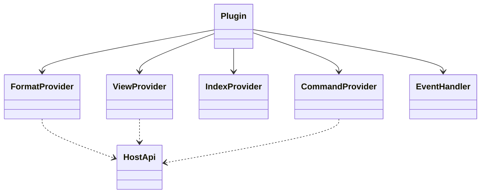

# Contratti Rust

> **Stato:** implementato  
> **Fonte di verità:** API pubblica di `fub-abi`

`fub-abi` definisce ciò che kernel, host e provider possono scambiarsi senza dipendere dalle implementazioni concrete.

## Famiglie principali

## Regole dei tipi pubblici

- riesportazione dalla radice del crate;
- serializzazione deterministica quando attraversano IPC;
- rappresentazione equivalente in WIT quando attraversano WASM;
- nessun tipo Tauri, Wasmtime, DOM o CodeMirror;
- errori discriminati;
- campi aggiunti in coda quando il contratto congelato lo richiede;
- identificatori grandi rappresentabili senza perdita in JavaScript.

## Canali

| Canale | Uso |
|---|---|
| `ReadApi` | letture senza capacità di mutazione |
| `HostApi` | capacità autorizzate dell'host |
| `IndexQuery` | richieste dati strutturate e paginabili |
| `UiNode` | descrizione dichiarativa dell'interfaccia |
| `Event` | fatti osservabili e tipizzati |
| `PluginError` | fallimenti attraversabili dal confine |

## Modifiche

Un cambio pubblico richiede aggiornamento coordinato di Rust, WIT, baseline congelate, mirror TypeScript e test. Consulta [wit-contract.md](wit-contract.md).
