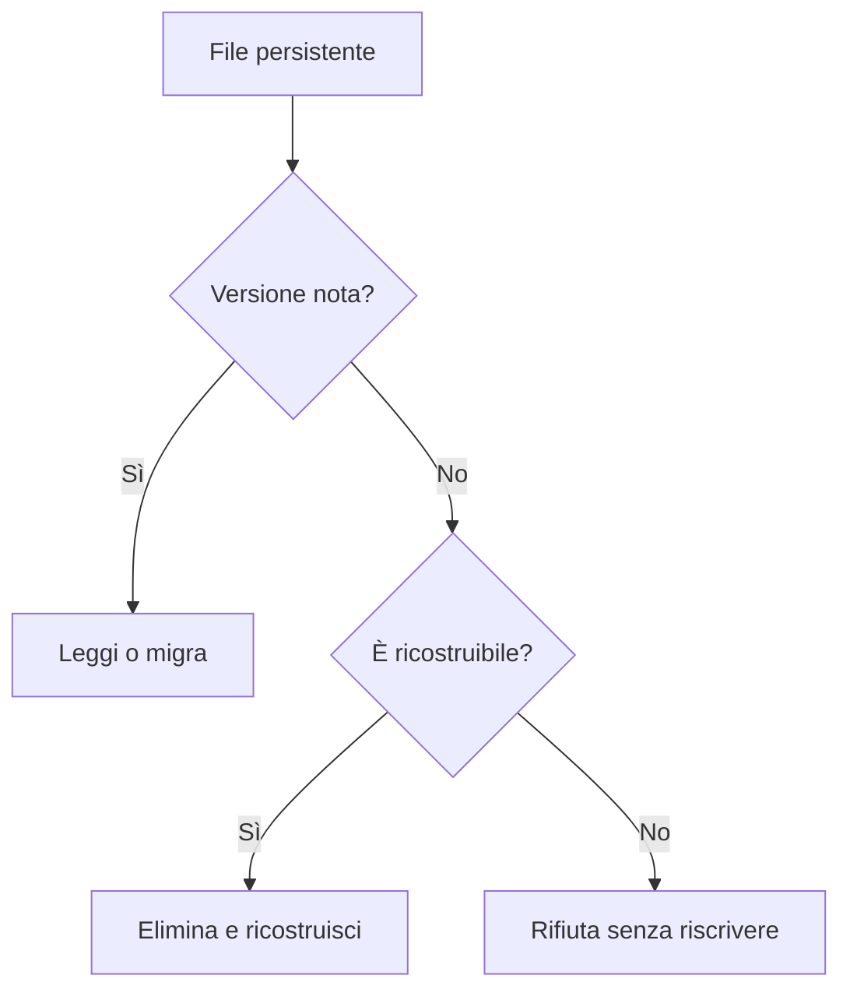

# Schemi su disco

> **Stato:** implementato  
> **Fonte di verità:** costanti `SchemaVersion` e `schemas_on_disk.rs`

Ogni formato persistente ha una versione indipendente. Il test [`schemas_on_disk.rs`](../../crates/fub-app/tests/schemas_on_disk.rs) verifica che questa tabella e le costanti nei sorgenti coincidano nei due versi.

| Schema | Dove | Oggi | Contenuto |
|---|---|---:|---|
| Registro dei vault | [`crates/fub-host/src/vaults.rs:44`](../../crates/fub-host/src/vaults.rs) | 1 | Vault conosciuti dalla macchina |
| Organizzazione | [`crates/fub-kernel/src/organization.rs:78`](../../crates/fub-kernel/src/organization.rs) | 1 | Albero, icone, spazi e note fissate |
| Stato di vista | [`crates/fub-kernel/src/viewstate.rs:57`](../../crates/fub-kernel/src/viewstate.rs) | 1 | Stato locale degli esemplari di vista |
| Anagrafe | [`crates/fub-kernel/src/entries.rs:142`](../../crates/fub-kernel/src/entries.rs) | **4** | Metadati incrementali dei file |
| Impostazioni | [`crates/fub-kernel/src/settings.rs:89`](../../crates/fub-kernel/src/settings.rs) | 1 | Valori per vault e macchina |
| Versioning | [`crates/fub-features/src/versioning.rs:261`](../../crates/fub-features/src/versioning.rs) | 1 | Snapshot dei documenti |
| Indice di ricerca | [`crates/fub-features/src/search.rs:93`](../../crates/fub-features/src/search.rs) | **5** | Schema e tokenizer Tantivy |
| Registro delle mutazioni | [`crates/fub-kernel/src/journal.rs:177`](../../crates/fub-kernel/src/journal.rs) | 1 | Mutazioni concluse del vault |
| Bozze | [`crates/fub-kernel/src/drafts.rs:110`](../../crates/fub-kernel/src/drafts.rs) | 1 | Testo non ancora salvato |
| Bundle diagnostico | [`crates/fub-kernel/src/maintenance.rs:232`](../../crates/fub-kernel/src/maintenance.rs) | 1 | Fatti raccolti per la diagnostica |
| Sidecar del cestino | [`crates/fub-kernel/src/vault.rs:149`](../../crates/fub-kernel/src/vault.rs) | 1 | Provenienza degli elementi cestinati |

## Politica

Un file scritto da una versione futura non viene interpretato parzialmente. I dati derivati possono essere ricostruiti; quelli autorevoli richiedono una migrazione esplicita o un rifiuto.

La disposizione generale dei file è in [on-disk-layout.md](on-disk-layout.md).
