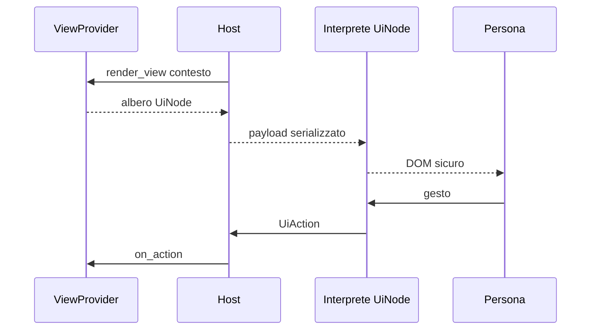

# Protocollo UI dichiarativo

> **Stato:** implementato  
> **Fonte di verità:** tipi UI di `fub-abi` e interprete `frontend/src/ui/`

Il protocollo permette a un provider di descrivere una vista senza inviare codice DOM alla shell.

## Flusso

## Elementi

Il protocollo comprende testo, gruppi, controlli, liste, tabelle, form, intenti e un'uscita custom con namespace, payload e fallback.

## Invarianti

- il provider decide dati e semantica;
- la shell decide DOM, focus, accessibilità e tema;
- un nodo sconosciuto produce un fallback leggibile;
- le azioni portano identità e payload sufficienti;
- nessun callback JavaScript attraversa il confine;
- un renderer custom ha owner e disposer;
- payload grandi non vengono rinviati interamente a ogni frame.

## Superfici

La superficie indica dove e come una view può essere montata. Layout, split e focus restano responsabilità della shell.
