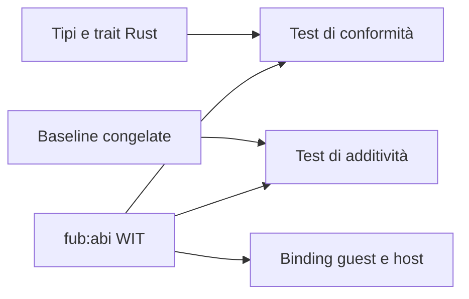

# Contratto WIT

> **Stato:** implementato; runtime parziale  
> **Fonte di verità:** `crates/fub-abi/wit/fub/abi.wit` e `wit/frozen/`

WIT descrive il contratto che un componente WASM vede. Deve avere la stessa semantica della superficie Rust pubblica.

## Relazione

## Versionamento

- major diversa: incompatibile;
- stessa major e minor del plugin non superiore a quella dell'host: compatibile;
- minor del plugin superiore: rifiuto;
- patch: correzioni senza cambio di superficie.

Dopo il freeze, il contratto cresce per aggiunta. Una rottura intenzionale della baseline deve essere esplicita nella review.

## Conformità

I test devono verificare:

- record, variant ed enum equivalenti;
- nomi e firme delle funzioni;
- tipi riesportati dalla radice Rust;
- costruibilità dei binding guest;
- assenza di rimozioni rispetto alle baseline;
- parità osservabile per i proxy WASM implementati.

## Limite

La presenza di una firma in WIT non prova che `fub-wasm-host` abbia già un proxy per quella superficie. Lo stato reale è in [architecture/wasm-runtime.md](../architecture/wasm-runtime.md).
