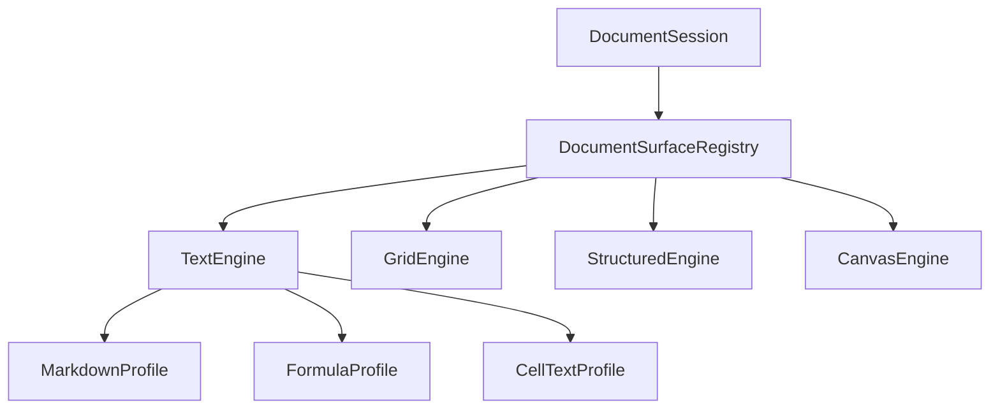

# RFC 0001 — Superfici di editing condivise

- **Stato:** proposta attiva
- **Ambito:** shell, editor, plugin
- **Motivazione:** riusare gli stessi motori di interazione in formati diversi

## Problema

Il motore CodeMirror e il profilo Markdown sono oggi composti nello stesso sottosistema. Un futuro foglio di calcolo, editor di formule o formato strutturato non deve copiare gestione di input, IME, clipboard, selezioni, tema, lifecycle e undo.

## Obiettivo

La shell fornisce famiglie di superfici. I provider scelgono e configurano una superficie senza reimplementarne la meccanica.

## Distinzioni

| Concetto | Possiede |
|---|---|
| `DocumentSession` | contenuto autorevole, revisione, dirty, salvataggio e conflitti |
| Superficie | cursore, selezione, scroll, zoom e history locale |
| Motore | meccanica comune dell'interazione |
| Profilo | semantica di un dominio |
| Formato | parse, modello, resa e serializzazione |

Formato e superficie hanno una relazione molti-a-molti.

## Invarianti

- un documento aperto in più riquadri ha un solo buffer autorevole;
- ogni superficie conserva stato visuale e undo propri;
- il core testuale non importa Markdown;
- nessun plugin WASM invia estensioni JavaScript o oggetti DOM;
- nessun IPC viene eseguito per ogni carattere;
- registrazioni, timer e observer scompaiono col proprietario;
- il contratto pubblico contiene soltanto dati serializzabili e rappresentabili in WIT.

## Strategia proposta

1. estrarre il motore testuale all'interno della shell;
2. mantenere Markdown come primo profilo;
3. aggiungere un secondo cliente reale;
4. misurare il confine necessario;
5. promuovere nell'ABI solo la parte stabile dimostrata da due clienti.

## Criteri di accettazione

- due profili reali usano lo stesso motore;
- test di IME, CRLF, selezioni, undo, sincronizzazione e teardown restano verdi;
- nessun import diretto di CodeMirror fuori dal package autorizzato;
- mount, suspend, resume e destroy hanno semantica verificata;
- la proposta viene chiusa con ADR prima di aggiungere firme WIT.

## Non deciso

- forma finale del contratto pubblico;
- API della griglia;
- formato di un futuro workbook;
- supporto DOCX;
- estensioni dinamiche di editor fornite da plugin non fidati.
