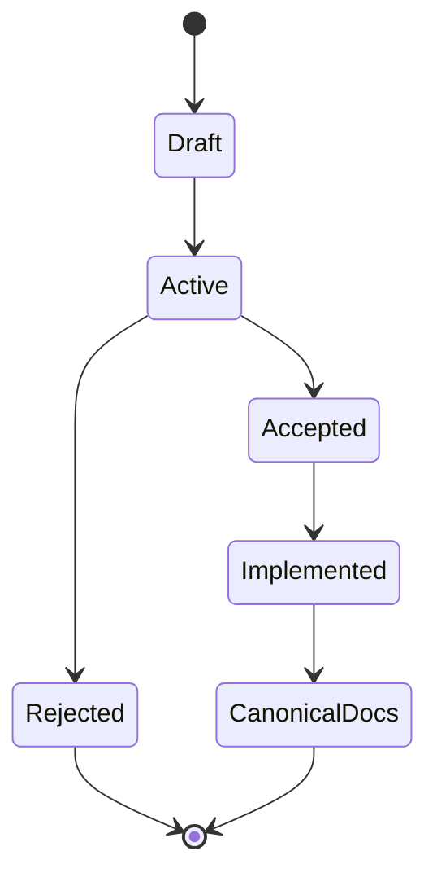

# RFC

Le RFC contengono proposte tecniche aperte. Non descrivono comportamento disponibile.

## Quando serve una RFC

- nuovo contratto pubblico;
- cambio che coinvolge più componenti;
- più alternative realistiche;
- conseguenze di compatibilità o persistenza;
- criteri di accettazione non ancora soddisfatti.

## Ciclo di vita

Quando una RFC viene implementata:

1. la decisione stabile diventa un ADR;
2. il comportamento entra nella documentazione canonica;
3. il lavoro residuo diventa issue;
4. la RFC viene rimossa dal ramo corrente.

La cronologia Git conserva il testo eliminato; non si crea una cartella `archive/`.

## RFC attive

- [0001 — Superfici di editing condivise](0001-shared-editing-surfaces.md)
