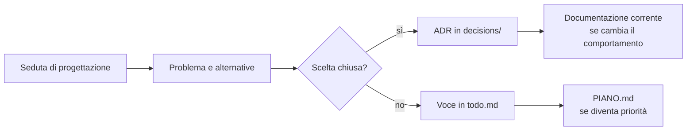

# Sedute di progettazione — archivio storico

La cartella si chiama `roadmap` per ragioni storiche, ma **non è la roadmap operativa corrente**. Contiene le sedute numerate che hanno esplorato problemi, alternative, misure e possibili decisioni.

Per lo stato attuale usa:

- [`../STATO.md`](../STATO.md) per ciò che è verificato nel repository;
- [`../PIANO.md`](../PIANO.md) per milestone e priorità;
- [`../todo.md`](../todo.md) per il lavoro ancora aperto;
- [`../decisions/README.md`](../decisions/README.md) per le scelte chiuse.

## Come leggere una seduta

Una seduta può contenere ipotesi poi smentite, numeri validi soltanto al momento dell'analisi e alternative incompatibili. Non va letta come specifica vigente.

La fonte stabile è:

- l'ADR prodotto dalla decisione, quando la scelta è chiusa;
- `todo.md`, quando la scelta è ancora aperta;
- la documentazione corrente, quando il comportamento è già implementato.

Le sedute sono numerate in ordine di lavoro. I collegamenti dagli ADR alle sezioni originarie vengono conservati per rendere verificabile il percorso che ha portato alla scelta.

## Documenti trasversali

- [`leva.md`](leva.md): criteri usati per trovare il punto con maggiore effetto architetturale;
- [`numerazione.md`](numerazione.md): convenzione per sedute, sezioni e riferimenti;
- [`strozzature.md`](strozzature.md): strozzature e dipendenze osservate durante la progettazione.

Questi file sono memoria del processo. Non devono duplicare lo stato operativo né ricevere nuove attività al posto del backlog.