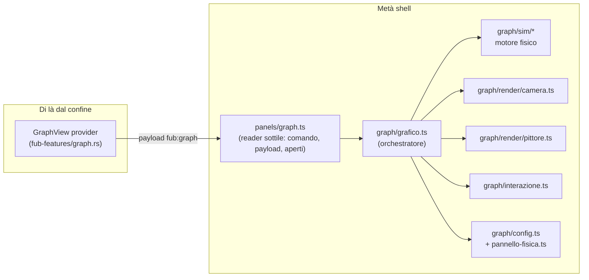

# Fub — Graph View 2.0 · Piano di architettura e implementazione

> Documento di guida per gli agenti di implementazione. È il contratto fra
> orchestratore e squadre: ogni modulo, firma e budget qui dentro è vincolante.
> I report `graph_problem_*.md` degli scout sono i requisiti di correzione:
> ogni bug lì elencato va risolto o esplicitamente «archiviato come scelta»
> con una riga di motivazione nel PR del modulo che lo tocca.

---

## 0. Contesto e vincoli non negoziabili

Il sistema oggi (verificato leggendo i sorgenti):

| Strato | File | Ruolo |
|---|---|---|
| Kernel | `crates/fub-kernel/src/graph.rs` (1347 L) | `LinkGraph` incrementale: risoluzione wiki/path/alias, backlink, neighbor BFS |
| Provider | `crates/fub-features/src/graph.rs` (390 L) | `GraphView` ViewProvider → `UiKind::Custom { ns: "fub:graph", payload }` |
| Shell | `frontend/src/panels/graph.ts` (433 L) | renderer Canvas2D registrato via `ui/custom.ts`, force-directed artigianale |
| Tema | `frontend/src/theme/tokens.css` | `--graph-node`, `--graph-node-active`, `--graph-node-hover` (dark `:root` + light `[data-theme="light"]`) |

Vincoli (derivano dalle decisioni del repo, NON si toccano):

1. **Il confine resta**: la shell disegna, il provider decide i dati. Il
   payload `{ nodes: string[], edges: {from,to}[] }` è il contratto
   (`fub:graph`): resta **byte-compatibile**. Nessuna conoscenza del kernel
   entra nel frontend. Nessun campo nuovo obbligatorio nel payload: grado,
   massa, colore derivano lato shell dagli archi.
2. **Nessuna dipendenza npm nuova**: niente d3, niente pixi. Canvas2D +
   TypeScript puro, come il resto della shell.
3. **Stile del repo**: commenti in italiano che spiegano il *perché* (non il
   *cosa*), doc-comment `///`, niente formatter esterni, test colocati
   `*.test.ts` (vitest + happy-dom: **niente Canvas2D nei test** → la logica
   deve stare in funzioni pure disegnabili-a-mano).
4. **Persistenza delle preferenze**: come tema e lingua (`localStorage`),
   perché è una preferenza della *shell* e non del vault (§ impostazioni).
   Chiave: `fub.graph.conf.v1`.
5. **Il grafo non chiede refresh al provider** (scelta dichiarata: interessi
   vuoti). La vividezza dei nodi aperti però deve vivere nella shell, in tempo
   reale: vedi §7.3.
6. **Budget hardware**: Intel N150, webview Tauri. Target: **60 fps con
   2000 nodi / 4000 archi**, degradazione morbida sotto. O(oggetto n²) è
   vietato sopra ~400 nodi: Barnes-Hut obbligatorio.

---

## 1. Vista d'insieme



Albero file nuovo (tutto sotto `frontend/src/graph/`):

```
frontend/src/graph/
├── grafico.ts          orchestratore: possiede tutto, monta/disfa
├── sim/
│   ├── tipi.ts         Struttura (SoA), ConfFisica, costanti
│   ├── quadtree.ts     Barnes-Hut (theta, build + attraversamento)
│   ├── forze.ts        forze pure su SoA (repulsione/molla/gravità/collisione)
│   ├── motore.ts       passo di integrazione, alpha, energia, calibrazione
│   └── *.test.ts
├── render/
│   ├── camera.ts       trasformazioni, zoom-al-cursore, inerzia, fit
│   ├── atlas.ts        sprite pre-renderizzati dei nodi (glow incluso)
│   ├── pittore.ts      disegno a layer: archi, nodi, etichette, effetti
│   └── *.test.ts       (solo le parti pure: culling, tier, curvatura)
├── interazione.ts      pointer/tastiera: hover, drag, pan, zoom, click
├── config.ts           ConfFisica+ConfGrafica, clamp, preset, persistenza
├── pannello-fisica.ts  UI di personalizzazione (DOM, i18n)
└── *.test.ts
```

`panels/graph.ts` si **assottiglia**: registrazione renderer/comando, lettura
payload (`leggiDati`), set dei documenti aperti, e delega a
`grafico.monta(host, dati, { apri })`. Tutto il resto dei suoi 433 byte-logic
viene riscritto dentro i moduli nuovi.

---

## 2. Contratto dati (lato shell)

```ts
// graph/sim/tipi.ts — la struttura è SoA: zero oggetti nel loop caldo.
export interface Struttura {
  /// numeri
  x: Float32Array;  y: Float32Array;
  vx: Float32Array; vy: Float32Array;
  fx: Float32Array; // forza accumulata per passo (buffer riusato)
  fy: Float32Array;
  massa: Float32Array;   // 1 + log(1+grado) * conf.pesoGrado
  raggio: Float32Array;  // 4 + min(9, sqrt(grado) * 1.7)  [px world]
  grado: Uint16Array;
  fisso: Uint8Array;     // 0 libero, 1 bloccato (pin), 2 trascinato
  /// identità
  id: string[];
  da: Uint32Array; a: Uint32Array;     // archi per indice
  curva: Float32Array;                 // curvatura stabile per arco (§5.3)
  n: number; m: number;
}
```

Derivazioni lato shell da `{nodes, edges}` (grado = uscenti+entranti,
self-loop scartato **prima** di contare il grado — bug noto n. oggi: conta).
`creaStruttura(dati, conf, seme)` semina su spirale deterministica
(fibonacci sunflower) con jitter dal RNG `mulberry32(seme)`, dove
`seme = hash(FNV-1a degli id ordinati)`: due aperture dello stesso vault
partono identiche (convenzione già del codice attuale).

---

## 3. Il motore fisico (`sim/`) — «soddisfacente» per progettazione

### 3.1 Integrazione
- Semi-implicit Euler, **dt fisso 1/60** per passo, **un passo di forze per
  frame** (niente ticks-per-frame variabili: era la causa per cui la durata
  della simulazione cambiava con la taglia del grafo — bug segnalato).
- Clamping velocità per nodo: `|v| ≤ conf.maxVelocità` (in unità-k/s).
- Bordi: il mondo è illimitato; il «contenimento» è la gravità centrale, non
  i muri rigidi (i muri col clamp di posizione senza azzerare la velocità
  normale creavano nodi appiccicati — bug segnalato). Nessun clamp di
  posizione: la camera segue (§4).

### 3.2 Forze (tutte in `forze.ts`, pure, operano su `Struttura`)
- **Repulsione** (Coulomb morbido): `F = k_r · mi·mj / (d² + ε)` con `ε`
  per evitare l'infinito; sotto `d < r_i + r_j + 4` entra la correzione
  posizionale di collisione (§3.2c), non la forza.
  Calcolo: **O(n²) diretto sotto `sogliaBH` (default 400 nodi), Barnes-Hut
  sopra**, con `theta = conf.theta` (default 0.9). Il quadtree si ricostruisce
  a ogni frame in un pool di nodi riusato (zero allocazioni nel frame).
- **Molle** con smorzamento **lungo l'arco** (dashpot: la parte che rende la
  fisica «soda»): `F = −k_s·(L−L0)·û − c_d·(v_rel·û)·û`.
  `L0` per arco = `conf.lunghezzaBase · (1 + 0.15·min(8, grado_from+grado_to))`
  (i nodi hub respirano di più). Con `c_d` scelto ~ `2·sqrt(k_s·m_reduced)`
  il sistema è quasi criticamente smorzato: converge senza oscillare.
- **Gravità** radiale verso (0,0): molla debole per unità di massa,
  `F = −k_g · m · p`, con `k_g` per-secondo piccolo: tiene il grafo in
  quadro senza schiacciarlo.
- **Collisioni**: 2 iterazioni di correzione posizionale
  `push = ½·(sovrapposizione)·(m_altro/(mi+m_altro))` per coppia vicina
  (dal quadtree): a riposo i nodi **non si sovrappongono mai**.
- **Molla del puntatore** durante il drag (§6): il nodo in drag è `fisso=2`,
  segue il puntatore con molla corta rigidissima + il suo contributo di
  velocità resta alla release (lancio con inerzia).

### 3.3 Ciclo di vita dell'«alpha» (calore)
- `alpha` ∈ (0,1]: decadimento **per secondo** indipendente dai frame persi:
  `alpha *= conf.raffreddamento^(dt·60)` con clamp di dt a 1/30 (se un frame
  dura 50 ms la sim non salta il doppio di fisica: rallenta, non esplode).
- `riscalda(livello)`: `alpha = max(alpha, livello)` — 1.0 al mount e a
  cambi strutturali, 0.3 al rilascio di un drag, 0.15 a un cambio preset.
- **Addormentamento**: `energia()` = Σ½m|v|² normalizzata; sotto
  `conf.sogliaQuiete` per 30 frame consecutivi → la simulazione si ferma e
  il rAF si spegne (si riaccende su riscalda/interazione). Il disegno
  su richiesta (dirty-flag) sostituisce il loop.

### 3.4 Calibrazione qualità (non velocità)
La taglia del grafo cambia *quanto costa un frame*, non *quanti passi fa*:
- nodi ≤ 400: repulsione esatta, glow pieno.
- 400 < nodi ≤ 2000: Barnes-Hut, glow solo su nodi accesi.
- nodi > 2000: Barnes-Hut + etichette solo degree≥3 + trail off.
Il tier si ricalcola a cambi di struttura e a EMA del frame-time > 22 ms
(scende di un gradino; risale se < 12 ms per 5 s).

---

## 4. Camera (`render/camera.ts`)

```ts
export interface Camera { scala: number; tx: number; ty: number; } // screen = world·scala + t
export function mondoInSchermo(c, p): {x,y};
export function schermoInMondo(c, p): {x,y};
export function zoomAlPunto(c, fattore, puntoSchermo): Camera; // il punto sotto il cursore resta lì (identità verificata dai test)
export function inquadra(boundMondo, viewport, pad): Camera;   // «F»: fit con padding 8%
```

- Zoom tastiera/rotella **al cursore**, scala ∈ [0.05, 8], smoothed
  esponenziale (target + interpolazione a costante di tempo 90 ms).
- Pan con inerzia: velocity della camera decade (0.9/frame), stop sotto 0.1 px.
- Il mondo non ha muri: coordinate ±∞, il fit iniziale inquadrato dopo il
  primo secondo di simulazione (o subito se il grafo parte già quieto).

---

## 5. Pittore (`render/atlas.ts` + `render/pittore.ts`) — «grafica pazzesca» nel budget

### 5.1 Due canvas sovrapposti
- `sfondo`: griglia di puntini (spacing world-adattivo, alpha 0.35) + vignette
  radiale. Ridisegnato **solo** su cambio camera/resize/tema.
- `principale`: archi, nodi, etichette, effetti.

### 5.2 Nodi: sprite atlas, non `arc()`+`shadowBlur`
Pre-render in un canvas offscreen, per ogni (colore × bucket di raggio):
sfera con gradiente radiale (core pieno → bordo trasparente) + glow esterno
già «cotto» nello sprite. A runtime è un `drawImage`: il 90% del costo di
`shadowBlur` sparisce. Atlas rigenerato su cambio tema
(`MutationObserver` su `documentElement[data-theme]`) e cambio tier.
Colori: `--graph-node` / `-active` / `-hover` + derivati (mix con bg per
le sfumature) letti dai computed style **e riverificati a cambio tema**.

### 5.3 Archi
- Curve quadratiche: `curva` per arco = valore stabile ∈ [−0.22, 0.22] da
  hash FNV-1a della coppia di id → gli archi bidirezionali a↔b si separano in
  due archi speculari (oggi si disegnano uno sopra l'altro).
- Batch: un solo `beginPath`+`stroke` per stato (spenti / accesi / in evidenza).
- Culling: bbox viewport con margine; alpha archi = `clamp(0.18, scala·0.35, 0.5)`.
- Archi in evidenza (nodo hover/aperto/trascinato): ridisegnati sopra con
  gradiente colore→colore e `lineWidth` 1.5, glow solo su questi (pochi).

### 5.4 Nodi accesi, hover, focus
- Aperti: alone pulsante `alpha = 0.5+0.5·sin(t·2π·1.2 + fase)` — fase da hash
  id (non sincronizzati, sembra vivo). Solo quando il rAF è attivo.
- Hover: anello + etichetta subito, tooltip DOM (nome, grado, «N in uscita /
  M in entrata») posizionato con `transform`, `pointer-events: none`.
- **Focus quartiere**: hover/drag evidenzia il quartiere a 1 salto (nodi+archi
  coinvolti pieni), il resto scende a alpha 0.12. Il resto del grafo resta
  leggibile in filigrana.

### 5.5 Etichette
- Densità per zoom+grado: `visibile = etichettaOvunque || grado ≥ soglia(consulta tier) || accento`;
  alpha in fade con la scala; larghezza misurata una volta e messa in cache
  (`Map<string,number>`); font dai token (`--font-sans`).

### 5.6 Effetti di moto (solo tier alto, solo mentre `alpha > soglia`)
- Trail: `fillRect` con bg ad alpha 0.25 invece del `clearRect` — scie che
  spariscono da sole al quietarsi. Colore sfondo letto dai token (non nero
  hardcodato: il tema chiaro esiste).
- Particelle NO: costo/valore sfavorevole su N150. Il «wow» viene da glow,
  pulse, trail e curve, tutti nel budget.

---

## 6. Interazione (`interazione.ts`)

Pointer Events unificati (mouse+touch), `setPointerCapture` sul canvas:
- **Hover**: hit-test con ricerca nel quadtree dell'ultimo frame (non O(n)
  lineare — ok comunque fino a 2k, ma il quadtree c'è già), raggio `r+6` in
  screen space (corregge il bug attuale: il hit-test ignora la scala).
- **Drag nodo**: `fisso=2` + molla puntatore; al rilascio `fisso` torna al
  valore precedente (pin esplicito con doppio-click: toggla `fisso=1`,
  visualizzato con un anello pieno), `riscalda(0.3)`.
- **Pan**: drag su vuoto (o tasto centrale/spazio) con inerzia.
- **Zoom**: rotella al cursore, pinch (2 pointer), `+`/`−` tastiera.
- **Click**: su nodo → `apri(id)` (stessa porta `onAction("open",{doc})` di
  oggi: **contratto invariato**); a vuoto → deseleziona.
- **Doppio click**: su nodo → centra camera con zoom 1.6; a vuoto → fit.
- **Tastiera** (`tabindex=0`, `aria-label` localizzato, freccia-keyboard per
  spostare il focus fra nodi in ordine di vicinato): frecce pan, `+`/`−`,
  `F` fit, `Invio` apre il nodo focalizzato, `Esc` deseleziona, `P` pin.
- `mouseleave` → hover pulito (bug oggi: resta bloccato).

## 7. Vividezza dello stato della shell (fix dei bug di stale)

7.1 **Aperti live**: `panels/graph.ts` espone `impostaAperti(set)`; il
grafico lo usa a ogni draw. Il set si ricalcola quando il layout cambia
(il meccanismo esatto di subscription a `state/layout.ts`/`store.ts` va
verificato dall'agente C: se esiste un bus/store sottoscrittabile ci si
aggancia, altrimenti si ricalcola su `pointerenter`+notifiche di cambio tab
— mai più una fotografia al mount).

7.2 **Resize**: il `ResizeObserver` osserva l'**host** (oggi osserva il
canvas: se il CSS non lo fa crescere, non scatta mai). Il primo ridimensiona
con rect 0 (tab nascosta) non deve seminare i nodi: il seeding avviene al
**primo rect valido** (mount differita).

7.3 **Tema**: token riverificati a `data-theme` change + rigenerazione atlas.

---

## 8. Configurazione ultrapersonalizzabile (`config.ts`, `pannello-fisica.ts`)

```ts
export interface ConfFisica {
  repulsione: number;      // k_r,    200..20000, def 2400
  lunghezzaBase: number;   // px world, 40..400,  def 120
  rigiditaMolla: number;   // k_s,    0.01..1,   def 0.12
  smorzamentoMolla: number;// c_d,    0..1,      def 0.55 (quota del criticamente smorzato)
  gravita: number;         // k_g,    0..0.2,    def 0.02
  attrito: number;         // per tick, 0.5..0.98, def 0.86
  maxVelocita: number;     // unità-k/s, 100..4000, def 900
  pesoGrado: number;       // 0..3,    def 0.8
  collisioni: boolean;     // def true
  theta: number;           // BH, 0.5..1.2, def 0.9
  jitter: number;          // semina, 0..1, def 0.35
}
export interface ConfGrafica {
  glow: boolean; pulse: boolean; trail: boolean; griglia: boolean;
  curvaturaArchi: number;  // 0..1 moltiplicatore sulla curva stabile
  densitaEtichette: number;// 0..1
}
export interface ConfGrafo { fisica: ConfFisica; grafica: ConfGrafica; preset: string }
```

- `clampConf` valida tutto (i valori dal pannello NON sono fidati), le
  funzioni pure del motore assumono conf già clampano.
- **Preset**: `organico` (default qui sopra), `costellazione` (repulsione
  ×2.5, molle 0.04, gravità 0.005 — spaziato e arioso), `alveare` (collisioni
  forti + gravità 0.08 — compatto), `nebulosa` (attrito 0.96, molle deboli,
  jitter alto — fluttuante), `rigido` (rigidità 0.35, smorzamento 0.8,
  attrito 0.7 — ingessato e prevedibile). `preset: "custom"` quando si tocca
  uno slider.
- Persistenza `localStorage["fub.graph.conf.v1"]` (try/catch: il localStorage
  può non esserci), merge difensivo su lettura (campi mancanti → default).
- **Pannello**: popover agganciato in alto a sinistra della view (dentro il
  renderer, NON un pannello shell), toggle «ingranaggio» sempre visibile.
  Slider con `input[type=range]` + etichetta valore, select preset, toggle
  grafica, bottoni «Riscalda» (riscalda(1)), «Sblocca i nodi fissi»,
  «Reimposta». Ogni cambio: clamp → persist → `riscalda(0.15)` (i soli
  cambi di `ConfGrafica` non scaldano: solo ridisegno). Stile con i token
  esistenti (`.graph-count` come riferimento di tono). i18n: chiavi
  `graph.conf.*` in `it` + `en` in `i18n/strings.ts`.
- Accessibilità del pannello: `role="dialog"` + `aria-label`, focus dentro,
  chiusura con Esc (tabindex del canvas ripristinato).

---

## 9. Contratti di modulo (firme vincolanti per lo sviluppo parallelo)

```ts
// sim/tipi.ts
export function creaStruttura(dati: DatiGrafo, conf: ConfFisica, seme: number): Struttura;
export function gradoDi(s: Struttura, i: number): { usc: number; entr: number };

// sim/motore.ts
export function passo(s: Struttura, conf: ConfFisica, q: Quadtree | null, dt: number): void;
export function energia(s: Struttura): number;            // normalizzata 0..1
export function calcolaTier(n: number, emaFrameMs: number): Tier;

// sim/quadtree.ts
export function costruisci(s: Struttura, pool: PoolQuad): Quadtree;
export function visita(q: Quadtree, theta: number, x: number, y: number, f: (dx: number, dy: number, d2: number, massa: number) => void): void;
export function vicino(q: Quadtree, x: number, y: number, r: number): number; // indice del nodo più vicino nel raggio, −1 se nessuno

// render/camera.ts (firme §4)

// grafico.ts — l'orchestratore
export interface Grafico {
  monta(host: HTMLElement, dati: DatiGrafo): void;
  impostaAperti(aperti: ReadonlySet<string>): void;
  apri: (id: string) => void;   // iniettato da panels/graph.ts → onAction
  smonta(): void;
}
export function creaGrafico(conf: ConfGrafo): Grafico;
```

Proprietà condivise fra squadre (invariante anti-collisione):
- I moduli `sim/*` non importano DOM. `render/*` e `interazione.ts` non
  importano `sim/motore` (solo `sim/tipi`). `grafico.ts` è l'unico che li
  conosce tutti. `panels/graph.ts` importa solo `grafico.ts` e `config.ts`.

---

## 10. Test (vitest, happy-dom, zero Canvas2D)

| Modulo | Test obbligatori |
|---|---|
| `sim/tipi` | grado conta uscenti+entranti, self-loop scartato **prima** del conteggio; semina deterministica (stesso seme → stesse posizioni); id duplicati gestiti |
| `sim/quadtree` | `visita` con theta→0 replica la somma O(n²) entro 1e-3; `vicino` trova il più vicino e rispetta il raggio |
| `sim/forze`+`motore` | simmetria della repulsione (q.d.a. della quantità di moto con massa uguali); molla attira sopra L0 e respinge sotto; determinismo del `passo` (snapshot numerico); `energia` decade monotonicamente su un sistema che si assesta; `riscalda` risveglia; clamp `maxVelocita` rispettato; dt clampato a 1/30 |
| `render/camera` | round-trown `schermoInMondo(mondoInSchermo(p))==p`; `zoomAlPunto` mantiene fermo il punto al cursore; `inquadra` contiene i bound |
| `config` | clamp di tutti i campi; round-trip serialize/parse con campi mancanti; preset hanno campi validi; `custom` al tocco di uno slider |
| `interazione` (parti pure) | hit-test in screen space con scala ≠ 1; soglia r+6 |
| pannello | costruzione DOM del pannello da conf; cambio slider → conf clampano + persist (localStorage mockabile) |

Nei test del motore niente `performance.now` dipendente: dt passato a mano.

## 11. Budget e invariabili di performance
- **Zero allocazioni nel frame caldo**: pool per il quadtree, buffer `fx/fy`
  riusati, nessun `[...spread]`, nessun `new` nei loop di forze/draw.
- `requestAnimationFrame` acceso solo se: `alpha > soglia` ∨ camera in
  movimento ∨ pulse attivi ∨ drag. Altrimenti redraw on-demand (dirty flag).
- Culling sistematico: nodi/archi fuori viewport non toccano il canvas
  (la fisica continua per tutti — è il punto: la sim è cheap, il draw è caro).
- `document.hidden` (IntersectionObserver sulla view) → tutto in pausa.

## 12. Piano di integrazione e proprietà dei lotti

| Lotto | Agente | File | Dipende da |
|---|---|---|---|
| A — Motore fisico | task | `graph/sim/*` + test | niente (firme §9) |
| B — Camera+pittore+interazione | task | `graph/render/*`, `graph/interazione.ts` + test | solo `sim/tipi.ts` (firme) |
| C — Config+pannello+orchestratore+panels/graph.ts | task | `graph/config.ts`, `graph/pannello-fisica.ts`, `graph/grafico.ts`, `panels/graph.ts`, `i18n/strings.ts`, `style.css` | A+B (merge finale) |
| D — Fix Rust (kernel+provider) | task | `crates/fub-kernel/src/graph.rs`, `crates/fub-features/src/graph.rs` + test | report scout 3+4 |

Ordine: A, B e D in parallelo; C dopo A+B; verifica finale (cargo test,
vitest, tsc, build) a cura dell'orchestratore. Ogni agente riceve anche i
report `graph_problem_*.md` pertinenti al proprio lotto: i bug lì dentro
vanno chiusi (fix) o archiviati (motivazione scritta).

## 13. Criteri di accettazione (fine lavori)
1. `cargo test --workspace` verde; `cd frontend && npx vitest run && npx tsc --noEmit && npm run build` verdi.
2. Grafo 2000 nodi/4000 archi: nessun frame > 22 ms in regime (verifica con
   contatore fps nel pannello, rimovibile, `?debugfps`).
3. Ogni bug dei report scout: fix verificato o archiviato con motivazione.
4. Contratto provider↔shell invariato: `graph_view_e2e.rs` verde senza
   modifiche al payload.
5. Cambio tema a caldo: il grafo si ricolora senza riaprire la tab.
6. Pannello fisica: ogni slider ha effetto visibile immediato e persiste
   dopo riapertura (localStorage).
